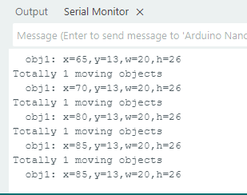

# 4.10 运动物体检测

## 4.10.1 算法简介

Sengo2静止不动，算法通过对比相邻帧的像素差异，来判断图像中是否有发生变化的区域，如果有则认为视野内存在运动物体，返回该区域的坐标信息。 算法只返回一个检测结果。

## 4.10.2 返回数据

主控器获取识别结果时，算法会返回以下数据：

|     结果     |      含义       |
| :----------: | :-------------: |
|   kXValue    | 物体中心横坐标x |
|   kYValue    | 物体中心纵坐标y |
| kWidthValue  |    物体宽度w    |
| kHeightValue |    物体高度h    |

代码：

```c
 // 遍历所有检测到的运动物体
    for (int i = 1; i <= obj_num; ++i) {
      // 获取运动物体的位置和尺寸信息
      int x = sengo.GetValue(VISION_TYPE, kXValue, i);      // 运动区域左上角 X 坐标
      int y = sengo.GetValue(VISION_TYPE, kYValue, i);      // 运动区域左上角 Y 坐标
      int w = sengo.GetValue(VISION_TYPE, kWidthValue, i);  // 运动区域宽度
      int h = sengo.GetValue(VISION_TYPE, kHeightValue, i); // 运动区域高度
      
      // 打印运动物体详细信息
      Serial.print("  obj");
      Serial.print(i);
      Serial.print(": ");
      Serial.print("x=");
      Serial.print(x);
      Serial.print(",y=");
      Serial.print(y);
      Serial.print(",w=");
      Serial.print(w);
      Serial.print(",h=");
      Serial.println(h);
    }
```

----------------

## 4.10.3 代码

```c
// 引入 Arduino 核心库
#include <Arduino.h>
// 引入 Sentry 视觉传感器库
#include <Sentry.h>

// 定义 Sengo2 类型的别名（简化使用）
typedef Sengo2 Sengo;

// 选择通信方式（当前启用 I2C）
#define SENGO_I2C
// #define SENGO_UART  // UART 方式被注释掉

// 根据选择的通信方式包含相应库
#ifdef SENGO_I2C
#include <Wire.h>  // I2C 通信库
#endif
#ifdef SENGO_UART
#include <SoftwareSerial.h>
#define TX_PIN 11  // 软件串口发送引脚
#define RX_PIN 10  // 软件串口接收引脚
SoftwareSerial mySerial(RX_PIN, TX_PIN);  // 创建软件串口对象
#endif

// 设置视觉识别类型为运动检测
#define VISION_TYPE Sengo::kVisionMotionDetect
Sengo sengo;  // 创建 Sentry 传感器对象

// 初始化设置（Arduino 启动时执行一次）
void setup() {
  sentry_err_t err = SENTRY_OK;  // 错误状态变量

  // 初始化串口通信（用于调试输出）
  Serial.begin(9600);
  
  Serial.println("Waiting for sengo initialize...");

  // I2C 初始化流程
#ifdef SENGO_I2C
  Wire.begin();  // 初始化 I2C 总线
  // 循环等待传感器初始化成功
  while (SENTRY_OK != sengo.begin(&Wire)) { 
    yield();  // 在等待期间让出 CPU 控制权（防止看门狗复位）
  }
#endif  // SENGO_I2C

  // UART 初始化流程（当前未启用）
#ifdef SENGO_UART
  mySerial.begin(9600);  // 初始化软件串口
  while (SENTRY_OK != sengo.begin(&mySerial)) { 
    yield();
  }
#endif  // SENGO_UART

  Serial.println("Sengo begin Success.");
  
  // 启动运动检测功能
  err = sengo.VisionBegin(VISION_TYPE);
  
  // 打印初始化结果
  Serial.print("sengo.VisionBegin(kVisionMotionDetect) ");
  if (err) {
    Serial.print("Error: 0x");
  } else {
    Serial.print("Success: 0x");
  }
  // 十六进制输出错误码（0 表示成功）
  Serial.println(err, HEX);
}

// 主循环（重复执行）
void loop() {
  // 获取检测到的运动物体数量（kStatus 表示查询状态）
  int obj_num = sengo.GetValue(VISION_TYPE, kStatus);
  
  if (obj_num > 0) {  // 如果检测到运动物体
    Serial.print("Totally ");
    Serial.print(obj_num);
    Serial.println(" moving objects");
    
    // 遍历所有检测到的运动物体
    for (int i = 1; i <= obj_num; ++i) {
      // 获取运动物体的位置和尺寸信息
      int x = sengo.GetValue(VISION_TYPE, kXValue, i);      // 运动区域左上角 X 坐标
      int y = sengo.GetValue(VISION_TYPE, kYValue, i);      // 运动区域左上角 Y 坐标
      int w = sengo.GetValue(VISION_TYPE, kWidthValue, i);  // 运动区域宽度
      int h = sengo.GetValue(VISION_TYPE, kHeightValue, i); // 运动区域高度
      
      // 打印运动物体详细信息
      Serial.print("  obj");
      Serial.print(i);
      Serial.print(": ");
      Serial.print("x=");
      Serial.print(x);
      Serial.print(",y=");
      Serial.print(y);
      Serial.print(",w=");
      Serial.print(w);
      Serial.print(",h=");
      Serial.println(h);
    }
  }
}
```

-----

## 4.10.4 代码结果

上传代码后，AI视觉模块将会对摄像头拍到的地方进行识别，如果有识别到有物体在运动则会进行捕捉并且会在串口监视器中打印识别到的运动物体的在屏幕中显示的位置xy坐标以及宽度和高度。




## 4.10.5 扩展玩法

**动态感应灯**

- **玩法简介：** 将模块对准房间门口或走廊。当检测到有较大范围的运动（有人经过）时，自动点亮LED灯，并延时熄灭，实现“人来灯亮，人走灯灭”。
- **实现：** 编程持续检测运动物体。一旦检测到，则触发数字引脚输出高电平，控制继电器或MOS管点亮灯带。