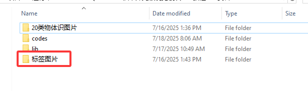
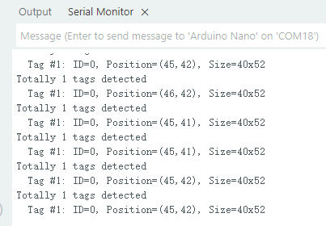

# 4.3 标签识别

## 4.3.1 算法简介

判断图像中是否有Apriltag标签， 支持16H5、25H9、36H11三种编码。算法运行时需要先选定一种编码格式，默认为36H11。不同编码的 Apriltag无法同时检测，但可以同时识别多达 25个相同编码的标签。

<span style="color:red;font-size:20px">注意：该算法不可以与其他带 \* 号的算法同时运行</span>

----------

## 4.3.2 分类标签


Apriltag标签为一组已经定义好的黑白方块图案，不同编码形式使用的方块数量是不同的。每个图案都有一个预定义的分类标签值，识别后会返回该值。



--------------------

## 4.3.3 配置参数

用户可指定编码格式，如未指定新的参数，则以默认格式36H11运行，参数定义如下：

|          模式          |    含义    |
| :--------------------: | :--------: |
| kVisionModeFamily16H5  | 16H5 编码  |
| kVisionModeFamily25H9  | 25H9 编码  |
| kVisionModeFamily36H11 | 36H11 编码 |

代码：

```c
  // 设置AprilTag家族类型为16H5（标准标签集）
  err = sengo.VisionSetMode(VISION_TYPE, Sengo::kVisionModeFamily16H5);
```

---------------

## 4.3.4 返回结果


识别到标签后会返回其坐标、大小和标签编号

当通过主控读取寄存器时，将会返回以下的数据：

|     参数     |      含义       |
| :----------: | :-------------: |
|   kXValue    | 标签中心横坐标x |
|   kYValue    | 标签中心纵坐标y |
| kWidthValue  |    标签宽度w    |
| kHeightValue |    标签高度h    |
| kHeightValue |    标签编号     |

代码：

```c
// 遍历所有检测到的标签
    for (int i = 1; i <= obj_num; ++i) {
      // 获取标签中心位置
      int x = sengo.GetValue(VISION_TYPE, kXValue, i);
      int y = sengo.GetValue(VISION_TYPE, kYValue, i);
      
      // 获取标签边界框尺寸
      int w = sengo.GetValue(VISION_TYPE, kWidthValue, i);
      int h = sengo.GetValue(VISION_TYPE, kHeightValue, i);
      
      // 获取标签ID（唯一标识符）
      int tag_id = sengo.GetValue(VISION_TYPE, kLabel, i);
      
      // 格式化输出检测结果
      Serial.print("  Tag #");
      Serial.print(i);
      Serial.print(": ");
      Serial.print("ID=");
      Serial.print(tag_id);
      Serial.print(", Position=(");
      Serial.print(x);
      Serial.print(",");
      Serial.print(y);
      Serial.print("), Size=");
      Serial.print(w);
      Serial.print("x");
      Serial.print(h);
      Serial.println();
    }
```

----------

## 4.3.5 使用技巧

1. 算法返回的标签宽度值与高度值比较稳定，可以利用这一点进行距离判断，标签旋转后不会改变其大小，但倾斜时可能会有影响

2. 标签越大，识别的距离就越远

## 4.3.6 代码

```c
#include <Arduino.h>
#include <Sentry.h>  // 引入Sentry机器视觉库

typedef Sengo2 Sengo;  // 为Sengo2类型创建别名Sengo，简化使用

// 通信方式选择（当前启用I2C）
#define SENGO_I2C
// #define SENGO_UART  // UART备用选项（已注释）

#ifdef SENGO_I2C
#include <Wire.h>  // I2C通信所需库
#endif

#ifdef SENGO_UART
#include <SoftwareSerial.h>
#define TX_PIN 11  // 自定义TX引脚
#define RX_PIN 10  // 自定义RX引脚
SoftwareSerial mySerial(RX_PIN, TX_PIN);  // 创建软串口对象
#endif

#define VISION_TYPE Sengo::kVisionAprilTag  // 使用AprilTag检测模式
Sengo sengo;  // 创建Sengo传感器对象

void setup() {
  sentry_err_t err = SENTRY_OK;  // 错误状态变量

  Serial.begin(9600);  // 初始化串口用于调试输出
  Serial.println("Waiting for sengo initialize...");

// 根据选择的通信方式初始化传感器
#ifdef SENGO_I2C
  Wire.begin();  // 初始化I2C总线
  // 持续尝试连接直到成功
  while (SENTRY_OK != sengo.begin(&Wire)) {
    yield();  // 在等待时允许其他任务运行
  }
#endif

#ifdef SENGO_UART
  mySerial.begin(9600);
  while (SENTRY_OK != sengo.begin(&mySerial)) {
    yield();
  }
#endif

  Serial.println("Sengo begin Success.");
  
  // ============== AprilTag检测配置 ==============
  
  // 设置AprilTag家族类型为16H5（标准标签集）
  err = sengo.VisionSetMode(VISION_TYPE, Sengo::kVisionModeFamily16H5);
  
  // 设置检测级别为速度优先（牺牲精度提高速度）
  err = sengo.VisionSetLevel(VISION_TYPE, kLevelSpeed);
  
  if (err) {
    Serial.print("sengo.VisionSetMode Error: 0x");
    Serial.println(err, HEX);  // 输出错误代码
  }
  
  // 启动AprilTag视觉识别
  err = sengo.VisionBegin(VISION_TYPE);
  Serial.print("sengo.VisionBegin(kVisionAprilTag) ");
  if (err) {
    Serial.print("Error: 0x");
  } else {
    Serial.print("Success: 0x");
  }
  Serial.println(err, HEX);  // 输出初始化结果
}

void loop() {
  // 读取检测到的AprilTag数量
  int obj_num = sengo.GetValue(VISION_TYPE, kStatus);
  
  if (obj_num > 0) {  // 如果检测到AprilTag
    Serial.print("Totally ");
    Serial.print(obj_num);
    Serial.println(" tags detected");
    
    // 遍历所有检测到的标签
    for (int i = 1; i <= obj_num; ++i) {
      // 获取标签中心位置
      int x = sengo.GetValue(VISION_TYPE, kXValue, i);
      int y = sengo.GetValue(VISION_TYPE, kYValue, i);
      
      // 获取标签边界框尺寸
      int w = sengo.GetValue(VISION_TYPE, kWidthValue, i);
      int h = sengo.GetValue(VISION_TYPE, kHeightValue, i);
      
      // 获取标签ID（唯一标识符）
      int tag_id = sengo.GetValue(VISION_TYPE, kLabel, i);
      
      // 格式化输出检测结果
      Serial.print("  Tag #");
      Serial.print(i);
      Serial.print(": ");
      Serial.print("ID=");
      Serial.print(tag_id);
      Serial.print(", Position=(");
      Serial.print(x);
      Serial.print(",");
      Serial.print(y);
      Serial.print("), Size=");
      Serial.print(w);
      Serial.print("x");
      Serial.print(h);
      Serial.println();
    }
  }
  
  delay(100);  // 适当延时，降低刷新率
}
```

-----------

## 4.3.7 代码结果

上传代码后，AI视觉模块将会对摄像头拍到的地方进行识别如果有16H5标签则会被他捕捉并识别，然后通过串口监视器进行打印标签在屏幕上显示的位置xy与宽度高度以及标签代表的值。




## 4.3.8 扩展玩法

**标签指令卡片**

- **玩法简介：** 将标签对应0-4对应到一个动作，如舵机旋转90度或者小车前进等操作。
- **实现：** 开发板读取标签的ID序列，通过对标签ID序列的判断从而执行对应的操作。