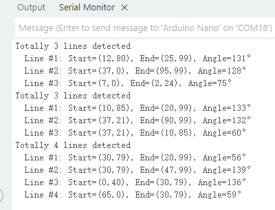

# 4.4 线条检测

## 4.4.1 算法简介


判断图像中是否有线段，如果有则会返回线段两个端点的坐标以及倾斜角度，如果线段为曲线，则返回由起点与终点相连所形成的直线的角度。

-----------

## 4.4.2 配置参数

用户可指定最大检测数量（1-5），如未指定新的参数，则以默认检测1条，参数定义如下：

| 参数 |       含义        |
| :--: | :---------------: |
|  1   | 可同时检测1个线段 |
|  2   | 可同时检测2个线段 |
|  3   | 可同时检测3个线段 |
|  4   | 可同时检测4个线段 |
|  5   | 可同时检测5个线段 |

<span style="color:red;">注意：显示屏上的线第一根线是红色，第二个线是黄色，第三根是绿色，第四根是蓝色，第五根是紫色。</span>

代码：

```c
  /* 设置检测线条数量 */
  err = sengo.VisionSetMode(VISION_TYPE, 4);  // 最多检测5条线
```

---------------

## 4.4.3 返回数据

主控器获取识别结果时，算法会返回以下数据：

|     参数     |          含义           |
| :----------: | :---------------------: |
|   kXValue    | 线段终点（远端）横坐标x |
|   kYValue    | 线段终点（远端）纵坐标y |
| kWidthValue  | 线段起点（近端）横坐标x |
| kHeightValue | 线段起点（近端）纵坐标y |
|    kLabel    |     线段的倾斜角度      |

<span style="color:red;font-size:20px;">注意：倾斜角逆时针增大，线段水平向右时其倾斜角为0°，线段垂直向上时其倾斜角为90°，线段水平向左时其倾斜角为 180°。算法不会向下检测输出角度。</span>

代码：

```c
    // 遍历所有检测到的线条
    for (int i = 1; i <= obj_num; ++i) {
      // 获取线条端点坐标
      int x1 = sengo.GetValue(VISION_TYPE, kXValue, i);      // 起点X坐标
      int y1 = sengo.GetValue(VISION_TYPE, kYValue, i);      // 起点Y坐标
      int x2 = sengo.GetValue(VISION_TYPE, kWidthValue, i);  // 终点X坐标
      int y2 = sengo.GetValue(VISION_TYPE, kHeightValue, i);  // 终点Y坐标
      
      // 获取线条角度（0-180度）
      int degree = sengo.GetValue(VISION_TYPE, kLabel, i);
      
      // 格式化输出检测结果
      Serial.print("  Line #");
      Serial.print(i);
      Serial.print(": ");
      Serial.print("Start=(");
      Serial.print(x1);
      Serial.print(",");
      Serial.print(y1);
      Serial.print("), End=(");
      Serial.print(x2);
      Serial.print(",");
      Serial.print(y2);
      Serial.print("), Angle=");
      Serial.print(degree);
      Serial.println("°");
    }
```

---------------

## 4.4.4 使用技巧

1. 请勿使用表面光滑的地图，避免反光导致检测失败；
2. 背景与线条边界应清晰分明，颜色差异明显，譬如白底黑线；
3. 背景尽量简单，颜色单一；如果背景杂乱，则可能会检测背景中的线条；
4. 线条粗细应适中，过细或过宽均影响检测；
5. 巡线时，第一条线段始终为屏幕下方最先检测到的线段；

--------------

## 4.4.5 代码

```c
#include <Arduino.h>
#include <Sentry.h>  // 引入Sentry机器视觉库

typedef Sengo2 Sengo;  // 为Sengo2类型创建别名Sengo

// 通信方式选择（当前启用I2C）
#define SENGO_I2C
// #define SENGO_UART  // UART备用选项（已注释）

#ifdef SENGO_I2C
#include <Wire.h>  // I2C通信所需库
#endif

#ifdef SENGO_UART
#include <SoftwareSerial.h>
#define TX_PIN 11  // 自定义TX引脚
#define RX_PIN 10  // 自定义RX引脚
SoftwareSerial mySerial(RX_PIN, TX_PIN);  // 创建软串口对象
#endif

#define VISION_TYPE Sengo::kVisionLine  // 使用线条检测模式
Sengo sengo;  // 创建Sengo传感器对象

void setup() {
  sentry_err_t err = SENTRY_OK;  // 错误状态变量

  Serial.begin(9600);  // 初始化串口用于调试输出
  Serial.println("Waiting for sengo initialize...");

// 根据选择的通信方式初始化传感器
#ifdef SENGO_I2C
  Wire.begin();  // 初始化I2C总线
  // 持续尝试连接直到成功
  while (SENTRY_OK != sengo.begin(&Wire)) { 
    yield();  // 在等待时允许其他任务运行
  }
#endif

#ifdef SENGO_UART
  mySerial.begin(9600);
  while (SENTRY_OK != sengo.begin(&mySerial)) { 
    yield();
  }
#endif

  Serial.println("Sengo begin Success.");
  
  // ============== 线条检测配置 ==============
  
  /* 设置检测线条数量 */
  err = sengo.VisionSetMode(VISION_TYPE, 4);  // 最多检测5条线
  Serial.print("sengo.VisionSetMode");
  if (err) {
    Serial.print(" Error: 0x");
  } else {
    Serial.print(" Success: 0x");
  }
  Serial.println(err, HEX);  // 输出配置结果
  
  // 启动线条视觉识别
  err = sengo.VisionBegin(VISION_TYPE);
  Serial.print("sengo.VisionBegin(kVisionLine) ");
  if (err) {
    Serial.print("Error: 0x");
  } else {
    Serial.print("Success: 0x");
  }
  Serial.println(err, HEX);
}

void loop() {
  // 读取检测到的线条数量
  int obj_num = sengo.GetValue(VISION_TYPE, kStatus);
  
  if (obj_num > 0) {  // 如果检测到线条
    Serial.print("Totally ");
    Serial.print(obj_num);
    Serial.println(" lines detected");
    
    // 遍历所有检测到的线条
    for (int i = 1; i <= obj_num; ++i) {
      // 获取线条端点坐标
      int x1 = sengo.GetValue(VISION_TYPE, kXValue, i);      // 起点X坐标
      int y1 = sengo.GetValue(VISION_TYPE, kYValue, i);      // 起点Y坐标
      int x2 = sengo.GetValue(VISION_TYPE, kWidthValue, i);  // 终点X坐标
      int y2 = sengo.GetValue(VISION_TYPE, kHeightValue, i);  // 终点Y坐标
      
      // 获取线条角度（0-180度）
      int degree = sengo.GetValue(VISION_TYPE, kLabel, i);
      
      // 格式化输出检测结果
      Serial.print("  Line #");
      Serial.print(i);
      Serial.print(": ");
      Serial.print("Start=(");
      Serial.print(x1);
      Serial.print(",");
      Serial.print(y1);
      Serial.print("), End=(");
      Serial.print(x2);
      Serial.print(",");
      Serial.print(y2);
      Serial.print("), Angle=");
      Serial.print(degree);
      Serial.println("°");
    }
  }
  
  delay(100);  // 适当延时，降低刷新率
}
```

--------------------

## 4.4.6 代码结果

上传代码后，AI视觉模块将会对摄像头拍到的地方进行分析如果有线条就会进行识别，并且在串口监视器中打印线条的起始和结束坐标以及角度（角度的判别是垂直线是90度，水平垂直线是180度）。




## 4.4.7 扩展玩法

**区分三角形与矩形**

- **玩法简介：** 使用打印机将三角形与矩形打印到A4纸上线条要粗一些，然后使用线条检查功能对进行检测如果检测到三条线就是三角形，如果检测到4条线就是矩形。
- **实现：** 开发板读取识别的线条数量，然后对线条数量进行判断，线条数量为3则为三角形，线条数量为4则为矩形。