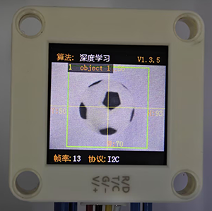
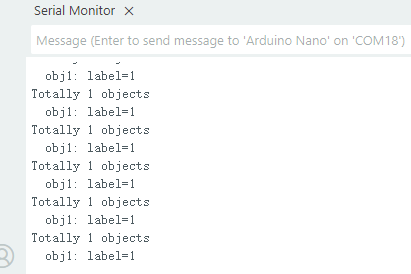

# 4.5 深度学习

## 4.5.1 算法简介


可以对任意物体进行离线学习存储并识别，可存储15个物体，已存储的数据可以全部或者单独进行删除。该算法只能对物体进行分类，无法检测物体的方位及大小。

-------------------------

## 4.5.2 分类标签

| 分类标签值 |     含义     |
| :--------: | :----------: |
|    1-15    | 物体分类编号 |

----------

## 4.5.3 保存数据

开启深度学习算法后，将摄像头正对目标物体，按下功能按键约5秒后松开，Sengo2开始学习，目标物体的数据会被存储并分配一个ID编号（注意：最多存储15个。）。

编号即标签值的分配原则：当前可用编号中最小的号。如果无空余编号，则Sengo2会提示存储失败。


---------

## 4.5.4 删除数据

执行完毕学习操作后，按下功能按键约10秒后松开，即可删除刚存储的数据；再次按下10秒后，则会清空全部的存储数据。若算法开启后未执行过学习操作，则下功能按键10秒后会直接清空全部的存储数据。

-------

## 4.5.5 返回数据

主控器获取识别结果时，算法会返回以下数据：

|     参数     |     含义     |
| :----------: | :----------: |
|   kXValue    |    固定值    |
|   kYValue    |    固定值    |
| kWidthValue  |    固定值    |
| kHeightValue |    固定值    |
|    kLabel    | 物体分类编号 |

代码：

```c
 // 遍历所有检测到的物体
    for (int i = 1; i <= obj_num; ++i) {
      // 获取当前物体的类别标签（模型训练时定义的类别ID）
      int label = sengo.GetValue(VISION_TYPE, kLabel, i);
      
      // 打印物体序号及其类别标签
      Serial.print("  obj");
      Serial.print(i);
      Serial.print(": ");
      Serial.print("label=");
      Serial.println(label);
    }
```

-------

## 4.5.6 使用技巧

1. 对于某些应用，譬如需要在较长距离内识别同一物体，或者在固定的位置识别不同角度下的同一物体（例如卡片旋转了90° 180°），解决方案：在不同距离下或者不同角度下对该物体进行学习并存储为ID1、ID2...识别时，如果返回的标签值为上述编号之一，即可认定为同一物体。
2. 学习物体时与识别物体时的背景（包含光照条件）如果存在差异，那么识别效果会受影响。

## 4.5.7 代码

```c
#include <Arduino.h>          // Arduino核心库
#include <Sentry.h>           // Sentry机器视觉传感器库

// 为Sengo2类型创建别名"Sengo"，简化后续使用
typedef Sengo2 Sengo;

// 定义通信方式（当前启用I2C）
#define SENGO_I2C             
// #define SENGO_UART          // UART串口通信方案（已注释禁用）

// 根据选择的通信方式包含相应库
#ifdef SENGO_I2C
#include <Wire.h>             // I2C通信所需库
#endif

#ifdef SENGO_UART
#include <SoftwareSerial.h>   // 软串口库
#define TX_PIN 11             // 自定义TX引脚号
#define RX_PIN 10             // 自定义RX引脚号
SoftwareSerial mySerial(RX_PIN, TX_PIN);  // 创建软串口对象
#endif

// 定义视觉处理类型为机器学习模式
#define VISION_TYPE Sengo::kVisionLearning  

// 创建Sengo传感器对象实例
Sengo sengo;

void setup() {
  sentry_err_t err = SENTRY_OK;  // 定义错误状态变量，初始化为无错误

  Serial.begin(9600);            // 初始化串口通信，波特率9600
  Serial.println("Waiting for sengo initialize...");  // 打印初始化提示

// 根据选择的通信方式初始化传感器
#ifdef SENGO_I2C
  Wire.begin();                   // 初始化I2C总线
  // 循环尝试连接传感器，直到成功
  while (SENTRY_OK != sengo.begin(&Wire)) { 
    yield();  // 在等待连接期间允许系统处理其他任务
  }
#endif  // SENGO_I2C

#ifdef SENGO_UART
  mySerial.begin(9600);           // 初始化软串口，波特率9600
  // 循环尝试连接传感器，直到成功
  while (SENTRY_OK != sengo.begin(&mySerial)) { 
    yield();  // 在等待连接期间允许系统处理其他任务
  }
#endif  // SENGO_UART

  Serial.println("Sengo begin Success.");  // 打印传感器初始化成功信息
  
  // 启动机器学习视觉识别功能
  err = sengo.VisionBegin(VISION_TYPE);
  
  // 打印视觉识别初始化结果
  Serial.print("sengo.VisionBegin(kVisionLearning) ");
  if (err) {
    Serial.print("Error: 0x");    // 如果出错，打印错误前缀
  } else {
    Serial.print("Success: 0x");  // 如果成功，打印成功前缀
  }
  Serial.println(err, HEX);       // 以16进制格式打印错误代码
}

void loop() {
  // 获取检测到的物体数量（kStatus参数返回检测到的对象总数）
  int obj_num = sengo.GetValue(VISION_TYPE, kStatus);
  
  // 如果检测到至少一个物体
  if (obj_num) {
    // 打印检测到的物体总数
    Serial.print("Totally ");
    Serial.print(obj_num);
    Serial.println(" objects");
    
    // 遍历所有检测到的物体
    for (int i = 1; i <= obj_num; ++i) {
      // 获取当前物体的类别标签（模型训练时定义的类别ID）
      int label = sengo.GetValue(VISION_TYPE, kLabel, i);
      
      // 打印物体序号及其类别标签
      Serial.print("  obj");
      Serial.print(i);
      Serial.print(": ");
      Serial.print("label=");
      Serial.println(label);
    }
  }
  
  delay(200);
}
```

----------

## 4.5.8 代码结果

上传代码后，按住AI视觉模块后面的功能按键并保持5秒然后对准白色背景下被识别的物体等待一会学习完毕后就可以对物体进行识别了。





## 4.5.9 扩展玩法

**专属手势识别器**（玩法难度较高）

- **玩法简介：** 不识别常规物体，而是训练它识别你自定义的几种手势（如“竖大拇指”、“OK”、“手掌”。识别到不同手势，控制电灯开关、播放音乐等。

- **实现：** 再背景干净（推荐白色背景）的环境下对手势进行识别并且每个手势需要识别3个这样能更好的识别分辨，代码中将三种一样手势的ID放到用逻辑或进行判断当有一个满足时就执行对应的功能。

- **难点：** 这个玩法对识别手势的背景，环境灯光，手势位置要求都很高需要注意

  