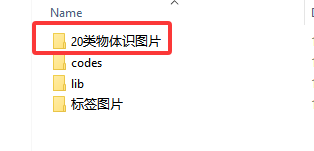
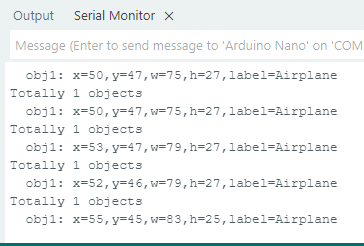

# 4.8 20类物体识别

## 4.8.1 算法简介

识别常见的20类物体，返回他们的坐标信息和分类标签。

## 4.8.2 分类标签 

| 分类标签 | 名称 | 分类标签 |   名称   |
| :------: | :--: | :------: | :------: |
|    1     | 飞机 |    2     |  自行车  |
|    3     |  鸟  |    4     |    船    |
|    5     | 瓶子 |    6     |  公交车  |
|    7     | 汽车 |    8     |    猫    |
|    9     | 椅子 |    10    |    牛    |
|    11    | 餐桌 |    12    |    狗    |
|    13    |  马  |    14    |  摩托车  |
|    15    |  人  |    16    | 盆栽植物 |
|    17    |  羊  |    18    |   沙发   |
|    19    | 火车 |    20    |  显示器  |

我们有在下载的文件资料文件夹中提供20类物体识别的图片以供使用。



---------------

## 4.8.4 返回数据

主控器获取识别结果时，算法会返回以下数据：

|     结果     |      含义       |
| :----------: | :-------------: |
|   kXValue    | 物体中心横坐标x |
|   kYValue    | 物体中心纵坐标y |
| kWidthValue  |    物体宽度w    |
| kHeightValue |    物体高度h    |
|    kLabel    |  物体分类标签l  |

代码：

```c
 // 遍历所有检测到的物体
        for (int i = 1; i <= obj_num; ++i) {
            // 获取物体坐标和尺寸信息
            int x = sengo.GetValue(VISION_TYPE, kXValue, i);  // 左上角 X 坐标
            int y = sengo.GetValue(VISION_TYPE, kYValue, i);  // 左上角 Y 坐标
            int w = sengo.GetValue(VISION_TYPE, kWidthValue, i);  // 物体宽度
            int h = sengo.GetValue(VISION_TYPE, kHeightValue, i);  // 物体高度
            int l = sengo.GetValue(VISION_TYPE, kLabel, i);  // 物体类别标签索引
            
            // 打印物体详细信息
            Serial.print("  obj");
            Serial.print(i);
            Serial.print(": ");
            Serial.print("x=");
            Serial.print(x);
            Serial.print(",y=");
            Serial.print(y);
            Serial.print(",w=");
            Serial.print(w);
            Serial.print(",h=");
            Serial.print(h);
            Serial.print(",label=");
            Serial.println(classes20[l]);  // 通过索引获取物体名称
        }
```

----------

## 4.8.5 使用技巧

1. 图像的清晰度会影响识别效果。如果图案偏小，摄像头无法聚焦到图案，图案成像模糊，会导致识别效果变差，此时应改用较大的图案。

2. 如果需要识别屏幕上的图案，应当适当调节屏幕的亮度，避免过曝。

-------

## 4.8.6 代码

```c
// 引入 Arduino 核心库
#include <Arduino.h>
// 引入 Sentry 视觉传感器库
#include <Sentry.h>

// 定义 Sengo2 类型的别名（简化使用）
typedef Sengo2 Sengo;

// 选择通信方式（当前启用 I2C）
#define SENGO_I2C
// #define SENGO_UART  // UART 方式被注释掉

// 根据选择的通信方式包含相应库
#ifdef SENGO_I2C
#include <Wire.h>  // I2C 通信库
#endif
#ifdef SENGO_UART
#include <SoftwareSerial.h>
#define TX_PIN 11  // 软件串口发送引脚
#define RX_PIN 10  // 软件串口接收引脚
SoftwareSerial mySerial(RX_PIN, TX_PIN);  // 创建软件串口对象
#endif

// 设置视觉识别类型为 20 类物体识别
#define VISION_TYPE Sengo::kVision20Classes
Sengo sengo;  // 创建 Sentry 传感器对象

// 20 类物体名称标签数组（索引 0 为未知物体）
const char* classes20[] = {
    "unknown",        // 0
    "Airplane",       // 1
    "Bicycle",        // 2
    "Bird",           // 3
    "Boat",           // 4
    "Bottle",         // 5
    "Bus",            // 6
    "Car",            // 7
    "Cat",            // 8
    "Chair",          // 9
    "Cow",            // 10
    "Dining Table",   // 11
    "Dog",            // 12
    "Horse",          // 13
    "Motorbike",      // 14
    "Person",         // 15
    "Potted Plant",   // 16
    "Sheep",          // 17
    "Sofa",           // 18
    "Train",          // 19
    "TV Monitor"      // 20
};

// 初始化设置（Arduino 启动时执行一次）
void setup() {
    sentry_err_t err = SENTRY_OK;  // 错误状态变量

    Serial.begin(9600);  // 初始化串口通信（用于调试输出）
    Serial.println("Waiting for sengo initialize...");

    // I2C 初始化流程
#ifdef SENGO_I2C
    Wire.begin();  // 初始化 I2C 总线
    // 循环等待传感器初始化成功
    while (SENTRY_OK != sengo.begin(&Wire)) { 
        yield();  // 在等待期间让出 CPU 控制权
    }
#endif

    // UART 初始化流程（当前未启用）
#ifdef SENGO_UART
    mySerial.begin(9600);
    while (SENTRY_OK != sengo.begin(&mySerial)) { 
        yield();
    }
#endif

    Serial.println("Sengo begin Success.");

    // 启动视觉识别功能（20 类物体检测）
    err = sengo.VisionBegin(VISION_TYPE);
    
    // 打印初始化结果
    Serial.print("sengo.VisionBegin(kVision20Classes) ");
    if (err) {
        Serial.print("Error: 0x");
    } else {
        Serial.print("Success: 0x");
    }
    Serial.println(err, HEX);  // 十六进制输出错误码
}

// 主循环（重复执行）
void loop() {
    // 获取检测到的物体数量（kStatus 表示查询状态）
    int obj_num = sengo.GetValue(VISION_TYPE, kStatus);
    
    if (obj_num) {  // 如果检测到物体
        Serial.print("Totally ");
        Serial.print(obj_num);
        Serial.println(" objects");
        
        // 遍历所有检测到的物体
        for (int i = 1; i <= obj_num; ++i) {
            // 获取物体坐标和尺寸信息
            int x = sengo.GetValue(VISION_TYPE, kXValue, i);  // 左上角 X 坐标
            int y = sengo.GetValue(VISION_TYPE, kYValue, i);  // 左上角 Y 坐标
            int w = sengo.GetValue(VISION_TYPE, kWidthValue, i);  // 物体宽度
            int h = sengo.GetValue(VISION_TYPE, kHeightValue, i);  // 物体高度
            int l = sengo.GetValue(VISION_TYPE, kLabel, i);  // 物体类别标签索引
            
            // 打印物体详细信息
            Serial.print("  obj");
            Serial.print(i);
            Serial.print(": ");
            Serial.print("x=");
            Serial.print(x);
            Serial.print(",y=");
            Serial.print(y);
            Serial.print(",w=");
            Serial.print(w);
            Serial.print(",h=");
            Serial.print(h);
            Serial.print(",label=");
            Serial.println(classes20[l]);  // 通过索引获取物体名称
        }
    }
}
```

-----------

## 4.8.7 代码结果

上传代码后，AI视觉模块将会对摄像头拍到的地方进行识别，如果有识别到20类物体中的某一个将会在串口监视器中打印识别到的物体的名称。




## 4.8.8 扩展玩法

**儿童智能认知卡**

- **玩法简介：** 让小朋友拿着20类物体卡片到摄像头前，AI会自动识别并读出物品的名称，并显示在屏幕上。
- **实现：** 识别到物体后，通过串口将物体名称发送给语音合成模块，并同时在屏幕显示大字体的名称。
- **难点：** 需要接入音频模块