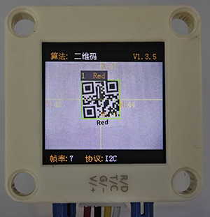
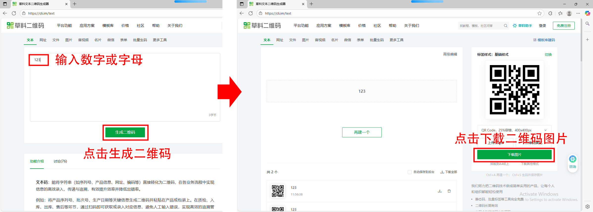
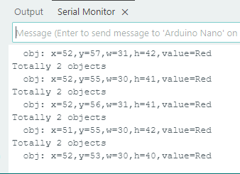

# 4.9 二维码识别

## 4.9.1 算法简介



可以识别一个简单的二维码并返回该二维码的坐标、大小及文本内容。二维码信息不超过25个字符，屏幕上可显示ASCII码字符，如果是中文二维码，则无法正常显示，但识别结果可由主控正常读取。

-------------

## 4.9.2 返回数据

该算法的返回数据包含两类信息，一类数据为属性信息，另一类为解码结果字符数据，每组结果包含5个字符。

| 结果 |     属性信息      |      | 结果 | 字符数据  |
| :--: | :---------------: | ---- | :--: | :-------: |
|  1   | 二维码中心横坐标x |      |  1   | 字符1编码 |
|  2   | 二维码中心纵坐标y |      |  2   | 字符2编码 |
|  3   |    二维码宽度w    |      |  3   | 字符3编码 |
|  4   |    二维码高度h    |      |  4   | 字符4编码 |
|  5   |  二维码字符数量   |      |  5   | 字符5编码 |

代码：

```c
    // 获取二维码的位置和尺寸信息
    int x = sengo.GetValue(VISION_TYPE, kXValue);      // 左上角 X 坐标
    int y = sengo.GetValue(VISION_TYPE, kYValue);      // 左上角 Y 坐标
    int w = sengo.GetValue(VISION_TYPE, kWidthValue);  // 二维码宽度
    int h = sengo.GetValue(VISION_TYPE, kHeightValue); // 二维码高度
    
    // 获取二维码内容（字符串）
    char* c = sengo.GetQrCodeValue();
    
    // 打印二维码详细信息
    Serial.print("  obj");
    Serial.print(": ");
    Serial.print("x=");
    Serial.print(x);
    Serial.print(",y=");
    Serial.print(y);
    Serial.print(",w=");
    Serial.print(w);
    Serial.print(",h=");
    Serial.print(h);
    Serial.print(",value=");
    Serial.println(c);  // 打印二维码内容
  }	
```

----------

## 4.9.3 如何生成二维码

我们有提供5个纸质的二维码卡片，二维码内容分别是“Red”，“Green”，“Blue”，“White”，“Black”。


如果我们提供的二维码满足不了你的需求，你可以通过下方的链接自己生成你需要的二维码。

[在线二维码生成器](https://cli.im/text/other)

进入链接后：

①选择文本

②输入需要生成的文字（注意避免中文字符与字符不得超过25个）

③点击生成二维码

④点击下载二维码图片



------------

## 4.9.4 代码

```c
// 引入 Arduino 核心库
#include <Arduino.h>
// 引入 Sentry 视觉传感器库
#include <Sentry.h>

// 定义 Sengo2 类型的别名（简化使用）
typedef Sengo2 Sengo;

// 选择通信方式（当前启用 I2C）
#define SENGO_I2C
// #define SENGO_UART  // UART 方式被注释掉

// 根据选择的通信方式包含相应库
#ifdef SENGO_I2C
#include <Wire.h>  // I2C 通信库
#endif
#ifdef SENGO_UART
#include <SoftwareSerial.h>
#define TX_PIN 11  // 软件串口发送引脚
#define RX_PIN 10  // 软件串口接收引脚
SoftwareSerial mySerial(RX_PIN, TX_PIN);  // 创建软件串口对象
#endif

// 设置视觉识别类型为二维码识别
#define VISION_TYPE Sengo::kVisionQrCode
Sengo sengo;  // 创建 Sentry 传感器对象

// 初始化设置（Arduino 启动时执行一次）
void setup() {
  sentry_err_t err = SENTRY_OK;  // 错误状态变量

  Serial.begin(9600);  // 初始化串口通信（用于调试输出）
  Serial.println("Waiting for sengo initialize...");

  // I2C 初始化流程
#ifdef SENGO_I2C
  Wire.begin();  // 初始化 I2C 总线
  // 循环等待传感器初始化成功
  while (SENTRY_OK != sengo.begin(&Wire)) { 
    yield();  // 在等待期间让出 CPU 控制权
  }
#endif  // SENGO_I2C

  // UART 初始化流程（当前未启用）
#ifdef SENGO_UART
  mySerial.begin(9600);
  while (SENTRY_OK != sengo.begin(&mySerial)) { 
    yield();
  }
#endif  // SENGO_UART

  Serial.println("Sengo begin Success.");
  
  // 启动二维码识别功能
  err = sengo.VisionBegin(VISION_TYPE);
  
  // 打印初始化结果
  Serial.print("sengo.VisionBegin(kVisionQrCode) ");
  if (err) {
    Serial.print("Error: 0x");
  } else {
    Serial.print("Success: 0x");
  }
  Serial.println(err, HEX);  // 十六进制输出错误码
}

// 主循环（重复执行）
void loop() {
  // 获取检测到的二维码数量（kStatus 表示查询状态）
  int obj_num = sengo.GetValue(VISION_TYPE, kStatus);
  
  if (obj_num) {  // 如果检测到二维码
    Serial.print("Totally ");
    Serial.print(obj_num);
    Serial.println(" objects");
    
    // 获取二维码的位置和尺寸信息
    int x = sengo.GetValue(VISION_TYPE, kXValue);      // 左上角 X 坐标
    int y = sengo.GetValue(VISION_TYPE, kYValue);      // 左上角 Y 坐标
    int w = sengo.GetValue(VISION_TYPE, kWidthValue);  // 二维码宽度
    int h = sengo.GetValue(VISION_TYPE, kHeightValue); // 二维码高度
    
    // 获取二维码内容（字符串）
    char* c = sengo.GetQrCodeValue();
    
    // 打印二维码详细信息
    Serial.print("  obj");
    Serial.print(": ");
    Serial.print("x=");
    Serial.print(x);
    Serial.print(",y=");
    Serial.print(y);
    Serial.print(",w=");
    Serial.print(w);
    Serial.print(",h=");
    Serial.print(h);
    Serial.print(",value=");
    Serial.println(c);  // 打印二维码内容
  }
}
```

-------

## 4.9.5 代码结果

上传代码后，AI视觉模块将会对摄像头拍到的地方进行分析如果有二维码就会进行识别，并且在串口监视器中打印二维码尺寸以及二维码的内容。




## 4.9.6 扩展玩法

**多功能指令卡**

- **玩法简介：** 制作一系列二维码，内容不是网址，而是直接写入控制指令（如`LED_ON`, `SERVO_90`）。扫描不同二维码，直接控制硬件执行动作。
- **实现：** 编程解析扫描到的字符串，直接将其作为命令执行。这是一种无需键盘输入的硬件控制方式。