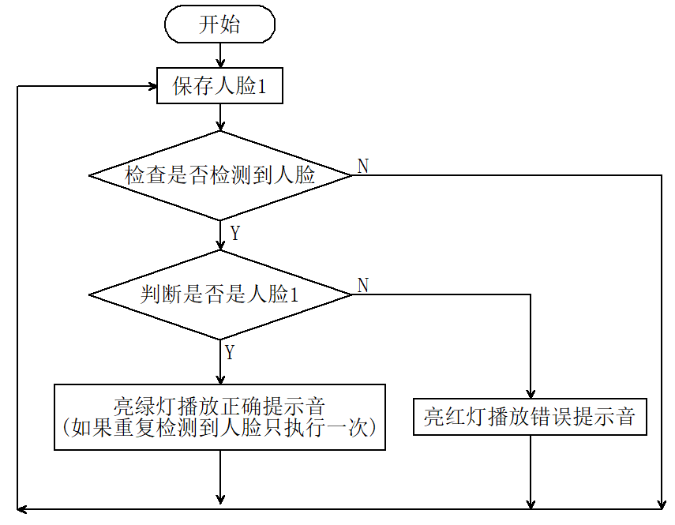

# 5.1 人脸解锁

## 5.1.1 简介

人脸识别解锁，判断是否是存储好的人脸，是则播放正确提示音亮绿灯，不是则播放错误提示音亮红灯。通过长按AI视觉模块的功能按键进行训练并存储人脸，然后通过代码对该人脸进行判断。

## 5.1.2 代码流程图



## 5.1.3 代码

```c
#include <Arduino.h>  // Arduino核心库
#include <Sentry.h>   // Sentry机器视觉传感器库
#include <Wire.h>     // I2C通信所需库
#include <Adafruit_NeoPixel.h>

#define PIN A3
Adafruit_NeoPixel strip = Adafruit_NeoPixel(4, PIN, NEO_GRB + NEO_KHZ800);

// 为Sengo2类型创建别名"Sengo"，简化后续使用
typedef Sengo2 Sengo;

// 定义通信方式（当前启用I2C）
#define SENGO_I2C
// #define SENGO_UART          // UART串口通信方案（已注释禁用）

// 根据选择的通信方式包含相应库
#ifdef SENGO_I2C
#include <Wire.h>  // I2C通信所需库
#endif

#ifdef SENGO_UART
#include <SoftwareSerial.h>               // 软串口库
#define TX_PIN 11                         // 自定义TX引脚号
#define RX_PIN 10                         // 自定义RX引脚号
SoftwareSerial mySerial(RX_PIN, TX_PIN);  // 创建软串口对象
#endif

#define speakerPin 3  //扬声器引脚

// 全局状态变量
unsigned long lastDetectionTime = 0;        // 最后检测到人脸的时间戳
const unsigned long disappearDelay = 5000;  // 人脸消失延迟时间(5秒)
bool currentFaceDetected = false;  // 是否检测到人脸1


// 定义视觉处理类型为人脸检测模式
#define VISION_TYPE Sengo::kVisionFace

// 创建Sengo传感器对象实例
Sengo sengo;

// 正确提示音（清脆的两短音）
void playSuccessSound() {
  for (int i = 0; i < 2; i++) {
    tone(speakerPin, 1500);  // 1500Hz高频
    delay(100);
    noTone(speakerPin);
    delay(50);  // 短音之间的间隔
  }
}

// 错误提示音（低沉的单长音）
void playErrorSound() {
  tone(speakerPin, 300);  // 300Hz低频
  delay(500);
  noTone(speakerPin);
}

// Fill the dots one after the other with a color
void colorWipe(uint32_t c, uint8_t wait) {
  for (uint16_t i = 0; i < strip.numPixels(); i++) {
    strip.setPixelColor(i, c);
    strip.show();
    delay(wait);
  }
}

void setup() {
  sentry_err_t err = SENTRY_OK;  // 定义错误状态变量，初始化为无错误

  Serial.begin(9600);                                 // 初始化串口通信，波特率9600
  Serial.println("Waiting for sengo initialize...");  // 打印初始化提示


// 根据选择的通信方式初始化传感器
#ifdef SENGO_I2C
  Wire.begin();  // 初始化I2C总线
  // 循环尝试连接传感器，直到成功
  // yield()函数在等待期间允许ESP8266/ESP32处理后台任务
  while (SENTRY_OK != sengo.begin(&Wire)) {
    yield();
  }
#endif  // SENGO_I2C

#ifdef SENGO_UART
  mySerial.begin(9600);  // 初始化软串口，波特率9600
  // 循环尝试连接传感器，直到成功
  while (SENTRY_OK != sengo.begin(&mySerial)) {
    yield();
  }
#endif  // SENGO_UART


  Serial.println("Sengo begin Success.");  // 打印传感器初始化成功信息

  // 启动人脸检测功能
  err = sengo.VisionBegin(VISION_TYPE);

  // 打印人脸检测初始化结果
  Serial.print("sengo.VisionBegin(kVisionFace) ");
  if (err) {
    Serial.print("Error: 0x");  // 如果出错，打印错误前缀
  } else {
    Serial.print("Success: 0x");  // 如果成功，打印成功前缀
  }
  Serial.println(err, HEX);  // 以16进制格式打印错误代码

  strip.begin();
  strip.show();  // Initialize all pixels to 'off'
}


void loop() {

  // 获取检测到的人脸数量
  int face_count = sengo.GetValue(VISION_TYPE, kStatus);
  unsigned long currentMillis = millis();

  // 检查是否有人脸1
  if (face_count > 0) {
    for (int i = 1; i <= face_count; ++i) {
      int current_face_id = sengo.GetValue(VISION_TYPE, kLabel, i);
      Serial.println(current_face_id);

      if (current_face_id == 1 && !currentFaceDetected) {
        lastDetectionTime = currentMillis;  // 更新最后检测时间
        currentFaceDetected = true;
        colorWipe(strip.Color(0, 255, 0), 50);  // 亮绿灯
        playSuccessSound();                     // 播放正确音
        colorWipe(strip.Color(0, 0, 0), 50);    // 关闭灯光
      } else if (current_face_id == 0 || current_face_id == 200) {
        colorWipe(strip.Color(255, 0, 0), 50);  // 亮红灯
        playErrorSound();                       // 播放错误音
        colorWipe(strip.Color(0, 0, 0), 50);    // 关闭灯光
      }
    }
  }

  //5秒延时代码
  if (currentFaceDetected && (currentMillis - lastDetectionTime >= disappearDelay)) {
    currentFaceDetected = false;  // 退出激活状态
  }
  delay(300);
}
```

## 5.1.4 代码结果

上传代码成功后，AI视觉模块就会对摄像头拍到的画面进行人脸识别，如果画面中出现人脸则将这个人脸与我们保存的标签号为"1"的人脸进行对比，从而判断是不是标签号为"1"的人脸， 是则小车发出正确提示音并且亮绿灯，不是则小车发出错误提示音并且亮红灯。