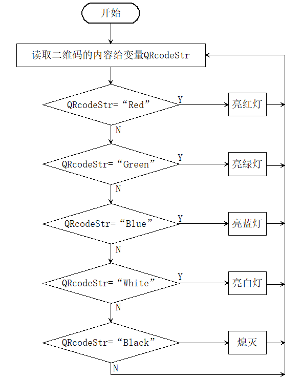

# 5.4 二维码控制车灯

## 5.4.1 简介

二维码控制车灯，AI视觉模块对二维码进行识别然后通过二维码的内容进行设置WS2812灯珠显示的颜色分别有：红色，绿的，蓝色，黑色（熄灭），白色，因为我们提供的二维码就是这些内容，你也可以根据`4.9 二维码识别`教程的方法自己生成想要二维码。

## 5.4.2 流程图 



## 5.4.3 代码

```c
// 引入 Arduino 核心库
#include <Arduino.h>
// 引入 Sentry 视觉传感器库
#include <Sentry.h>
#include <Adafruit_NeoPixel.h>

#define PIN A3
Adafruit_NeoPixel strip = Adafruit_NeoPixel(4, PIN, NEO_GRB + NEO_KHZ800);

// 定义 Sengo2 类型的别名（简化使用）
typedef Sengo2 Sengo;

// 选择通信方式（当前启用 I2C）
#define SENGO_I2C
// #define SENGO_UART  // UART 方式被注释掉

// 根据选择的通信方式包含相应库
#ifdef SENGO_I2C
#include <Wire.h>  // I2C 通信库
#endif
#ifdef SENGO_UART
#include <SoftwareSerial.h>
#define TX_PIN 11                         // 软件串口发送引脚
#define RX_PIN 10                         // 软件串口接收引脚
SoftwareSerial mySerial(RX_PIN, TX_PIN);  // 创建软件串口对象
#endif

// 设置视觉识别类型为二维码识别
#define VISION_TYPE Sengo::kVisionQrCode
Sengo sengo;  // 创建 Sentry 传感器对象

String QCcodeStr = "";
unsigned long lastDetectionTime = 0;

// Fill the dots one after the other with a color
void colorWipe(uint32_t c, uint8_t wait) {
  for (uint16_t i = 0; i < strip.numPixels(); i++) {
    strip.setPixelColor(i, c);
    strip.show();
    delay(wait);
  }
}

// 初始化设置（Arduino 启动时执行一次）
void setup() {
  sentry_err_t err = SENTRY_OK;  // 错误状态变量

  Serial.begin(9600);  // 初始化串口通信（用于调试输出）
  Serial.println("Waiting for sengo initialize...");

  // I2C 初始化流程
#ifdef SENGO_I2C
  Wire.begin();  // 初始化 I2C 总线
  // 循环等待传感器初始化成功
  while (SENTRY_OK != sengo.begin(&Wire)) {
    yield();  // 在等待期间让出 CPU 控制权
  }
#endif  // SENGO_I2C

  // UART 初始化流程（当前未启用）
#ifdef SENGO_UART
  mySerial.begin(9600);
  while (SENTRY_OK != sengo.begin(&mySerial)) {
    yield();
  }
#endif  // SENGO_UART

  Serial.println("Sengo begin Success.");

  // 启动二维码识别功能
  err = sengo.VisionBegin(VISION_TYPE);

  // 打印初始化结果
  Serial.print("sengo.VisionBegin(kVisionQrCode) ");
  if (err) {
    Serial.print("Error: 0x");
  } else {
    Serial.print("Success: 0x");
  }
  Serial.println(err, HEX);  // 十六进制输出错误码

  strip.begin();
  strip.show();  // Initialize all pixels to 'off'
}

// 主循环（重复执行）
void loop() {
  // 获取检测到的二维码数量（kStatus 表示查询状态）
  int obj_num = sengo.GetValue(VISION_TYPE, kStatus);
  //读取运行时间
  unsigned long currentMillis = millis();

  if (obj_num) {  // 如果检测到二维码
    lastDetectionTime = currentMillis;
    // 获取二维码内容（字符串）
    QCcodeStr = sengo.GetQrCodeValue();
    Serial.print(",value=");
    Serial.println(QCcodeStr);  // 打印二维码内容

    if (QCcodeStr == "Red") {
      colorWipe(strip.Color(255, 0, 0), 50);  // 亮红灯
    } else if (QCcodeStr == "Green") {
      colorWipe(strip.Color(0, 255, 0), 50);  // 亮绿灯
    } else if (QCcodeStr == "Blue") {
      colorWipe(strip.Color(0, 0, 255), 50);  // 亮蓝灯
    } else if (QCcodeStr == "Black") {
      colorWipe(strip.Color(0, 0, 0), 50);  // 熄灭
    } else if (QCcodeStr == "White") {
      colorWipe(strip.Color(255, 255, 255), 50);  // 亮白灯
    }
  }
  //如果5秒内没有检测到二维码将会熄灭WS2812灯
  if (currentMillis - lastDetectionTime >= 5000) {
    lastDetectionTime = currentMillis;
    colorWipe(strip.Color(0, 0, 0), 50);  // 熄灭
  }
}
```

## 5.4.4 代码结果

上传代码成功后，AI视觉模块会对拍到的画面进行识别，判断是否有二维码，如果有便将二维码的内容进行赋值给变量，然后通过变量进行判断是否是对应的内容，内容"Red"亮红灯，内容"Green"亮绿灯，内容"Blue"亮绿灯，内容"White"亮白灯，内容"Black"熄灭灯。