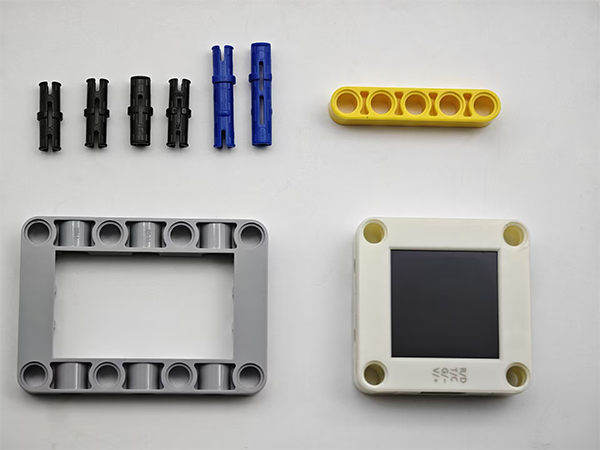
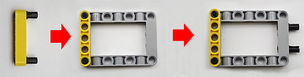
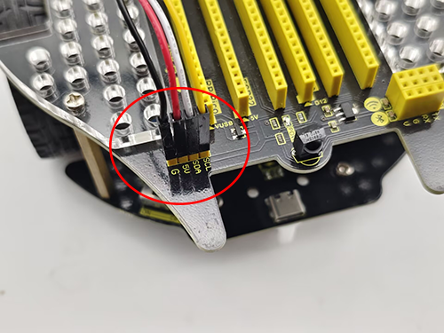
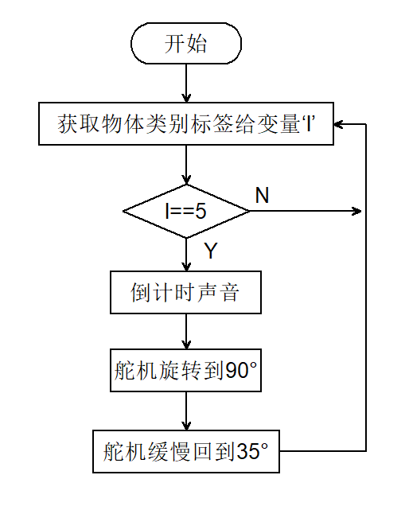

# 5.6 智能投石车

## 5.6.1 简介

使用AI视觉模块搭配小车的投石攻城车造型，制作出有趣的自动识别投石器，先将AI视觉模块固定到投石器小车上，然后使用AI模块进行识别如果识别到了瓶子就蜂鸣器开始倒计时3声然后投掷，投掷结束后缓慢落下投掷臂等待下一次识别到瓶子后投掷。

## 5.6.2 将AI模块安装到投石小车上

<p style="color:red;font-size:25px;">注意：你需要先按照小车教程将`投石攻城车`的乐高搭建好，然后再按照下方的安装教程进行安装。</p>

**所需配件**



**步骤1：**



**步骤2：**


**步骤3：**


**步骤4：**

|  AI视觉模块  | 小车接口 |
| :----------: | :------: |
| T/C (黄色线) |   SCL    |
| R/D (白色线) |   SDA    |
| V/+ (红色线) |    5V    |
| G/- (黑色线) |    G     |



**完整展示：**


## 5.6.3 流程图



## 5.6.4 代码

```c
// 引入 Arduino 核心库
#include <Arduino.h>
// 引入 Sentry 视觉传感器库
#include <Sentry.h>
//引入 Servo 舵机控制库
#include <Servo.h>

Servo servo; //创建伺服对象以控制伺服系统

#define BUZZER_PIN 3 //蜂鸣器引脚

// 定义 Sengo2 类型的别名（简化使用）
typedef Sengo2 Sengo;

// 选择通信方式（当前启用 I2C）
#define SENGO_I2C
// #define SENGO_UART  // UART 方式被注释掉

// 根据选择的通信方式包含相应库
#ifdef SENGO_I2C
#include <Wire.h>  // I2C 通信库
#endif
#ifdef SENGO_UART
#include <SoftwareSerial.h>
#define TX_PIN 11  // 软件串口发送引脚
#define RX_PIN 10  // 软件串口接收引脚
SoftwareSerial mySerial(RX_PIN, TX_PIN);  // 创建软件串口对象
#endif

// 设置视觉识别类型为 20 类物体识别
#define VISION_TYPE Sengo::kVision20Classes
Sengo sengo;  // 创建 Sentry 传感器对象

// 全局状态变量
unsigned long lastDetectionTime = 0;        // 最后检测到瓶子的时间戳
const unsigned long disappearDelay = 2000;  // 投掷间歇时间
bool currentBottleDetected = false;  // 是否检测到瓶子

// 初始化设置（Arduino 启动时执行一次）
void setup() {
    sentry_err_t err = SENTRY_OK;  // 错误状态变量

    Serial.begin(9600);  // 初始化串口通信（用于调试输出）
    Serial.println("Waiting for sengo initialize...");

    // I2C 初始化流程
#ifdef SENGO_I2C
    Wire.begin();  // 初始化 I2C 总线
    // 循环等待传感器初始化成功
    while (SENTRY_OK != sengo.begin(&Wire)) { 
        yield();  // 在等待期间让出 CPU 控制权
    }
#endif

    // UART 初始化流程（当前未启用）
#ifdef SENGO_UART
    mySerial.begin(9600);
    while (SENTRY_OK != sengo.begin(&mySerial)) { 
        yield();
    }
#endif

    Serial.println("Sengo begin Success.");

    // 启动视觉识别功能（20 类物体检测）
    err = sengo.VisionBegin(VISION_TYPE);
    
    // 打印初始化结果
    Serial.print("sengo.VisionBegin(kVision20Classes) ");
    if (err) {
        Serial.print("Error: 0x");
    } else {
        Serial.print("Success: 0x");
    }
    Serial.println(err, HEX);  // 十六进制输出错误码

    servo.attach(A0);
    servo.write(35);

    pinMode(BUZZER_PIN,OUTPUT);
}

// 主循环（重复执行）
void loop() {
    // 获取检测到的物体数量（kStatus 表示查询状态）
    int obj_num = sengo.GetValue(VISION_TYPE, kStatus);
    unsigned long currentMillis = millis();

    
    if (obj_num) {  // 如果检测到物体
        Serial.print("Totally ");
        Serial.print(obj_num);
        Serial.println(" objects");
        
        // 遍历所有检测到的物体
        for (int i = 1; i <= obj_num; ++i) {
            // 获取物体类别标签
            int l = sengo.GetValue(VISION_TYPE, kLabel, i);  // 物体类别标签索引
            if(l == 5 && !currentBottleDetected){
            lastDetectionTime = currentMillis;  // 更新最后检测时间
              //投掷倒计时声音
              countdown(3);
              //投掷
              servo.write(90);
              delay(1000);
              //缓慢回落
              for(int j = 90;j > 35;j--){
                servo.write(j);
                delay(15);
              }
              // servo.write(35);
              delay(500);
            }
        }
    }
    if((currentMillis - lastDetectionTime) > disappearDelay){
      currentBottleDetected = false; 
    }
}

void countdown(int seconds) {
  for (int i = seconds; i > 0; i--) {
    // 倒计时滴答声
    tone(BUZZER_PIN, 800, 100);
    delay(200);
    noTone(BUZZER_PIN);

    // 间隔时间
    delay(800);
  }
}
```

## 5.6.5 代码结果

上传代码成功后，AI视觉模块会开启“20类物体”模式然后对拍到的画面进行识别，判断是否有检测到瓶子，如果有则进行投掷，投掷前会有三声倒计时提示音倒计时结束就会进行投掷，投掷完成后投掷臂会慢慢的回落等待下一次投掷。
