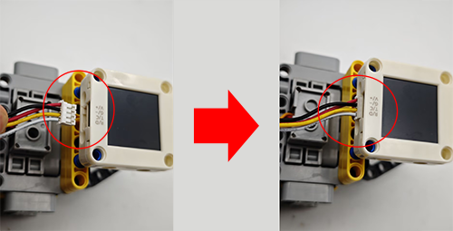
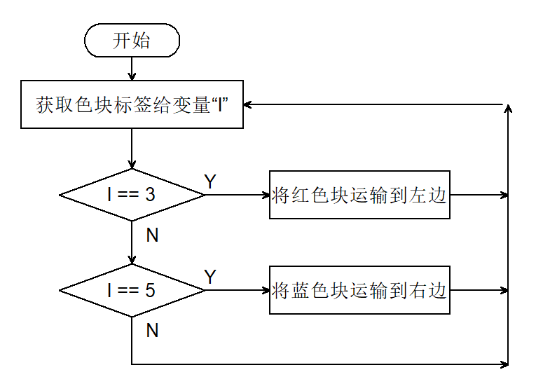

# 5.7 红蓝颜色分拣车

## 5.7.1 简介

使用AI视觉模块搭配小车的足球机器人造型，制作出有趣的色块分拣机器人，先将AI视觉模块固定到足球机器人小车上，然后使用AI模块进行识别，如果识别到了红色块就运输到左边然后原路返回原位，如果识别到蓝色则运输到右边再原路返回到原位。

## 5.7.2 将AI模块安装到足球小车上

<p style="color:red;font-size:25px;">注意：你需要先按照小车教程将`足球机器人`的乐高搭建好，然后再按照下方的安装教程进行安装。</p>

 **所需配件：**


**步骤1：**


**步骤2：**


**步骤3：**


**步骤4：**


**步骤5：**



**步骤6：**

|  AI视觉模块  | 小车接口 |
| :----------: | :------: |
| T/C (黄色线) |   SCL    |
| R/D (白色线) |   SDA    |
| V/+ (红色线) |    5V    |
| G/- (黑色线) |    G     |


**完整展示：**


## 5.7.3 流程图



## 5.7.4 代码

```c
#include <Arduino.h>
#include <Sentry.h>  // 引入Sentry机器视觉传感器库
#include <Servo.h>   //引入Servo舵机控制库

Servo servo;  //创建伺服对象以控制伺服系统

typedef Sengo2 Sengo;  // 为Sengo2类型创建别名Sengo，简化后续使用

// 通信方式选择（当前启用I2C）
#define SENGO_I2C
// #define SENGO_UART   // UART备用选项（已注释）

#ifdef SENGO_I2C
#include <Wire.h>  // I2C通信所需的库
#endif

#ifdef SENGO_UART
#include <SoftwareSerial.h>
#define TX_PIN 11                         // 自定义TX引脚
#define RX_PIN 10                         // 自定义RX引脚
SoftwareSerial mySerial(RX_PIN, TX_PIN);  // 创建软串口对象
#endif

#define VISION_TYPE Sengo::kVisionBlob  // 使用Blob检测（色块识别）
Sengo sengo;                            // 创建Sengo传感器对象

//电机驱动引脚
#define ML 4
#define ML_PWM 6
#define MR 2
#define MR_PWM 5


void setup() {
  sentry_err_t err = SENTRY_OK;  // 错误状态变量

  Serial.begin(9600);  // 初始化串口用于调试输出
  Serial.println("Waiting for sengo initialize...");

// 根据选择的通信方式初始化传感器
#ifdef SENGO_I2C
  Wire.begin();  // 初始化I2C总线
  // 持续尝试连接直到成功
  while (SENTRY_OK != sengo.begin(&Wire)) {
    yield();  // 在等待时允许其他任务运行
  }
#endif

#ifdef SENGO_UART
  mySerial.begin(9600);
  while (SENTRY_OK != sengo.begin(&mySerial)) {
    yield();
  }
#endif

  Serial.println("Sengo begin Success.");

  // ============== Blob检测参数配置 ==============
  sengo.SetParamNum(VISION_TYPE, 2);  // 设置检测2种颜色的色块

  sentry_object_t param = { 0 };  // 初始化参数结构体

  /* 设置色块最小检测尺寸（像素）*/
  param.width = 50;   // 最小宽度50像素
  param.height = 50;  // 最小高度50像素

  /* 配置第一个色块（红色）*/
  param.label = Sengo::kColorRed;                // 设置颜色标签为红色
  err = sengo.SetParam(VISION_TYPE, &param, 1);  // 应用到参数1

  if (err) {
    Serial.print("] Error: 0x");
  } else {
    Serial.print("] Success: 0x");
  }
  Serial.println(err, HEX);  // 输出16进制状态码

  /* 配置第二个色块（蓝色）*/
  param.label = Sengo::kColorBlue;               // 设置颜色标签为蓝色
  err = sengo.SetParam(VISION_TYPE, &param, 2);  // 应用到参数2

  if (err) {
    Serial.print("] Error: 0x");
  } else {
    Serial.print("] Success: 0x");
  }
  Serial.println(err, HEX);

  /* 设置每种颜色的最大检测数量 */
  err = sengo.VisionSetMode(VISION_TYPE, 1);  // 最多检测1个色块
  Serial.print("sengo.VisionSetMode");
  if (err) {
    Serial.print(" Error: 0x");
  } else {
    Serial.print(" Success: 0x");
  }
  Serial.println(err, HEX);

  // 启动Blob视觉识别
  err = sengo.VisionBegin(VISION_TYPE);
  Serial.print("sengo.VisionBegin(kVisionBlob) ");
  if (err) {
    Serial.print("Error: 0x");
  } else {
    Serial.print("Success: 0x");
  }
  Serial.println(err, HEX);

  servo.attach(A0);
  servo.write(160);

  pinMode(ML, OUTPUT);      //设置左电机方向控制引脚为输出
  pinMode(ML_PWM, OUTPUT);  //设置左电机方向控制引脚为输出
  pinMode(MR, OUTPUT);      //设置左电机方向控制引脚为输出
  pinMode(MR_PWM, OUTPUT);  //设置左电机方向控制引脚为输出
}

void loop() {
  // 读取检测到的物体总数
  int obj_num = sengo.GetValue(VISION_TYPE, kStatus);

  if (obj_num > 0) {  // 如果检测到物体
    // 遍历所有检测到的色块
    for (int i = 1; i <= obj_num; ++i) {
      int l = sengo.GetValue(VISION_TYPE, kLabel, i);  // 颜色标签
      if (l == 3) {
        sorting(l);
      } else if (l == 5) {
        sorting(1);
      } else car_stop();
    }
  } else car_stop();
}


//色块分拣代码（目的减少重复代码量）
void sorting(int val) {
  //抓住色块
  servo.write(180);
  delay(500);
  //用if区分红色块和蓝色块的分拣方向
  if (val == 3) {
    //左转
    car_left();
  } else {
    //右转
    car_right();
  }
  delay(300);
  //前进
  car_forward();
  delay(300);
  car_stop();
  delay(300);
  //松开色块
  servo.write(160);
  delay(300);
  //后退
  car_back();
  delay(300);
  //用if区分红色块和蓝色块的返回方向
  if (val == 3) {
    //右转
    car_right();
  } else {
    //左转
    car_left();
  }
  delay(300);
}


//小车前进代码
void car_forward() {
  digitalWrite(ML, LOW);
  analogWrite(ML_PWM, 100);
  digitalWrite(MR, LOW);
  analogWrite(MR_PWM, 100);
}

//小车后退代码
void car_back() {
  digitalWrite(ML, HIGH);
  analogWrite(ML_PWM, 150);
  digitalWrite(MR, HIGH);
  analogWrite(MR_PWM, 150);
}

//小车左转代码
void car_left() {
  digitalWrite(ML, HIGH);
  analogWrite(ML_PWM, 155);
  digitalWrite(MR, LOW);
  analogWrite(MR_PWM, 100);
}

//小车右转代码
void car_right() {
  digitalWrite(ML, LOW);
  analogWrite(ML_PWM, 100);
  digitalWrite(MR, HIGH);
  analogWrite(MR_PWM, 155);
}

//小车停止代码
void car_stop() {
  digitalWrite(ML, LOW);
  analogWrite(ML_PWM, 0);
  digitalWrite(MR, LOW);
  analogWrite(MR_PWM, 0);
}

```

## 5.7.5 代码结果

上传代码成功后，AI视觉模块会进入“色块检测”功能对拍到的画面进行识别，判断是否有红色块或蓝色块，如果检测到红色块小车会夹住红色快然后将它送到小车的左边然后小车会原路返回到原位。如果检测到蓝色块小车会夹住蓝色块然后将它送到小车的右边然后小车会原路返回到原位。（返回到原位时位置稍有偏差，因为他是通过行驶的时间设置的）

注意：代码中有设置色块最小尺寸，如果你的色块识别后的尺寸比这个小将不会被识别，你可以修改下方代码的尺寸进行识别。

```c
  /* 设置色块最小检测尺寸（像素）*/
  param.width = 50;   // 最小宽度50像素
  param.height = 50;  // 最小高度50像素
```

