# 2.1 Windows系统驱动安装

将主板连接到电脑（如图）；

打开 “ 设备管理器 ” 。

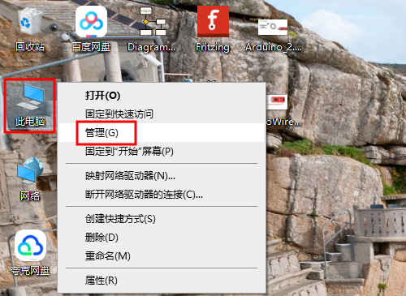

如下图所示，电脑自动安装了驱动就可以跳过此教程。

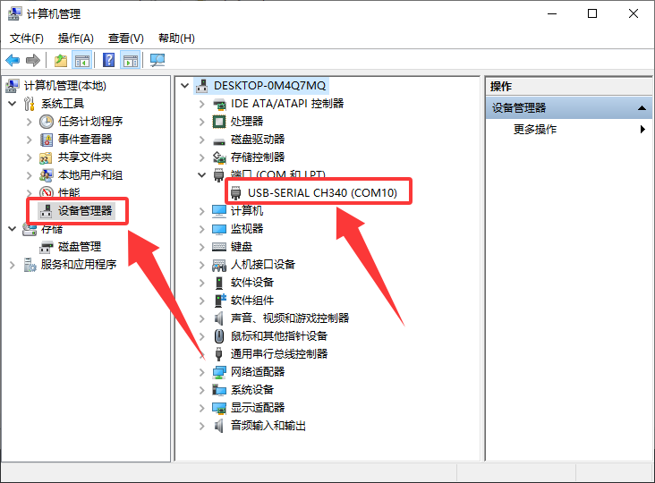

如下图所示，电脑没有自动安装驱动，需要手动安装。

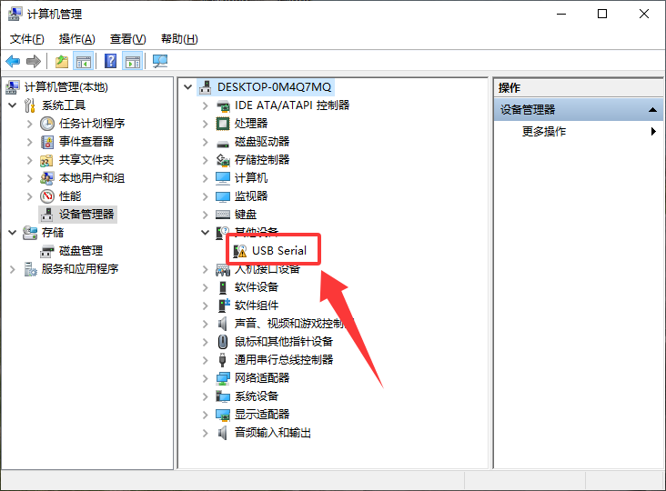

1、下载驱动后解压。

Windows系统驱动下载：[Windows驱动](./Windows.7z)

下载成功后解压文件。

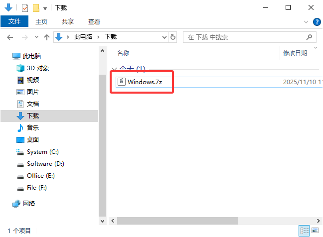

2、打开解压后的文件夹，点击 “ SETUP ” 。

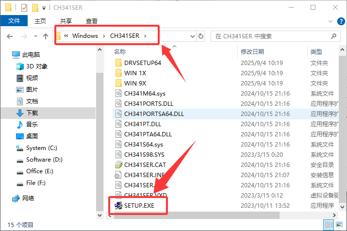

3、然后会有一个弹窗点击 “ 是 ” 。

4、点击 “ 安装” 。

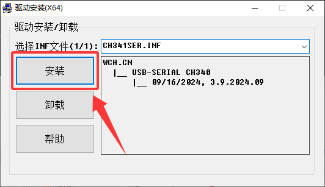

5、安装将成功。

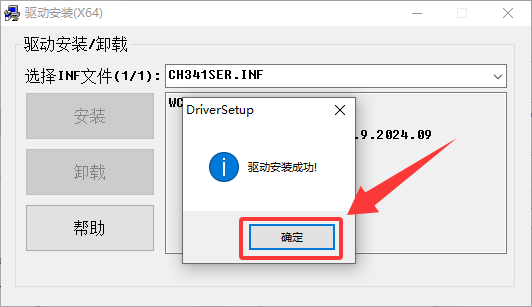

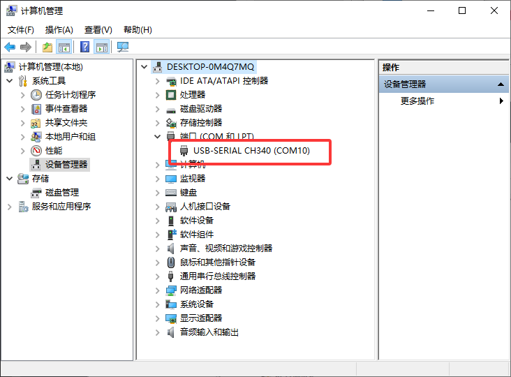

# 2.2 Mac系统驱动安装

Mac系统驱动下载：[Mac驱动](./Mac.7z)

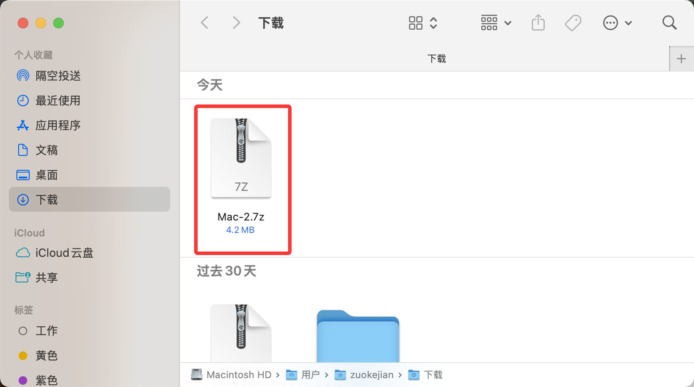

1、下载驱动后解压，点击后缀为 “**.pkg**” 文件。

2、点击 “**继续**”。

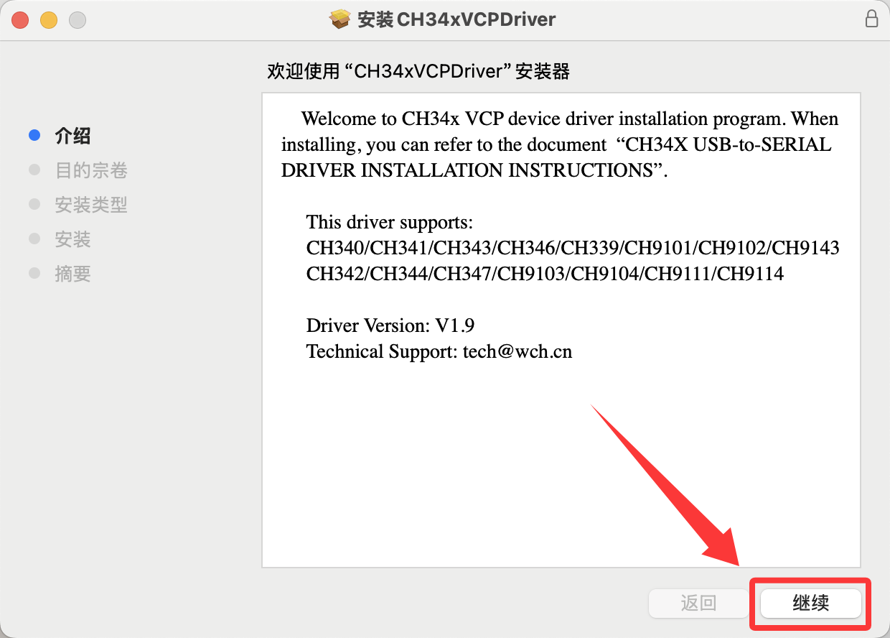

3、点击 “**安装**”。

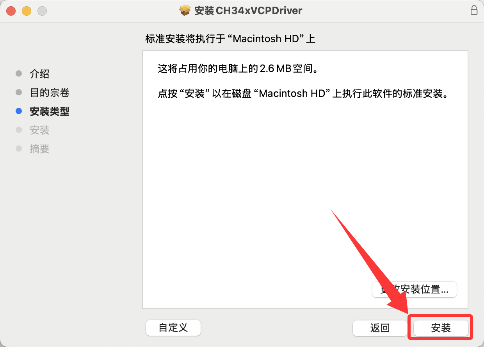

4、输入你的电脑用户名与密码，然后点击 “**安装软件**”，等待安装。

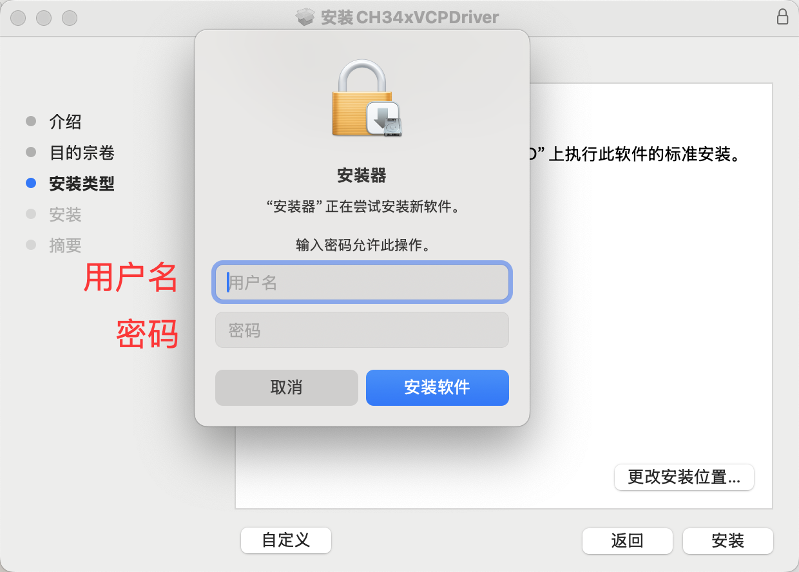

5、安装完成。

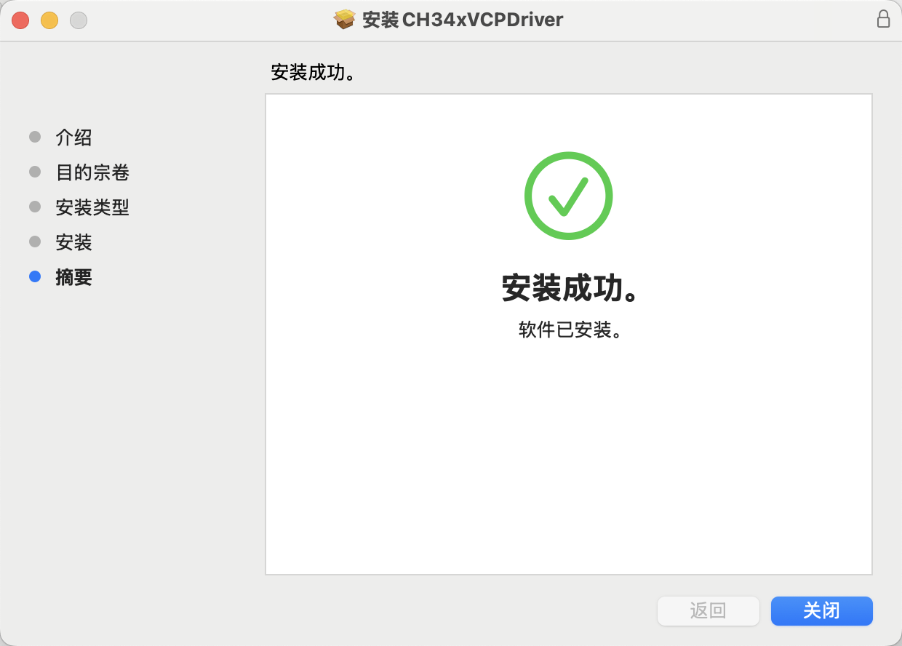

