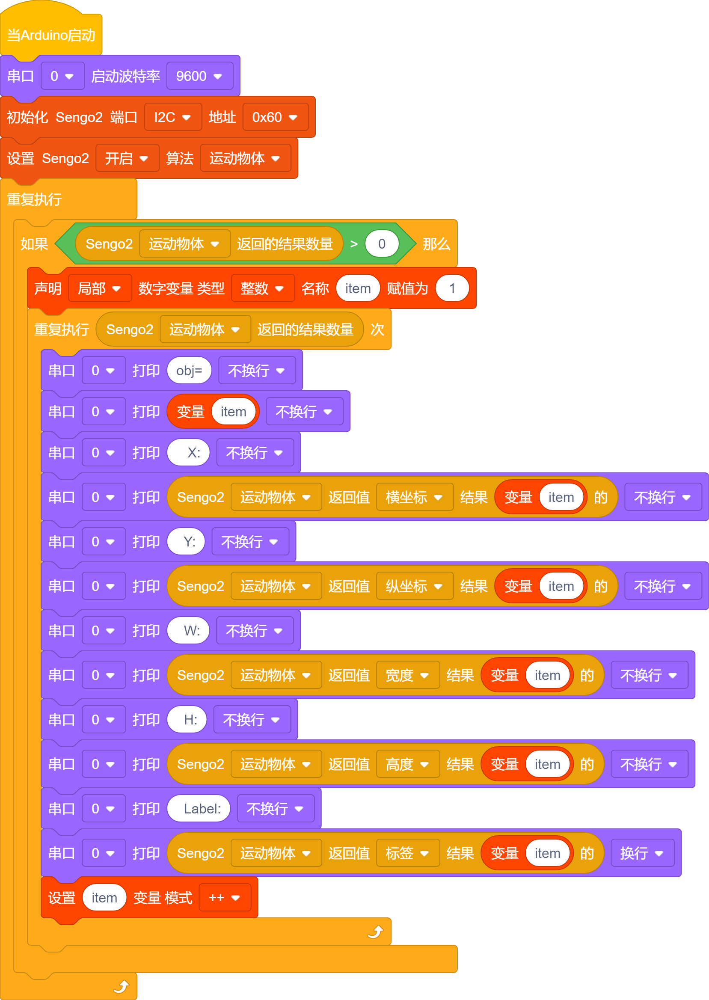
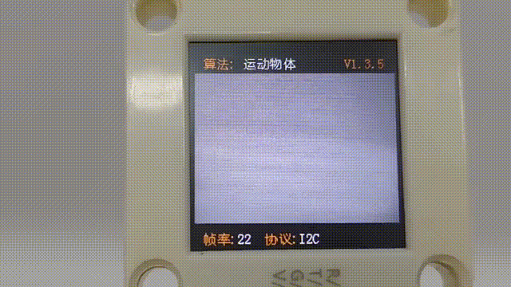
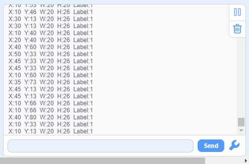

# 4.10 运动物体检测

## 4.10.1 算法简介

Sengo2静止不动，算法通过对比相邻帧的像素差异，来判断图像中是否有发生变化的区域，如果有则认为视野内存在运动物体，返回该区域的坐标信息。 算法只返回一个检测结果。

----------------

## 4.10.3 代码

1. 在代码启动中设置串口波特率为`9600`，然后设置AI视觉模块的通信方式为`I2C`，再设置AI视觉模块运行`运动物体`模式

2. 使用判断模块对检测数量进行判断，只有检测数量大于0时才进行运动物体的坐标与大小宽度高度值的输出，注意选择的是`运动物体`

-----

## 4.10.4 代码结果

上传代码后，AI视觉模块将会对摄像头拍到的地方进行识别，如果有识别到有物体在运动则会进行捕捉并且会在串口监视器中打印识别到的运动物体的在屏幕中显示的位置xy坐标以及宽度和高度。

## 4.10.5 扩展玩法

**动态感应灯**

- **玩法简介：** 将模块对准房间门口或走廊。当检测到有较大范围的运动（有人经过）时，自动点亮LED灯，并延时熄灭，实现“人来灯亮，人走灯灭”。
- **实现：** 编程持续检测运动物体。一旦检测到，则触发数字引脚输出高电平，控制继电器或MOS管点亮灯带。