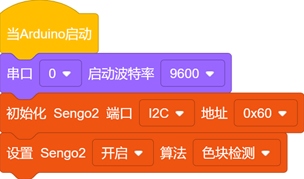
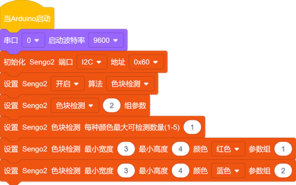
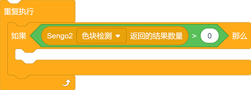
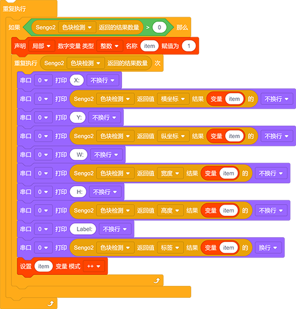
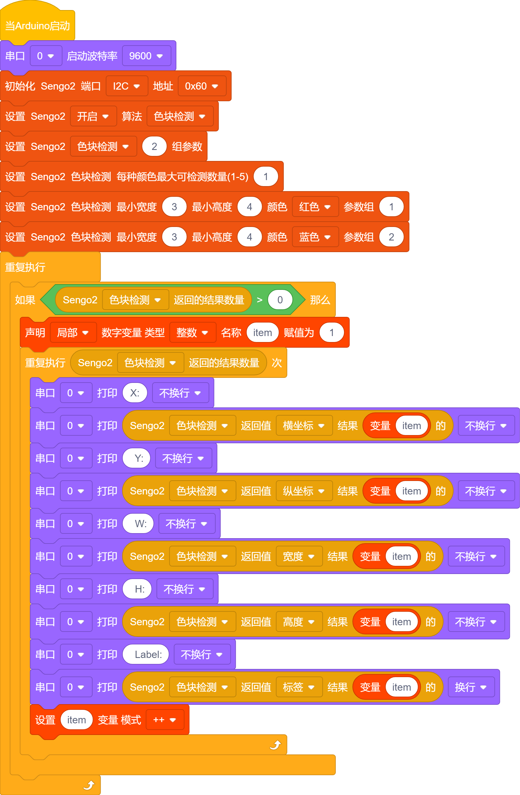

# 4.2 色块检测

## 4.2.1 算法简介

指定某种或多种颜色进行检测，判断图像中是否有这些颜色的色块，如果有则返回其坐标和大小，颜色分类标签与颜色识别中的定义相同。

颜色分类标签：

| 标签值 | 含义 | 标签值 | 含义 |
| :----: | :--: | :----: | :--: |
|   1    | 黑色 |   2    | 白色 |
|   3    | 红色 |   4    | 绿色 |
|   5    | 蓝色 |   6    | 黄色 |
|   0    | 未知 |        |      |

---------------------------

## 4.2.2 代码块介绍

1. 块，用于设置AI视觉模块对色块检测数量的，最少每种颜色检测1个最多每种颜色检测5个

| 模式 |            含义             |
| :--: | :-------------------------: |
|  1   | 每种颜色最多同时检测1个色块 |
|  2   | 每种颜色最多同时检测2个色块 |
|  3   | 每种颜色最多同时检测3个色块 |
|  4   | 每种颜色最多同时检测4个色块 |
|  5   | 每种颜色最多同时检测5个色块 |

2. 块，用于设置检测色块的最小大小是多大以及设置检测的颜色与参数组

3. 块，用于返回检测到物体的现在再屏幕上的位置（y，z)以及大小（w，h)还有一个就是标签，`结果`后面的参数是用来设置输出对应参数组的

|  形参   |      含义       |
| :-----: | :-------------: |
| x-coord | 色块中心横坐标x |
| y-coord | 色块中心纵坐标y |
|  width  |    色块宽度w    |
| height  |    色块高度h    |
|  Libel  |  颜色分类标签   |

4. 块，用于判断`色块检测`的颜色块的，搭配判断模块使用

---------------------

## 4.2.3 代码

1. 在代码启动中设置串口波特率为`9600`，然后设置AI视觉模块的通信方式为`I2C`，再设置AI视觉模块运行`色块检测`模式

2. 设置参宿组为2（示例代码中只识别了两种颜色），再设置每种颜色识别的数量为1个， 再设置识别色块的尺寸最小值以及识别的颜色与参数组号

3. 使用判断模块对检测数量进行判断，只有检测数量大于0时才进行色块数据的输出，注意选择的是`色块检测`

4. 利用结果数量进行循环，当检测到两个颜色块就会循环两次然后再参数组上使用变量每次循环打印后变量加一，这样就能将两个色块的数据进行打印输出了

**完整代码：**

----------------------------

## 4.2.4 代码结果

上传代码后，AI视觉模块将会对摄像头拍到的地方进行分析如果有红色块和蓝色块就会进行框选标记，并且再串口监视器中打印色块再屏幕中的位置坐标xy与宽度高度还有颜色标签值。

## 4.2.5 扩展玩法

**智能分拣助手**

- **玩法简介：** 让识别模块区分不同颜色和形状的积木（如红色方块、蓝色圆形），并通过控制两个不同的舵机，将不同的积木推入对应的收集盒。
- **实现：** 编程设定识别目标为“红色圆形”和“蓝色方块”。识别到目标A，则舵机A动作；识别到目标B，则舵机B动作。专注于色块的**形状**和**颜色**双重属性。