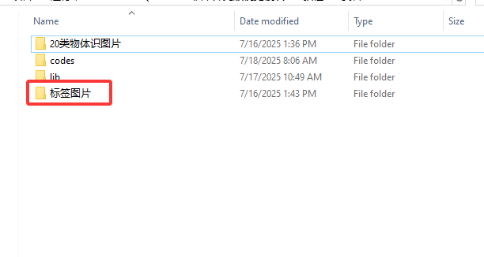
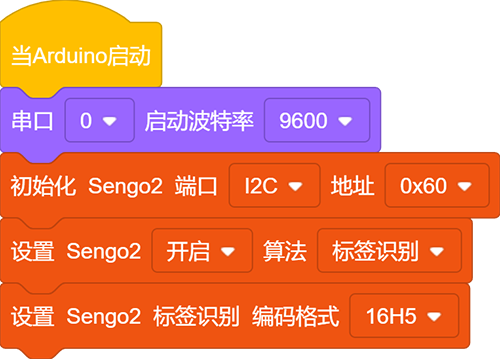
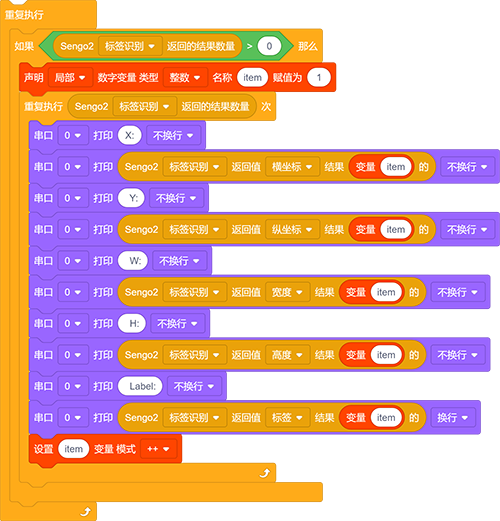
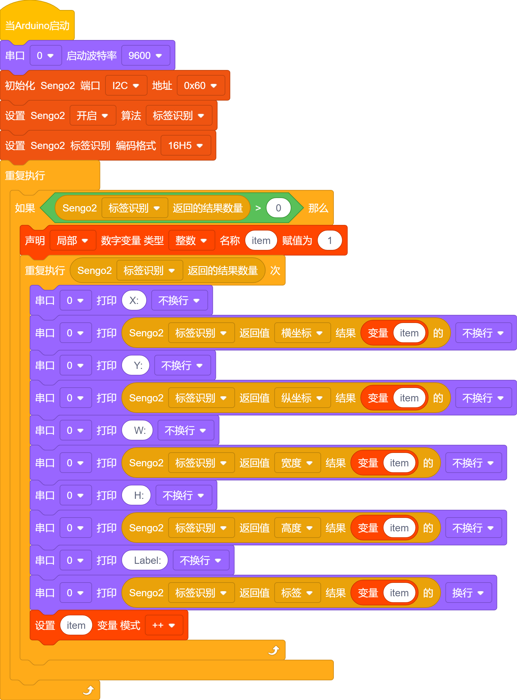
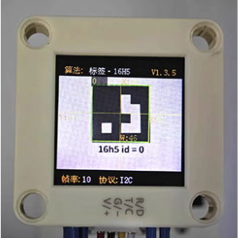
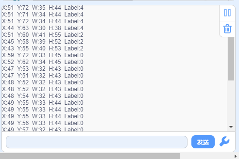

# 4.3 标签识别

## 4.3.1 算法简介

判断图像中是否有Apriltag标签， 支持16H5、25H9、36H11三种编码。算法运行时需要先选定一种编码格式，默认为36H11。不同编码的 Apriltag无法同时检测，但可以同时识别多达 25个相同编码的标签。

----------

## 4.3.2 分类标签

Apriltag标签为一组已经定义好的黑白方块图案，不同编码形式使用的方块数量是不同的。每个图案都有一个预定义的分类标签值，识别后会返回该值。

标签图片存放位置：

标签识别状态：

## 4.3.3 代码块介绍

1. 块，用于设置标签的类型，有`36H11`,`25H9`,`16H5`教程中使用的都是`16H5`我们也提供了一些16h5的标签卡片。

----------

## 4.3.5 使用技巧

1. 算法返回的标签宽度值与高度值比较稳定，可以利用这一点进行距离判断，标签旋转后不会改变其大小，但倾斜时可能会有影响

2. 标签越大，识别的距离就越远

## 4.3.6 代码

1. 在代码启动中设置串口波特率为`9600`，然后设置AI视觉模块的通信方式为`I2C`，再设置AI视觉模块运行`标签识别`模式
2. 设置识别的标签类型为`16H5`

3. 使用判断模块对检测数量进行判断，只有检测数量大于0时才进行标签卡片数据的输出，注意选择的是`标签识别`
4. 利用结果数量进行循环，当检测到多个标签时就会循环多次然后再参数组上使用变量每次循环打印后变量加一，这样就能将多个标签的数据进行打印输出了（注意：设置好返回数据的功能模式是“标签识别”）

**完整代码：**

-----------

## 4.3.7 代码结果

上传代码后，AI视觉模块将会对摄像头拍到的地方进行识别如果有16H5标签则会被他捕捉并识别，然后通过串口监视器进行打印标签在屏幕上显示的位置xy与宽度高度以及标签代表的值。

## 4.3.8 扩展玩法

**标签指令卡片**

- **玩法简介：** 将标签对应0-4对应到一个动作，如舵机旋转90度或者小车前进等操作。
- **实现：** 开发板读取标签的ID序列，通过对标签ID序列的判断从而执行对应的操作。