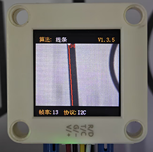
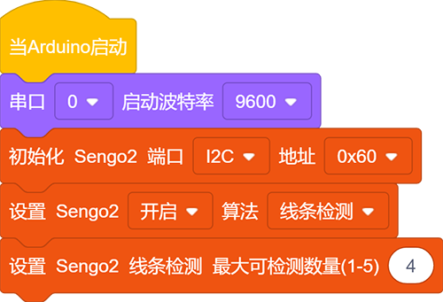
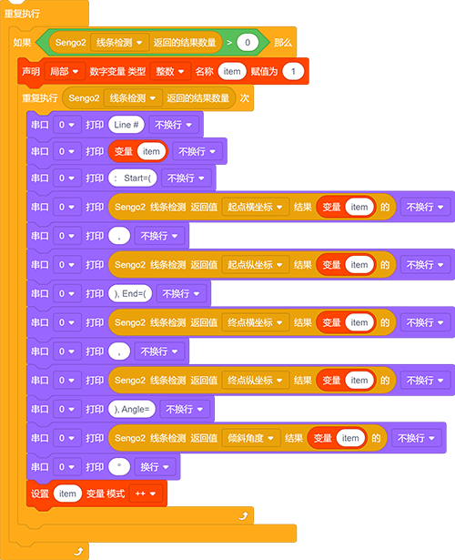
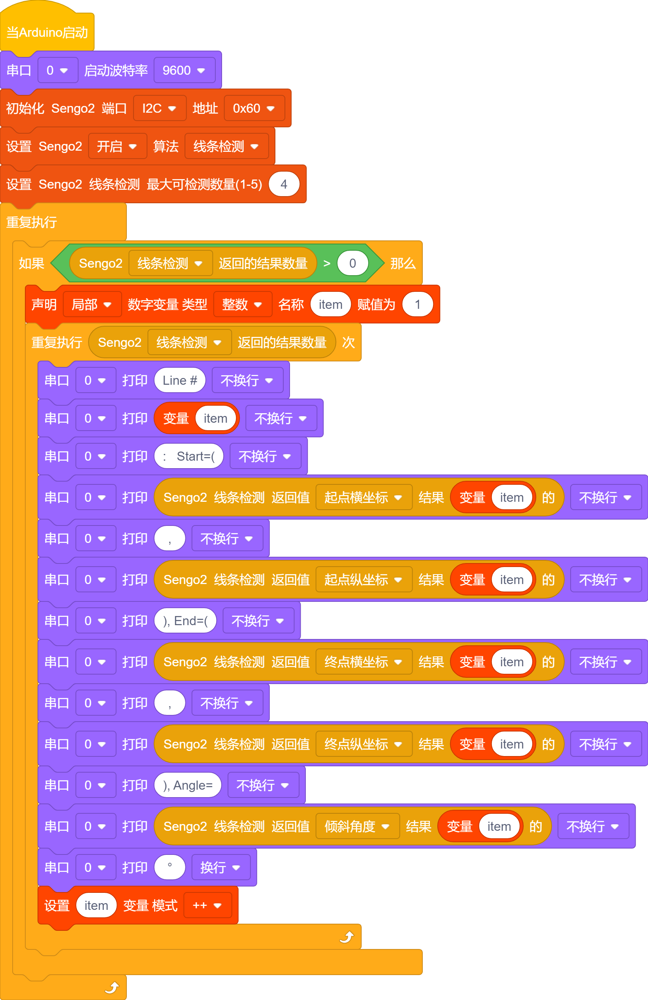
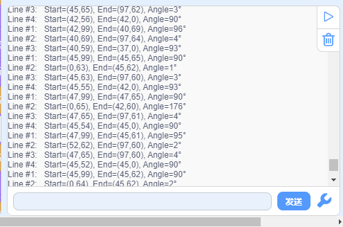

# 4.4 线条检测

## 4.4.1 算法简介

判断图像中是否有线段，如果有则会返回线段两个端点的坐标以及倾斜角度，如果线段为曲线，则返回由起点与终点相连所形成的直线的角度。

-----------

## 4.4.2 代码块介绍

1. 块，用于设置检测的线条数量，最少是1条最多是5条。

注意：显示屏上的线第一根线是红色，第二个线是黄色，第三根是绿色，第四根是蓝色，第五根是紫色。

2. 块，用于返回线条的数据。

|    参数    |          含义           |
| :--------: | :---------------------: |
| 终点横坐标 | 线段终点（远端）横坐标x |
| 终点纵坐标 | 线段终点（远端）纵坐标y |
| 起点横坐标 | 线段起点（近端）横坐标x |
| 起点纵坐标 | 线段起点（近端）纵坐标y |
|  倾斜角度  |     线段的倾斜角度      |

注意：倾斜角逆时针增大，线段水平向右时其倾斜角为0°，线段垂直向上时其倾斜角为90°，线段水平向左时其倾斜角为 180°。算法不会向下检测输出角度。

---------------

## 4.4.3 使用技巧

1. 请勿使用表面光滑的地图，避免反光导致检测失败；
2. 背景与线条边界应清晰分明，颜色差异明显，譬如白底黑线；
3. 背景尽量简单，颜色单一；如果背景杂乱，则可能会检测背景中的线条；
4. 线条粗细应适中，过细或过宽均影响检测；
5. 巡线时，第一条线段始终为屏幕下方最先检测到的线段；

--------------

## 4.4.4 代码

1. 在代码启动中设置串口波特率为`9600`，然后设置AI视觉模块的通信方式为`I2C`，再设置AI视觉模块运行`线条检测`模式
2. 设置识别线条的数量，我们设置为4条

3. 使用判断模块对检测数量进行判断，只有检测数量大于0时才进行线条数据的输出，注意选择的是`线条检测`
4. 利用结果数量进行循环，当检测到多条线条时就会循环多次然后再参数组上使用变量每次循环打印后变量加一，这样就能将多个条线条的数据进行打印输出了（注意：设置好返回数据的功能模式是`线条检测`）

**完整代码：**

--------------------

## 4.4.5 代码结果

上传代码后，AI视觉模块将会对摄像头拍到的地方进行分析如果有线条就会进行识别，并且在串口监视器中打印线条的起始和结束坐标以及角度（角度的判别是垂直线是90度，水平垂直线是180度）。

## 4.4.7 扩展玩法

**区分三角形与矩形**

- **玩法简介：** 使用打印机将三角形与矩形打印到A4纸上线条要粗一些，然后使用线条检查功能对进行检测如果检测到三条线就是三角形，如果检测到4条线就是矩形。
- **实现：** 开发板读取识别的线条数量，然后对线条数量进行判断，线条数量为3则为三角形，线条数量为4则为矩形。