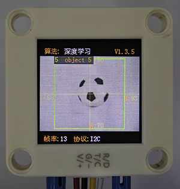
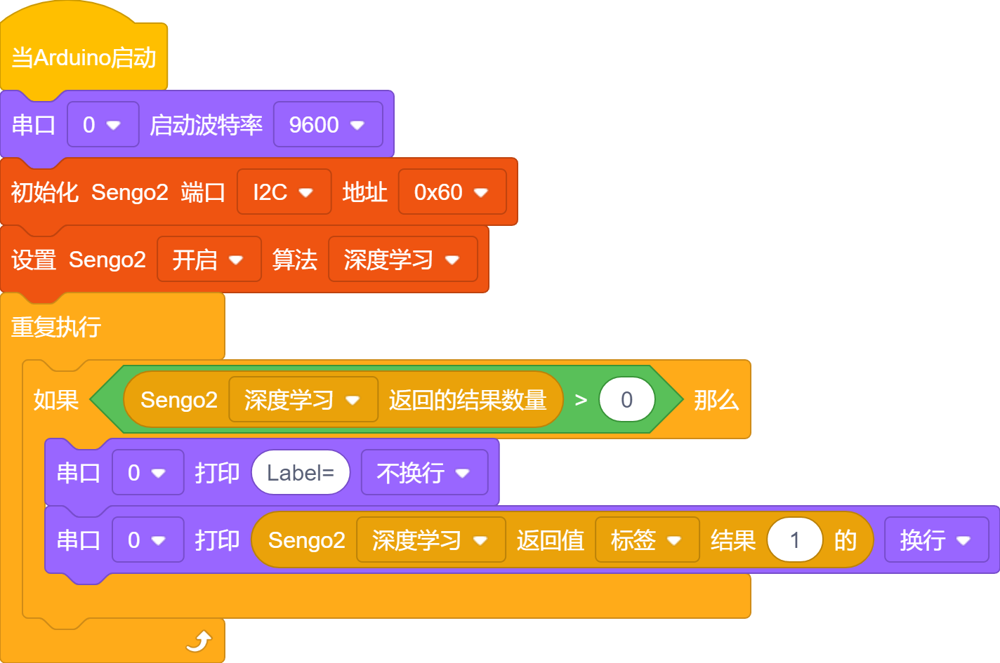
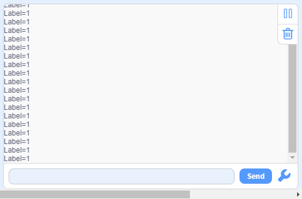

# 4.5 深度学习

## 4.5.1 算法简介

可以对任意物体进行离线学习存储并识别，可存储15个物体，已存储的数据可以全部或者单独进行删除。该算法只能对物体进行分类，无法检测物体的方位及大小。

-------------------------

## 4.5.2 分类标签

| 分类标签值 |     含义     |
| :--------: | :----------: |
|    1-15    | 物体分类编号 |

----------

## 4.5.3 保存数据

开启深度学习算法后，将摄像头正对目标物体，按下功能按键约5秒后松开，Sengo2开始学习，目标物体的数据会被存储并分配一个ID编号（注意：最多存储15个。）。

编号即标签值的分配原则：当前可用编号中最小的号。如果无空余编号，则Sengo2会提示存储失败。

---------

## 4.5.4 删除数据

执行完毕学习操作后，按下功能按键约10秒后松开，即可删除刚存储的数据；再次按下10秒后，则会清空全部的存储数据。若算法开启后未执行过学习操作，则下功能按键10秒后会直接清空全部的存储数据。

-------

## 4.5.5 代码块介绍

1. 块，用于删除与存储学习到的物体，上电时会删除旧的存储然后进行新的识别（不建议使用，手动存储即可)
2. 注意再`深度学习`模式下块只有`标签`模式数据可用

-------

## 4.5.6 使用技巧

1. 对于某些应用，譬如需要在较长距离内识别同一物体，或者在固定的位置识别不同角度下的同一物体（例如卡片旋转了90° 180°），解决方案：在不同距离下或者不同角度下对该物体进行学习并存储为ID1、ID2...识别时，如果返回的标签值为上述编号之一，即可认定为同一物体。
2. 学习物体时与识别物体时的背景（包含光照条件）如果存在差异，那么识别效果会受影响。

## 4.5.7 代码

1. 在代码启动中设置串口波特率为`9600`，然后设置AI视觉模块的通信方式为`I2C`，再设置AI视觉模块运行`深度学习`模式

2. 使用判断模块对检测数量进行判断，只有检测数量大于0时才进行物体数据的输出，注意选择的是`深度学习`

3. 直接对`深度学习`模式下的`标签`进行输出

   **完整代码：**

   

----------

## 4.5.8 代码结果

上传代码后，按住AI视觉模块后面的功能按键并保持5秒然后对准白色背景下被识别的物体等待一会学习完毕后就可以对物体进行识别了。

## 4.5.9 扩展玩法

**专属手势识别器**（玩法难度较高）

- **玩法简介：** 不识别常规物体，而是训练它识别你自定义的几种手势（如“竖大拇指”、“OK”、“手掌”。识别到不同手势，控制电灯开关、播放音乐等。

- **实现：** 再背景干净（推荐白色背景）的环境下对手势进行识别并且每个手势需要识别3个这样能更好的识别分辨，代码中将三种一样手势的ID放到用逻辑或进行判断当有一个满足时就执行对应的功能。

- **难点：** 这个玩法对识别手势的背景，环境灯光，手势位置要求都很高需要注意