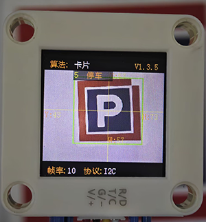
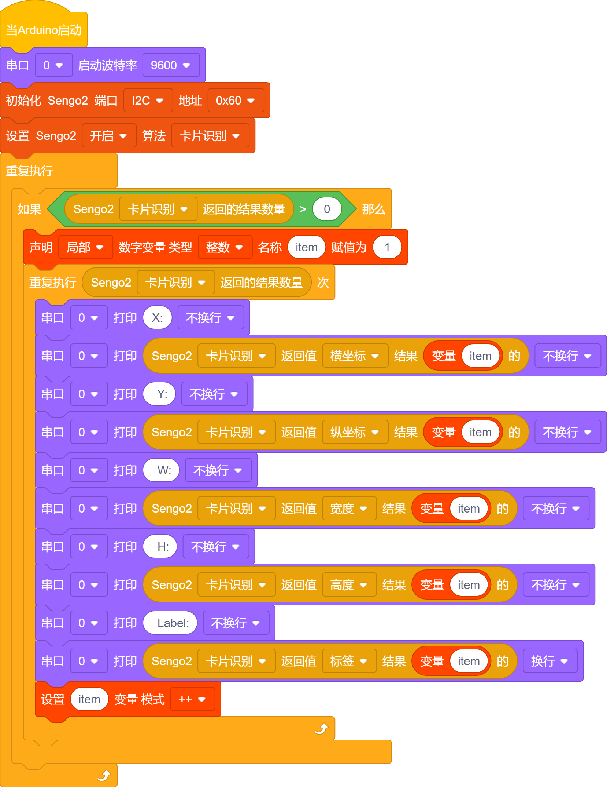
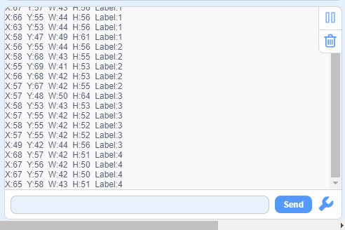

# 4.6 卡片识别

## 4.6.1 算法简介

识别图像中是否有配套的交通卡片，返回卡片的坐标、大小、分类标签等信息。

--------

## 4.6.2 卡片分类标签

| 分类标签 |  含义  |          图片           |
| :------: | :----: | :---------------------: |
|    1     |  前进  |  |
|    2     |  左转  |  |
|    3     |  右转  |  |
|    4     |  掉头  |  |
|    5     |  停车  |  |
|    6     |  绿灯  |  |
|    7     |  红灯  |  |
|    8     | 速度40 |  |
|    9     | 速度60 |  |
|    10    | 速度80 |  |

注意：算法可以同时识别多张卡片。在一定的旋转角、偏转角与俯仰角内卡片仍然可以被识别，使用时请尽量正对卡片以期获得较好的识别效果。

------------

## 4.6.3 代码

1. 在代码启动中设置串口波特率为`9600`，然后设置AI视觉模块的通信方式为`I2C`，再设置AI视觉模块运行`卡片识别`模式

2. 使用判断模块对检测数量进行判断，只有检测数量大于0时才进行卡片数据的输出，注意选择的是`卡片识别`

3. 利用结果数量进行循环，当检测到多张卡片时就会循环多次然后再参数组上使用变量每次循环打印后变量加一，这样就能将多个卡片的数据进行打印输出了（注意：设置好返回数据的功能模式是“卡片识别”）

**完整代码：**

## 4.6.4 代码结果

上传代码后，AI视觉模块将会对摄像头拍到的地方进行分析如果有卡片就会进行识别，并且在串口监视器中打印卡片的x，y坐标与宽度(w)，高度（h）以及卡片的标签值。

## 4.6.5 扩展玩法

**颜色选择器**

- **玩法简介：** 使用卡片的左转右转控制WS2812灯的变化，如灯光正常顺序是：红>绿>蓝>黄>紫等，使用卡片的左转右转可以对灯光进行调节。假如：当前灯光为红色使用右转卡片就会变成绿色，使用左转卡片就会变成紫色以此循环。
- **实现：** 识别到卡片后，对一个变量进行加减就可以实现控制灯光的操作。