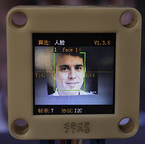
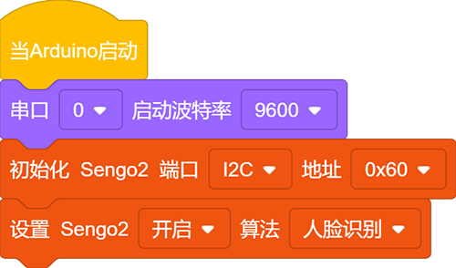
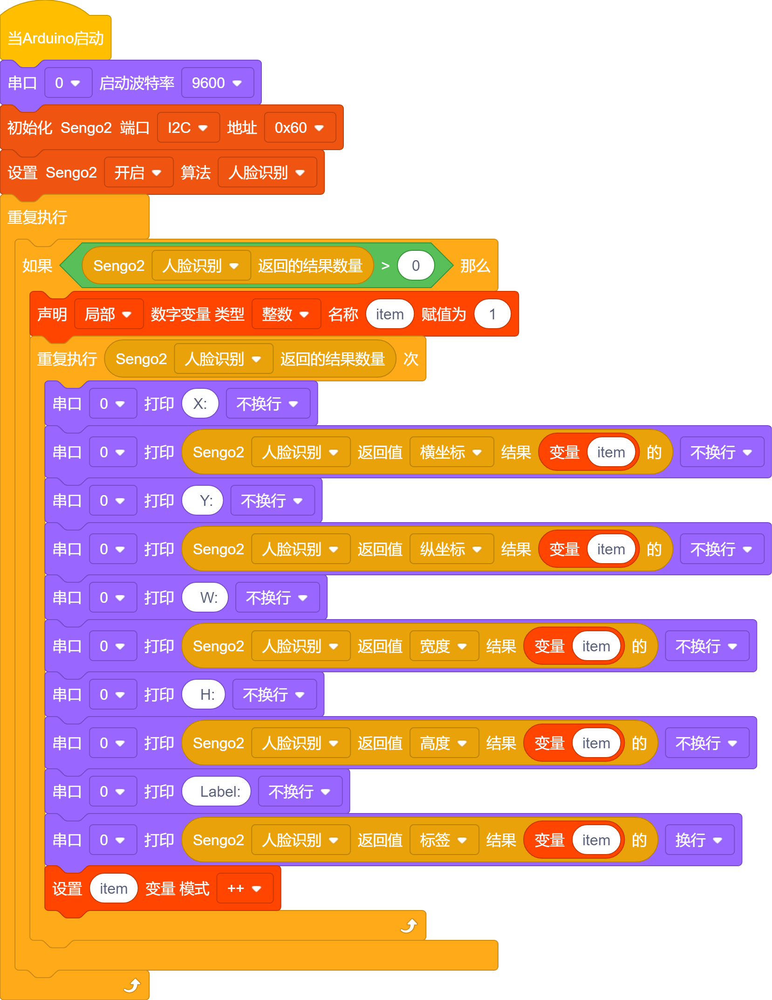
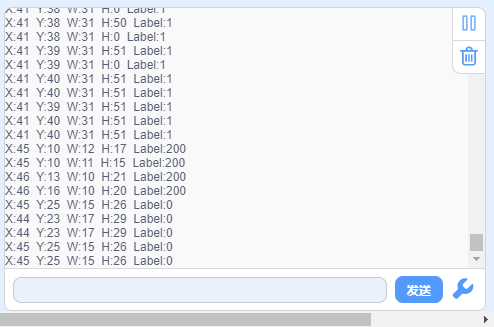

# 4.7 人脸识别

## 4.7.1 算法简介

判断图像中是否有人脸及识别人脸，用户可通过功能按键训练存储或删除人脸数据，Sengo2可以存储15张人脸数据。

-----------------

## 4.7.2 人脸分类标签

Sengo2定义了17个人脸的分类标签：

| 分类标签 |  含义  | 分类标签 |        含义        |
| :------: | :----: | :------: | :----------------: |
|    0     | 新人脸 |   1-15   | 存储的人脸分类编号 |
|   200    | 戴口罩 |          |                    |

新人脸（标签 0）：

戴口罩人脸 （标签 200）：

存储的人脸（标签 1-15）

---------------

## 4.7.3 保存人脸数据

开启人脸识别算法后，将摄像头正对人脸，按下功能按键约5秒后松开，Sengo2开始训练人脸，图像中当前的人脸数据会被存储并分配一个ID编号。

人脸数据的编号即标签值的分配原则：当前可用编号中最小的号。如果无空余编号，则Sengo2会提示保存失败。

----------------

## 4.7.4 删除人脸数据

执行完毕人脸存储操作后，按下功能按键约10秒后松开，即可删除刚存储的人脸数据；再次按下10秒后，则会清空存储的全部人脸数据。若算法开启后未执行过人脸保存操作，则下功能按键10秒后会直接清空全部的人脸数据。

------------------

## 4.7.5 使用技巧

1. 环境光线充足，正对人脸且完整的人脸在视野中较大时识别效果佳
2. 佩戴眼镜或头发遮住面部时，会影响人脸检测效果

----------------

## 4.7.6 代码

1. 在代码启动中设置串口波特率为`9600`，然后设置AI视觉模块的通信方式为`I2C`，再设置AI视觉模块运行`人脸识别`模式

2. 使用判断模块对检测数量进行判断，只有检测数量大于0时才进行人脸数据的输出，注意选择的是`人脸识别`

3. 利用结果数量进行循环，当检测到多个人脸时就会循环多次然后再参数组上使用变量每次循环打印后变量加一，这样就能将多个人脸的数据进行打印输出了（注意：设置好返回数据的功能模式是`人脸识别`）

**完整代码：**

--------------------

## 4.7.7 代码结果

上传代码后，按住AI视觉模块后面的功能按键并保持5秒然后对准人脸等待一会学习完毕后就可以对物体进行识别了，当遇到新的人脸与戴口罩的人脸也是会提示的。

## 4.7.8 扩展玩法

**专注力监测仪**

- **玩法简介：** 学习时，摄像头对着你。如果它检测到你的人脸离开了摄像头视野（扭头干别的去了），会发出友好的语音提醒：“嘀嘀嘀！”
- **实现：** 编程持续检测人脸。如果连续若干帧没有检测到人脸，则通过连接的语音模块触发提醒音频。