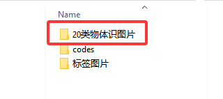
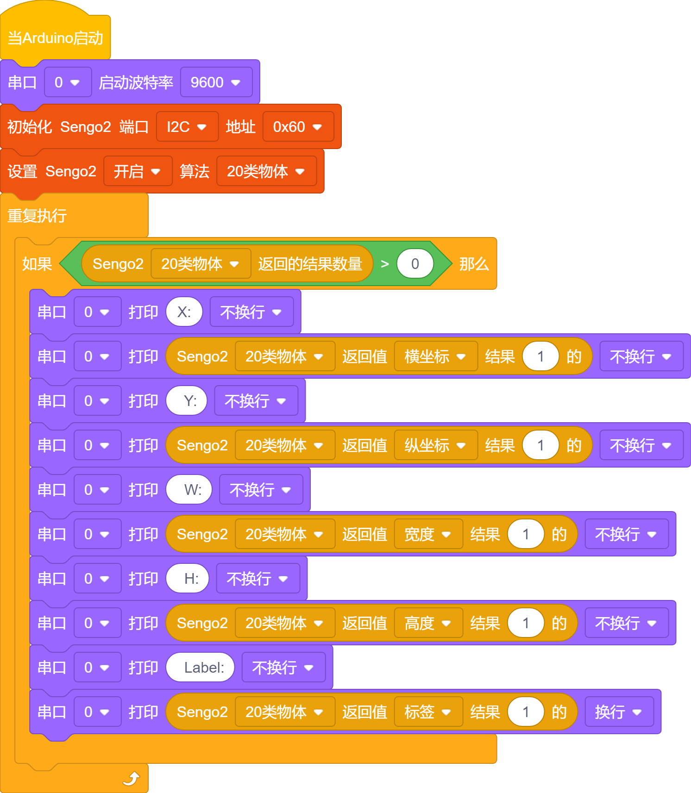

# 4.8 20类物体识别

## 4.8.1 算法简介

识别常见的20类物体，返回他们的坐标信息和分类标签。

## 4.8.2 分类标签 

| 分类标签 | 中文含义 | 分类标签 | 中文含义 |
| :------: | :------: | :------: | :------: |
|    1     |   飞机   |    2     |  自行车  |
|    3     |    鸟    |    4     |    船    |
|    5     |   瓶子   |    6     |  公交车  |
|    7     |   汽车   |    8     |    猫    |
|    9     |   椅子   |    10    |    牛    |
|    11    |   餐桌   |    12    |    狗    |
|    13    |    马    |    14    |  摩托车  |
|    15    |    人    |    16    | 盆栽植物 |
|    17    |    羊    |    18    |   沙发   |
|    19    |   火车   |    20    |  显示器  |

我们有在下载的文件资料文件夹中提供20类物体识别的图片以供使用。

----------

## 4.8.3 使用技巧

1. 图像的清晰度会影响识别效果。如果图案偏小，摄像头无法聚焦到图案，图案成像模糊，会导致识别效果变差，此时应改用较大的图案。

2. 如果需要识别屏幕上的图案，应当适当调节屏幕的亮度，避免过曝。

-------

## 4.8.4 代码

1. 在代码启动中设置串口波特率为`9600`，然后设置AI视觉模块的通信方式为`I2C`，再设置AI视觉模块运行`20类物体`模式

2. 使用判断模块对检测数量进行判断，只有检测数量大于0时才进行20类物体数据的输出，注意选择的是`20类物体`

**完整代码：**

-----------

## 4.8.5 代码结果

上传代码后，AI视觉模块将会对摄像头拍到的地方进行识别，如果有识别到20类物体中的某一个将会在串口监视器中打印识别到的物体的名称。

## 4.8.8 扩展玩法

**儿童智能认知卡**

- **玩法简介：** 让小朋友拿着20类物体卡片到摄像头前，AI会自动识别并读出物品的名称，并显示在屏幕上。
- **实现：** 识别到物体后，通过串口将物体名称发送给语音合成模块，并同时在屏幕显示大字体的名称。
- **难点：** 需要接入音频模块