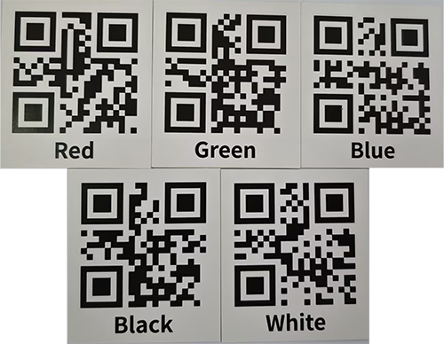
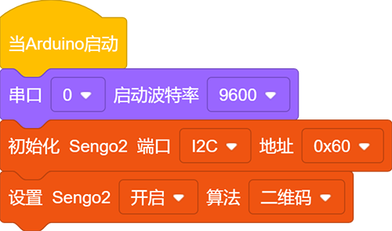
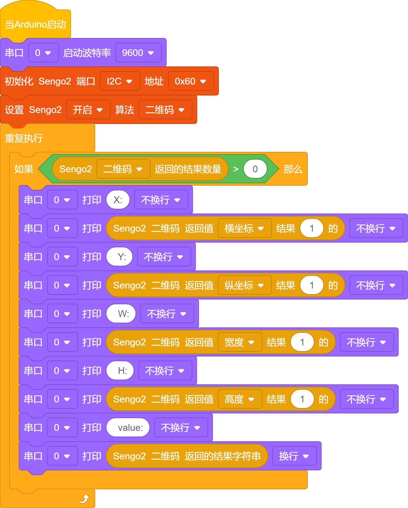
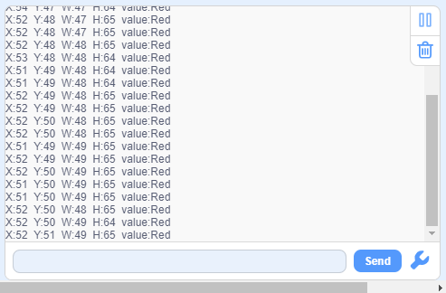

# 4.9 二维码 识别

## 4.9.1 算法简介

可以识别一个简单的二维码并返回该二维码的坐标、大小及文本内容。二维码信息不超过25个字符，屏幕上可显示ASCII码字符，如果是中文二维码，则无法正常显示，但识别结果可由主控正常读取。

-------------

## 4.9.2 代码块介绍

1. 块，用于读取二维码的坐标x，y以及大小w，h，如下表：

|  参数   |     属性信息      |
| :-----: | :---------------: |
| x-coord | 二维码中心横坐标x |
| y-coord | 二维码中心纵坐标y |
|  width  |    二维码宽度w    |
| height  |    二维码高度h    |

2. 块，用于读取二维码存储的内容，如：“Red”，“Green”等...

----------

## 4.9.3 如何生成二维码

我们有提供5个纸质的二维码卡片，二维码内容分别是“Red”，“Green”，“Blue”，“White”，“Black”。

如果我们提供的二维码满足不了你的需求，你可以通过下方的链接自己生成你需要的二维码。

[在线二维码生成器](https://cli.im/text/other)

进入链接后：

①选择文本

②输入需要生成的文字（注意避免中文字符与字符不得超过25个）

③点击生成二维码

④点击下载二维码图片

------------

## 4.9.4 代码

1. 在代码启动中设置串口波特率为`9600`，然后设置AI视觉模块的通信方式为`I2C`，再设置AI视觉模块运行`二维码`模式

2. 使用判断模块对检测数量进行判断，只有检测数量大于0时才进行二维码数据的输出，注意选择的是`二维码`

**完整代码：**

-------

## 4.9.5 代码结果

上传代码后，AI视觉模块将会对摄像头拍到的地方进行分析如果有二维码就会进行识别，并且在串口监视器中打印二维码尺寸以及二维码的内容。

## 4.9.6 扩展玩法

**多功能指令卡**

- **玩法简介：** 制作一系列二维码，内容不是网址，而是直接写入控制指令（如`LED_ON`, `SERVO_90`）。扫描不同二维码，直接控制硬件执行动作。
- **实现：** 编程解析扫描到的字符串，直接将其作为命令执行。这是一种无需键盘输入的硬件控制方式。