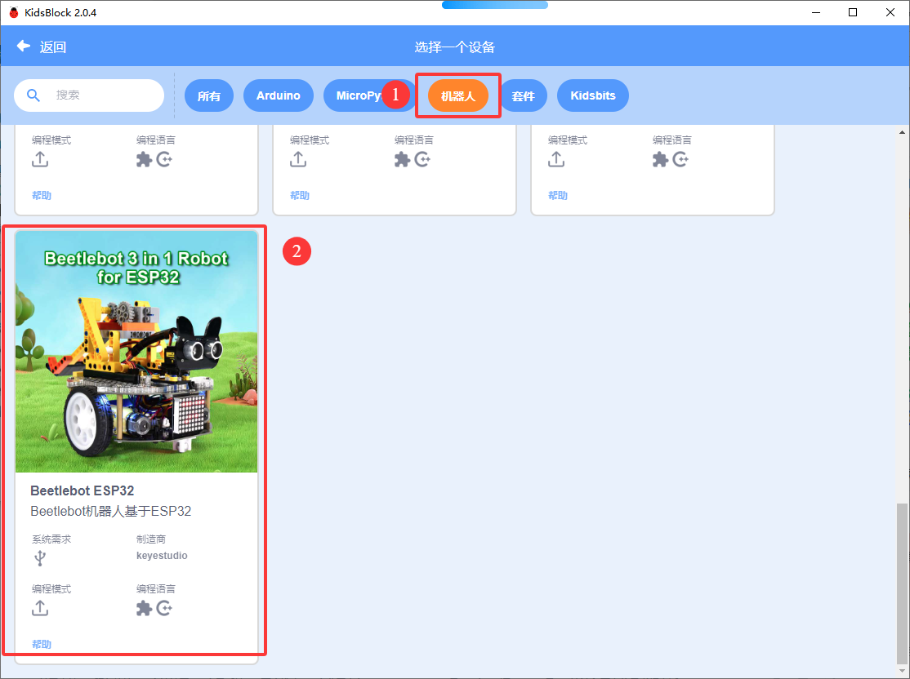
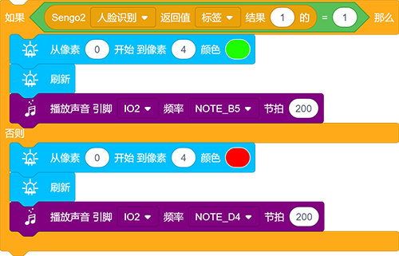
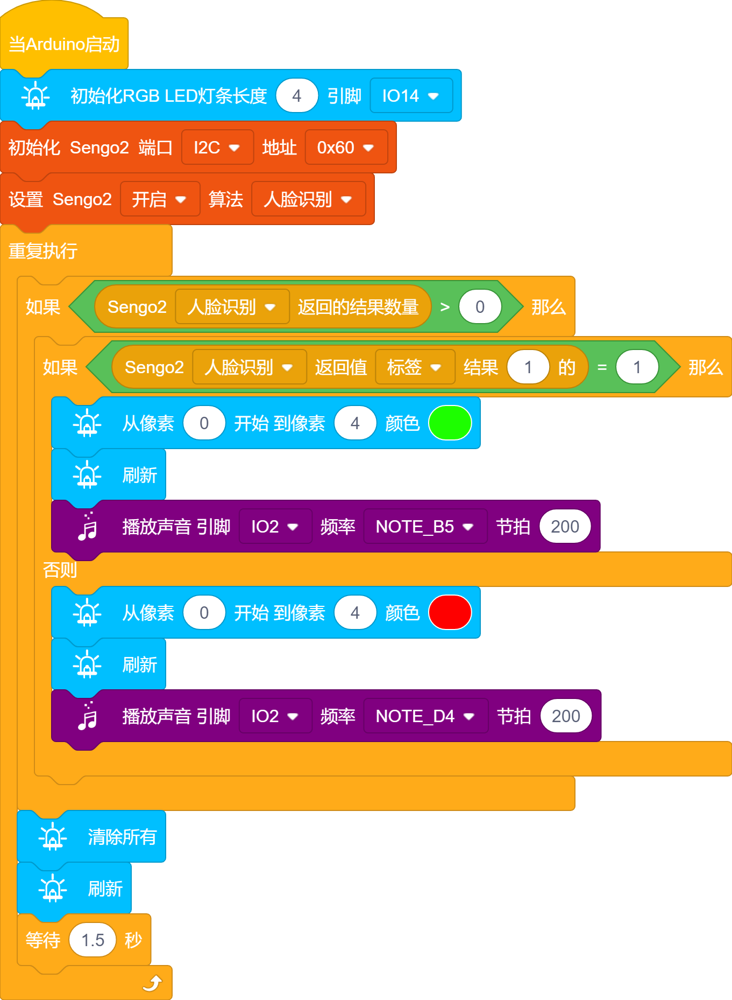

# 5.1 人脸解锁小车

## 5.1.1 简介

人脸识别解锁，判断是否是存储好的人脸，是则播放正确提示音亮绿灯，不是则播放错误提示音亮红灯。通过长按AI视觉模块的功能按键进行训练并存储人脸，然后通过代码对该人脸进行判断。 

## 5.1.2 代码流程图

## 5.1.3 代码

如果你选择自己搭建代码，请选择小车的专用开发模块，因为我们要使用AI视觉模块与小车进行互动就会用到小车功能模块代码，添加小车专业的开发模块就能直接使用无需再次添加了。

1.在代码启动中添加初始化RGB LED灯的代码块，然后设置AI视觉模块的通信方式为`I2C`，再设置AI视觉模块运行`人脸识别`模式

2.使用判断模块对检测数量进行判断，只有检测数量大于0时才进行人脸数据的读取，注意功能选择的是`人脸识别`；判断人脸的`标签`是否等于1，如果是则RGB LED灯亮绿灯并且蜂鸣器发出声音代表识别成功，如果`标签`的值不等于1则RGB LED亮红灯并且蜂鸣器发出声音代码识别失败。

3. 再判断模块外面添加熄灭RGB LED的代码并且延时1.5秒

**完整代码：**

## 5.1.4 代码结果

上传代码成功后，AI视觉模块就会对摄像头拍到的画面进行识别，判断是否有人脸，如果有人脸就判断是否是我们设置的人脸，是则小车发出正确提示音并且亮绿灯，不是则小车发出错误提示音并且亮红灯。