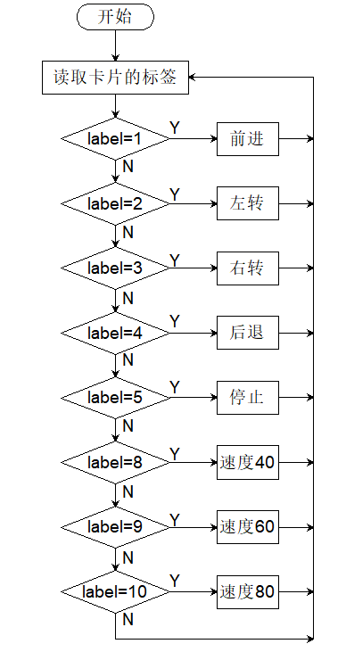
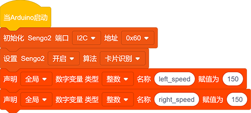
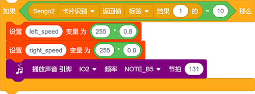
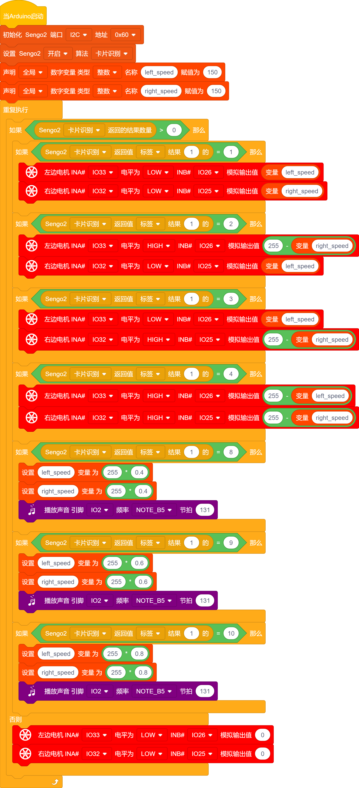

# 5.2 交通卡片控制小车

## 5.2.1 简介

交通卡片控制小车，卡片有前进，左转，右转，掉头，停止，速度40，速度60，速度80，红灯，绿灯，AI视觉模块进行识别交通卡片，通过对应的卡片使小车进行相应的动作。

## 5.2.2 流程图

## 5.2.3 代码

如果你选择自己搭建代码，请选择小车的专用开发模块，因为我们要使用AI视觉模块与小车进行互动就会用到小车功能模块代码，添加小车专业的开发模块就能直接使用无需再次添加了。

1.在代码启动中添加设置AI视觉模块的通信方式为`I2C`，再设置AI视觉模块运行`卡片识别`模式，再定义两个全局的int类型变量，分别命名为`left_speed`,`right_speed`

2.使用判断模块对检测数量进行判断，只有检测数量大于0时才进行数据的读取，注意功能选择的是`卡片识别`；

3.使用判断模块对读取到的卡片的`标签`进行判断，通过集成教程中的标签对照表可以找到每个卡片对应的标签值，比如：标签=1是前进卡片，标签= 2是左转卡片，标签= 3 是右转卡片 ，标签= 4是掉头卡片（后退）等等，我们就使用判断模块对 label进行判断就能知道识别到哪个卡片，然后小车在执行对应的动作。

如下图是识别到前进卡片的小车前进的代码：

如下图是识别到后退卡片的小车后退的代码：

此时你会注意到后退的代码电机的速度用255做了减法，这是因为小车后退时255是反正是最低速度而0是最高速度刚好与小车前进的速度值相反，所以我们做了减法设置（你也可以调节速度与小车前进后退进行测试，你将很直观的发现这一现象）

4.设置速度的代码则是将变量`left_speed`与`right_speed`进行乘法运算，我们有速度40，60，80，那么我们就将识别到40速度卡片时分将变量`left_speed`与`right_speed`设置为它自身的0.4（也就是乘以0.4），速度60则是乘以0.6，速度80则是乘以0.8，使用蜂鸣器模块将设置速度时发出滴滴的声音

如下图是识别到速度80卡片时的代码:

**完整代码：**

## 5.2.4 代码结果

上传代码成功后，AI视觉模块会对拍到的画面进行识别，判断是否有交通卡片，如果有则想卡片的标签值赋值到变量Tags，通过对变量Tags的值进行判断，label= 1 小车前进，label= 2 小车左转 ，label= 3 小车右转 ，label= 4 小车后退 ，label= 5 小车停止 ，label= 8 小车速度设置为全速（255）的40% ， label= 9 小车速度设置为全速（255）的60% ，label= 10 小车速度设置为全速（255）的80%。

