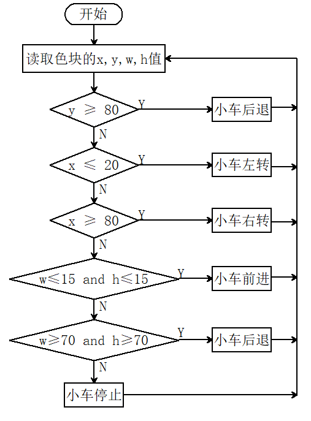
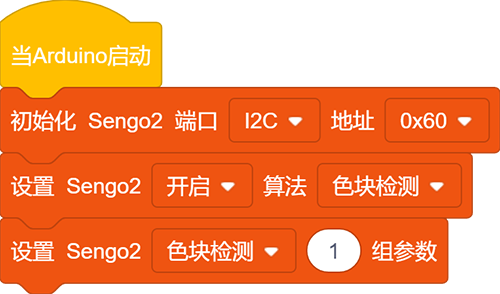
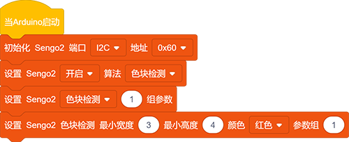
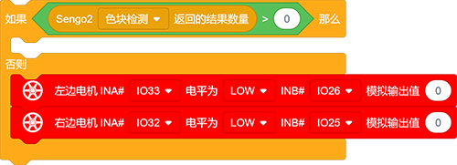
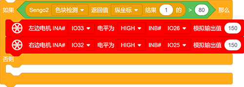
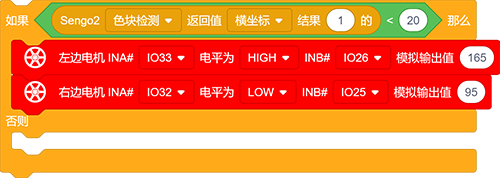
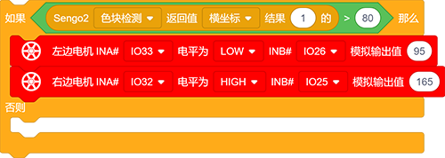
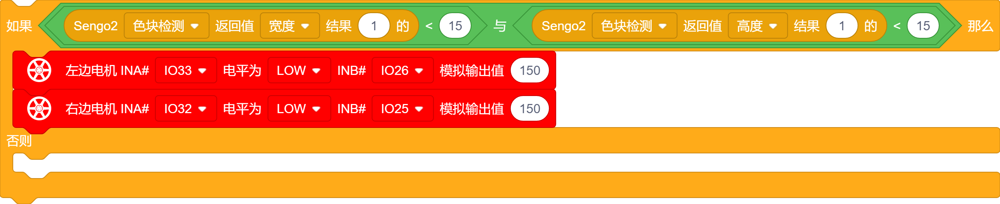
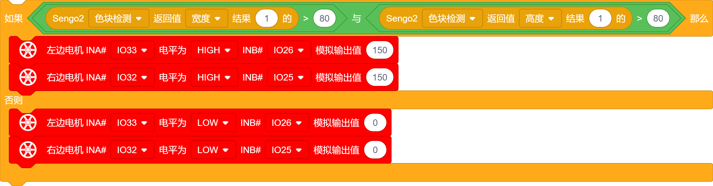
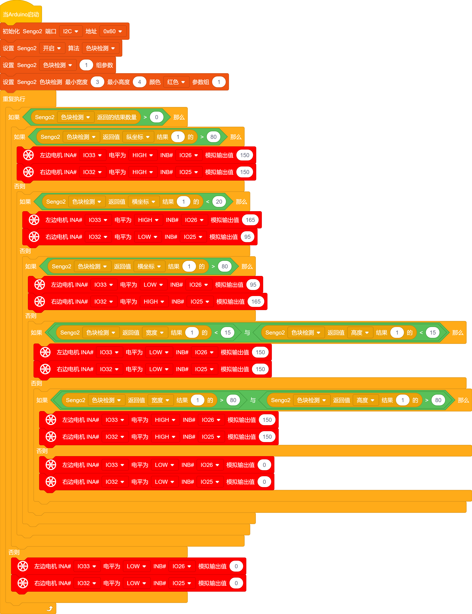

# 5.3 色块追踪小车

## 5.3.1 简介

色块追踪小车，AI视觉模块对色块进行锁定并且根据AI视觉模块给出的色块XY以及宽高进行左右前后的跟踪。

## 5.3.2 流程图

## 5.3.3 代码

如果你选择自己搭建代码，请选择小车的专用开发模块，因为我们要使用AI视觉模块与小车进行互动就会用到小车功能模块代码，添加小车专业的开发模块就能直接使用无需再次添加了。

1.在代码启动中添加设置引脚为输出模式代码块（设置控制电机的引脚为输出模式），然后设置AI视觉模块的通信方式为`I2C`，再设置AI视觉模块运行`色块检测`模式。

2.设置参宿组为1（只识别了1种颜色）， 再设置识别色块的尺寸最小值以及识别的颜色与参数组号为1

3.使用判断模块对检测数量进行判断，如果检测数量大于0时进行数据的读取否则小车停止，注意功能选择的是`色块检测`；

4.判断色块显示坐标"y"是否大于"80"，如果是则执行小车后退代码直到坐标"y"小于80

4.判断色块显示坐标"x"是否小于"20"，如果是则执行小车左转代码直到坐标"x"大于20

5.判断色块显示坐标"x"是否大于"80"，如果是则执行小车右转代码直到坐标"x"小于80

6.判断色块显示尺寸宽与高是否都小于15，如果是则执行小车前进代码直到尺寸宽与高都大于15

6.判断色块显示尺寸宽与高是否都大于80，如果是则执行小车后退代码直到尺寸宽与高都小于80，最后else执行小车停止代码

7.将"如果...否则.."模块进行嵌套后便能得到完整代码了。

**完整代码：**

## 5.3.4 代码结果

上传代码成功后，AI视觉模块会对拍到的画面进行识别，判断是否有红色块，如果有红色块便从这个色块的x，y，w，h值上判断小车的动作，比如红色块靠显示屏的右边小车便往右边转动，红色快靠左小车就往左边转到，红色快靠下小车就后退。（使用我们提供的颜色卡片）

