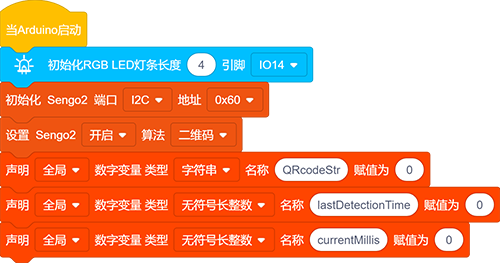
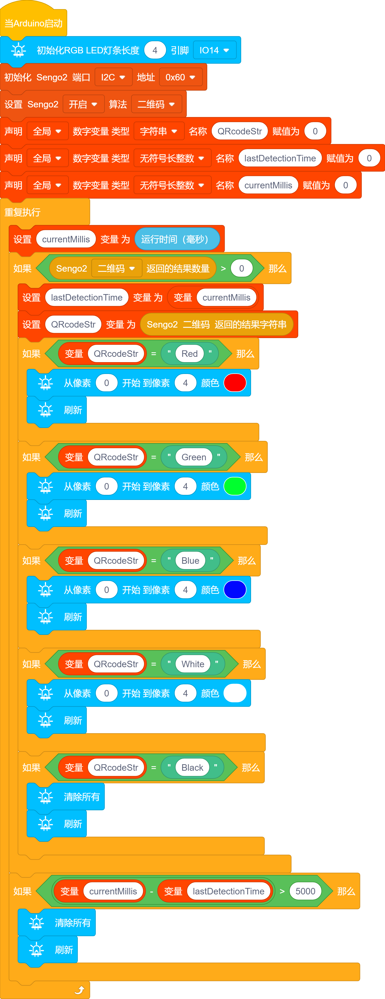

# 5.4 二维码控制车灯

## 5.4.1 简介

二维码控制车灯，AI视觉模块对二维码进行识别然后通过二维码的内容进行设置WS2812灯珠显示的颜色分别有：红色，绿的，蓝色，黑色（熄灭），白色，因为我们提供的二维码就是这些内容，你也可以根据`4.9 二维码识别`教程的方法自己生成想要二维码。

## 5.4.2 流程图 

## 5.4.3 代码

如果你选择自己搭建代码，请选择小车的专用开发模块，因为我们要使用AI视觉模块与小车进行互动就会用到小车功能模块代码，添加小车专业的开发模块就能直接使用无需再次添加了。

1.在代码启动中添加初始化RGB LED灯的代码块，然后设置AI视觉模块的通信方式为`I2C`，再设置AI视觉模块运行`二维码`模式，再定义三个变量，分别为String类型的变量名为`QRcodeStr`，unsigned long 类型的变量名为`lastDetectionTime`，unsigned long 类型的变量名为`currentMillis`

2.给变量`currentMillis`赋值运行时间模块，在栏中模块的作用是返回从开发板上电时开始的运行时间（单位：mS)

3.将变量`currentMillis`得到的起始时间赋值给变量`lastDetectionTime`，将AI视觉模块读取到的二维码内容赋值给变量`QRcodeStr`，使用判断模块判断变量`QRcodeStr`的值是否等于对应的字符“Red”如果是则亮红灯如果不是则进行其他字符的判断都不是则不亮灯。

4.使用判断红色字符的方法添加判断“Green”,“Blue”,“White”,“Black”的代码

5.在最外面的循环模块中添加一个计时代码，功能是当AI视觉识别模块最后一次识别到二维码内容时RGB LED灯点亮后5秒后熄灭RGB LED灯（如果一直在识别二维码卡片则不会熄灭）

**完整代码：**

## 5.4.4 代码结果

上传代码成功后，AI视觉模块会对拍到的画面进行识别，判断是否有二维码，如果有便将二维码的内容进行赋值给变量，然后通过变量进行判断是否是对应的内容，内容"Red"亮红灯，内容"Green"亮绿灯，内容"Blue"亮蓝灯，内容"White"亮白灯，内容"Black"熄灭灯。通过二维码卡片识别RGB LED灯亮对应的颜色后撤销二维码卡片5秒后RGB LED灯会熄灭。