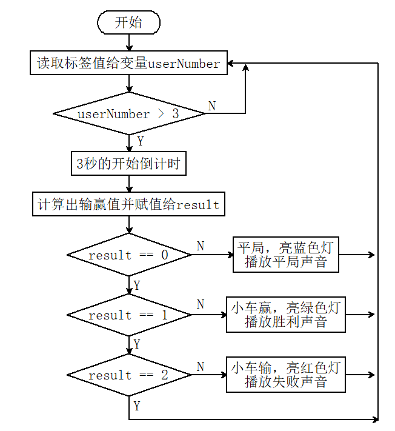
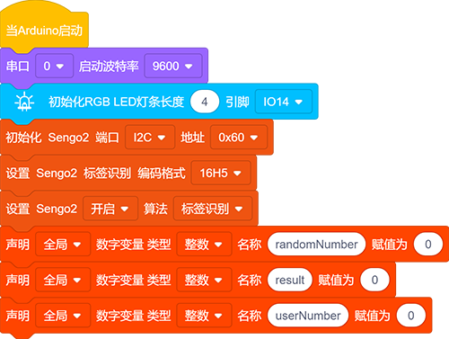
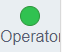
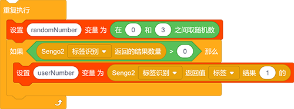
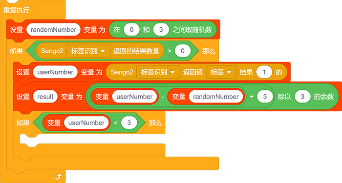
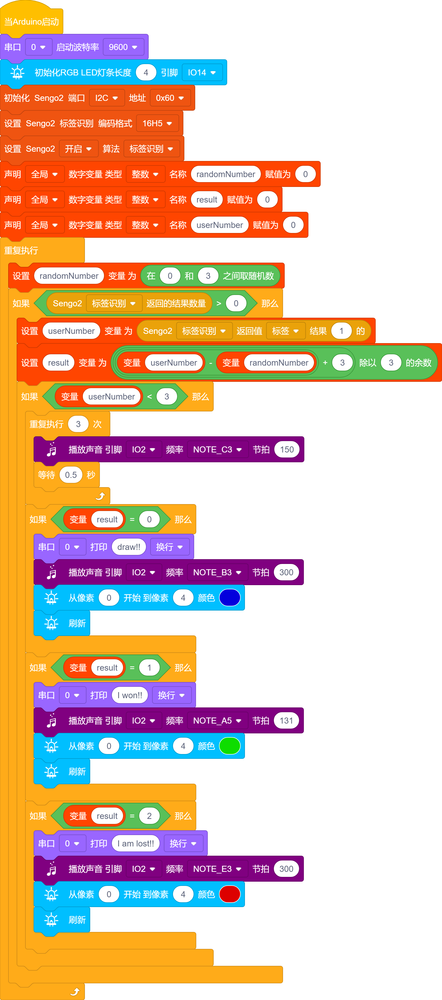

# 5.5 标签石头剪刀布

## 5.5.1 简介

标签石头剪刀布，使用16h5标签的0（石头），1（剪刀），2（布）代表手势的石头剪刀布与小车进行输赢比赛，小车会随机生成0（石头），1（剪刀），2（布），如果小车赢了小车会发出胜利的声音并亮绿灯，如果小车输了小车会发出失败的声音并亮红灯，如果是平局则发出平局的声音并亮蓝灯。

## 5.5.2 流程图

## 5.5.3 代码

如果你选择自己搭建代码，请选择小车的专用开发模块，因为我们要使用AI视觉模块与小车进行互动就会用到小车功能模块代码，添加小车专业的开发模块就能直接使用无需再次添加了。

1.在代码启动中设置串口波特率为`9600`，添加初始化RGB LED灯的代码块，然后设置AI视觉模块的通信方式为`I2C`，再设置AI视觉模块运行`标签识别`模式，设置识别的标签类型为`16H5`，定义三个int类型变量分别名为`randomNumber`，`result`，`userNumber`

2.给变量`randomNumber`赋值一个随机生成的0-2的数，在栏中模块的作用是随机返回指定范围内的数值，我们将他设置成从0开始到3结束（注意不会生成数字3)

3.判断是否有检查到标签卡片，如果有则进入代码执行对应代码，读取卡片标签值并赋值给变量`userNumber`

4.给变量`result`赋值计算输赢的值，`result = 0`平局，`result = 1`小车获胜，`result = 2`小车输了，计算方式是：`result = ((userNumber - randomNumber) + 3) % 3`，取余模块在栏中

5.使用判断模块对变量`userNumber `进行判断，如果大于3则不执行后面的代码这一步骤是防止不需要的值触发石头剪刀布的代码

6.使用循环模块进行开始倒计时，倒计时结束后使用if语句对变量`result`进行判断，如果`result = 0`则亮蓝色灯并且发出平局的声音并在串口打印“draw!!”，如果`result = 1`则亮绿色灯并且发出胜利的声音并在串口打印“I won!!”，如果`result = 3`则亮红色灯并且发出输了的声音并在串口打印“I am lost!!”

**完整代码：**

## 5.5.4 代码结果

上传代码成功后，AI视觉模块会对拍到的画面进行识别，判断是否有16h5类型的标签，如果有则将标签值传输给开发板。我们可以随机将标签值为“0，1，2”的卡片放到摄像头识别区与小车进行猜拳，如果是平局小车会亮蓝色灯并发出平局的音效，如果是小车赢了那么小车会亮绿灯并发出胜利了的音效，如果是小车输了那么小车会亮红灯并发出失败了的音效。
