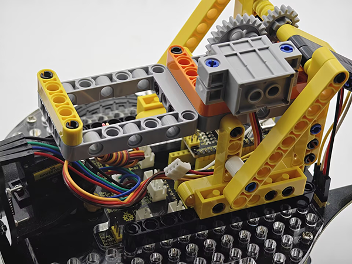
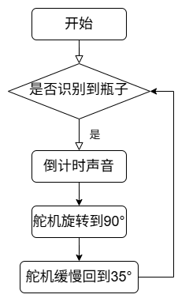
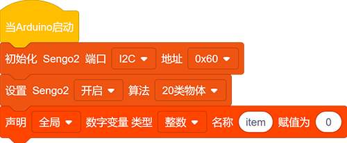
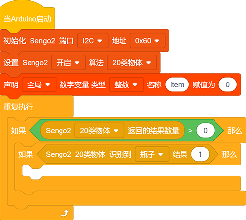
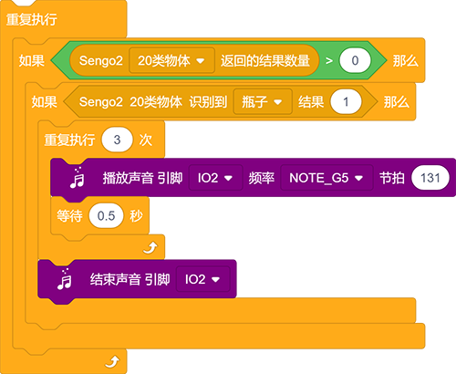
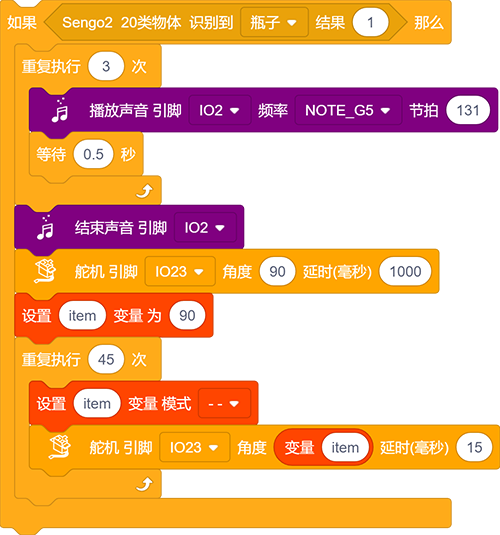
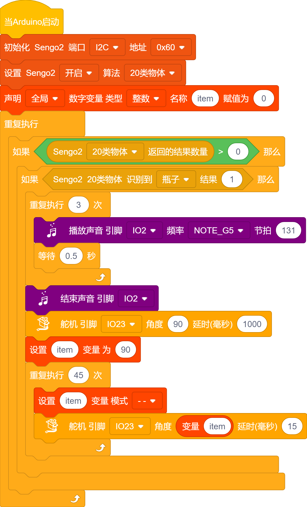

# 5.6 智能投石车

## 5.6.1 简介

使用AI视觉模块搭配小车的投石攻城车造型，制作出有趣的自动识别投石器，先将AI视觉模块固定到投石器小车上，然后使用AI模块进行识别如果识别到了瓶子就蜂鸣器开始倒计时3声然后投掷，投掷结束后缓慢落下投掷臂等待下一次识别到瓶子后投掷。

## 5.6.2 将AI模块安装到投石小车上

注意：你需要先按照小车教程将`投石攻城车`的乐高搭建好，然后再按照下方的安装教程进行安装。

**所需配件**

**步骤1：**

**步骤2：**

**步骤3：**

**步骤4：**

|  AI视觉模块  | 小车接口 |
| :----------: | :------: |
| T/C (黄色线) |   SCL    |
| R/D (白色线) |   SDA    |
| V/+ (红色线) |    5V    |
| G/- (黑色线) |    G     |

**完整展示：**

## 5.6.3 流程图

## 5.6.4 代码

如果你选择自己搭建代码，请选择小车的专用开发模块，因为我们要使用AI视觉模块与小车进行互动就会用到小车功能模块代码，添加小车专业的开发模块就能直接使用无需再次添加了。

1. 在代码启动中设置AI视觉模块的通信方式为`I2C`，再设置AI视觉模块运行`20类物体`模式，定义一个全局变量的int类型“item”

2. 使用判断模块对检测数量进行判断，只有检测数量大于0时才进行20类物体数据检测，注意选择的是`20类物体`，再次判断是否检测到"瓶子"使用判断

3. 如果检测到"瓶子"就进行投掷倒计时提示音，总共提示3声间隔0.5S。

4. 倒计时提示音结束后就会进行投掷，设置舵机旋转到90度并延时1000ms ；投掷臂缓慢回落，先设置变量"item"为90，然后使用循环模块循环45次并且每次循环使变量"item"减1，将"item"设置成角度值再添加一个15ms的延时，这样就会使舵机每循环一次回落一度达到缓慢回落的效果。

**完整代码：**

## 5.6.5 代码结果

上传代码成功后，AI视觉模块会开启“20类物体”模式然后对拍到的画面进行识别，判断是否有检测到瓶子，如果有则进行投掷，投掷前会有三声倒计时提示音倒计时结束就会进行投掷，投掷完成后投掷臂会慢慢的回落等待下一次投掷。
