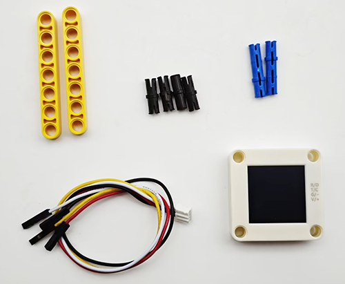
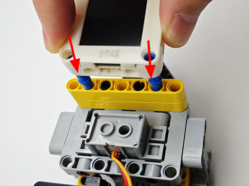
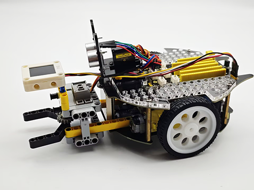
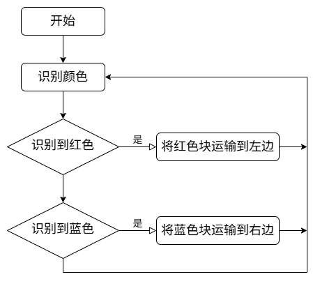
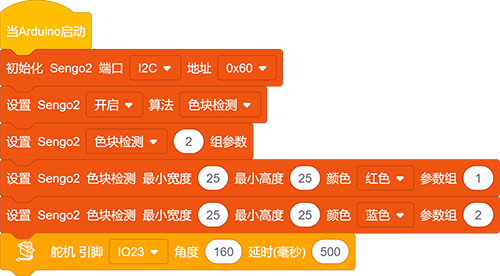
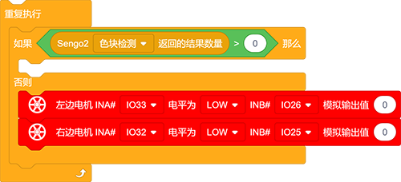
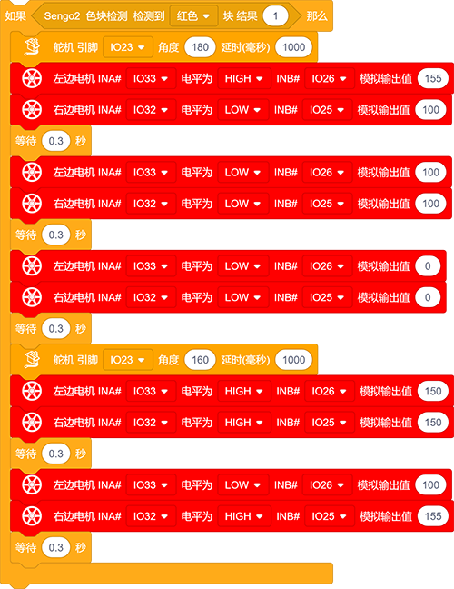
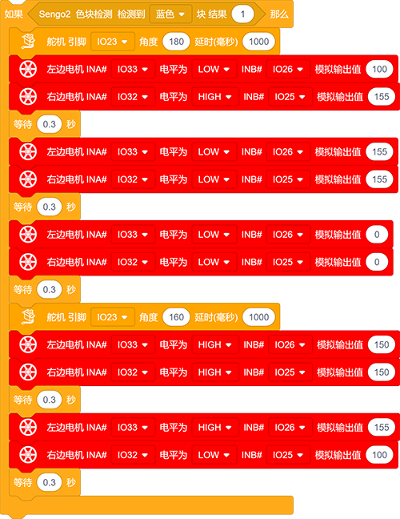
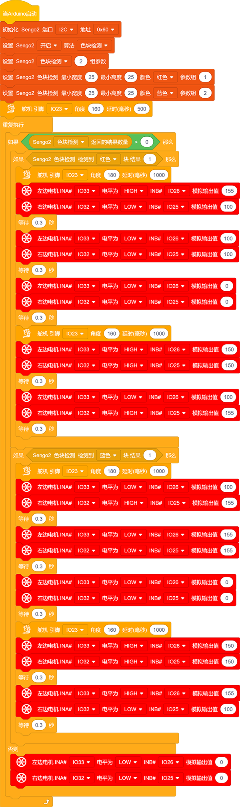

# 5.7 红蓝颜色分拣车

## 5.7.1 简介

使用AI视觉模块搭配小车的足球机器人造型，制作出有趣的色块分拣机器人，先将AI视觉模块固定到足球机器人小车上，然后使用AI模块进行识别，如果识别到了红色块就运输到左边然后原路返回原位，如果识别到蓝色则运输到右边再原路返回到原位。

## 5.7.2 将AI模块安装到足球小车上

注意：你需要先按照小车教程将`足球机器人`的乐高搭建好，然后再按照下方的安装教程进行安装。

 **所需配件：**

**步骤1：**

**步骤2：**

**步骤3：**

**步骤4：**

**步骤5：**

**步骤6：**

|  AI视觉模块  | 小车接口 |
| :----------: | :------: |
| T/C (黄色线) |   SCL    |
| R/D (白色线) |   SDA    |
| V/+ (红色线) |    5V    |
| G/- (黑色线) |    G     |

**完整展示：**

## 5.7.3 流程图

## 5.7.4 代码

如果你选择自己搭建代码，请选择小车的专用开发模块，因为我们要使用AI视觉模块与小车进行互动就会用到小车功能模块代码，添加小车专业的开发模块就能直接使用无需再次添加了。

1. 在代码启动中设置AI视觉模块的通信方式为`I2C`，再设置AI视觉模块运行`色块检测`模式 ，设置参宿组为2（识别了两种颜色），再设置每种颜色识别的数量为1个， 再设置识别色块的尺寸最小值为宽：25高：25以及识别的颜色（红色，蓝色）与参数组号红色为1，蓝色为2，设置舵机旋转到160度。

2. 使用判断模块对检测数量进行判断，只有检测数量大于0 时才进行色块数据的输出，注意选择的是`色块检测`，在"否则"下方添加小车停止的代码

3. 判断检测到的颜色快是否是红色，使用块，如果识别到了红色块，小车会进行以下动作：（1)舵机旋转到180度使夹子夹住红色块并延时1000ms；（2)小车左转0.3秒，小车前进0.3秒，小车停止行驶；（3)舵机旋转到160度，松开夹子放下红色块；（4)小车后退0.3秒，小车右转0.3秒，至此小车的动作结束，效果是将红色块送至小车的左边

4. 判断检测到的颜色快是否是蓝色，使用块将"红色"修改为"蓝色"，如果识别到了蓝色块，小车会进行以下动作：（1)舵机旋转到180度使夹子夹住蓝色块并延时1000ms；（2)小车右转0.3秒，小车前进0.3秒，小车停止行驶；（3)舵机旋转到160度，松开夹子放下蓝色块；（4)小车后退0.3秒，小车左转0.3秒，至此小车的动作结束，效果是将蓝色块送至小车的右边

**完整代码：**

## 5.7.5 代码结果

上传代码成功后，AI视觉模块会进入“色块检测”功能对拍到的画面进行识别，判断是否有红色块或蓝色块，如果检测到红色块小车会夹住红色快然后将它送到小车的左边然后小车会原路返回到原位。如果检测到蓝色块小车会夹住蓝色块然后将它送到小车的右边然后小车会原路返回到原位。（返回到原位时位置稍有偏差，因为他是通过行驶的时间设置的）

注意：代码中有设置色块最小尺寸，如果你的色块识别后的尺寸比这个小将不会被识别，你可以修改下方代码的尺寸进行识别。

