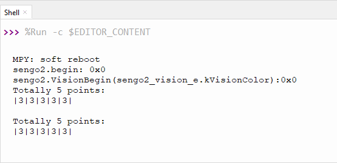
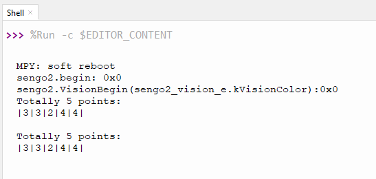
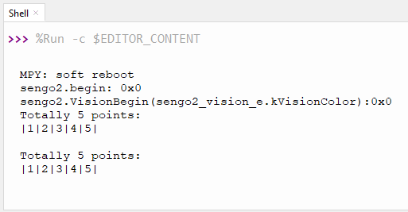

# 4.1 识别颜色

## 4.1.1 算法简介


指定一个或多个识别区域，其位置和大小可根据需要进行设置，返回该区域的颜色标签以及红色分量值R、绿色分量值G与蓝色分量值B。

---------------------

## 4.1.2 颜色分类标签

Sengo2定义了7 种颜色的分类标签：

|      标签值      | 含义 |      标签值       | 含义 |
| :--------------: | :--: | :---------------: | :--: |
| 1（kColorBlack） | 黑色 | 2（kColorWhite）  | 白色 |
|  3（kColorRed）  | 红色 | 4（kColorGreen）  | 绿色 |
| 5（kColorBlue）  | 蓝色 | 6（kColorYellow） | 黄色 |

<span style="color:red;font-size:20px;">注：不在表格中的常见的颜色如紫色、青色（蓝绿色）、橙色、灰色等，其颜色区分度较低，容易误识别为表格中的颜色。如若需要识别以上颜色，可根据返回的RGB分量值自行进行判定。</span>

示例1：


串口标签值输出为：



示例2：


串口标签值输出为：（可以看到前两个识别框对应红色，中间识别框对应白色，最后两个识别卡对应绿色，而输出的标签值也与表格对应）



-------------------------

## 4.1.3 配置参数

用户可指定识别区域坐标和识别框的大小，如未指定新的参数，则以默认值运行，参数定义如下：

| 参数 |        含义         |
| :--: | :-----------------: |
|  x   | 识别区域中心横坐标x |
|  y   | 识别区域中心纵坐标y |
|  w   |    识别区域宽度w    |
|  h   |    识别区域高度h    |

代码：(代码中for循环5次分别设置5个识别框)

```python
   num = 5  #设置检测数量最多5个
    #其他代码...
    # num = 5 也就是循环5次分别对应5个识别框
    for i in range(1, (num + 1), 1):
        #设置识别框显示在屏幕上的x轴坐标
        x = (round(100 * i / (num + 1)))
        #设置识别框显示在屏幕上的y坐标
        y = 50
        #设置识别框显示在屏幕上的宽度
        w = (round(i * 2 + 1))
        #设置识别框显示在屏幕上的高度
        h = (round(i * 2 + 1))
        #写入识别框参数
        sengo2.SetParam(sengo2_vision_e.kVisionColor,[x, y, w, h, 0],i)
```

---------------

## 4.1.4 返回数据

主控器获取检测结果时，算法会返回以下数据：

|  形参   |          含义          |
| :-----: | :--------------------: |
| kRValue | 红色分量值R，范围0-255 |
| kGValue | 绿色分量值G，范围0-255 |
| kBValue | 蓝色分量值B，范围0-255 |
| kLabel  |      颜色分类标签      |

代码：

```python
            #获取第i个物体的标签（颜色ID）
            label = sengo2.GetValue(sengo2_vision_e.kVisionColor,sentry_obj_info_e.kLabel,i)
```

`sengo2.GetValue(sengo2_vision_e.kVisionColor,sentry_obj_info_e.kLabel,i)`中的形参sentry_obj_info_e.kLabel，所以返回的是颜色分类标签值，假如我将他替换成"sentry_obj_info_e.kLabel"，`sentry_obj_info_e.kRValue`那么返回是是红色分量值R（0-255）

--------------------

## 4.1.5 识别颜色算法使用技巧

1. 当识别区域较小时，譬如2x2，虽然识别速度快，但因像素点过少，结果易被干扰，其可信度较低，只适用于背景单一可控的应用场合；

2. 当识别区域较大时，譬如20x20，因像素点多，区域内杂色的干扰被会滤除，结果具有较高的可信度，但识别速度慢；

3. 当识别区域内不同颜色的面积相当时，结果可能会反复跳变；

-----------------------

## 4.1.6 代码

```python
from machine import I2C,UART,Pin
from  Sengo2  import *
import time
import random

num = 5  #设置检测数量最多5个
x = 0
y = 0
i = 0

def result_output():
    global num, x, y, i
    # Sengo2不主动返回检测识别结果，需要主控板发送指令进行读取。读取的流程：首先读取识别结果的数量，接收到指令后，Sengo2会刷新结果数据，如果结果数量不为零，那么主控再发送指令读取结果的相关信息。请务必按此流程构建程序。
    obj_num = sengo2.GetValue(sengo2_vision_e.kVisionColor, sentry_obj_info_e.kStatus)
    if obj_num:
        print("Totally %d points: "%( obj_num ))
        print("|",end='')
        for i in range(1, (obj_num + 1), 1):
            #获取第i个物体的标签（颜色ID）
            label = sengo2.GetValue(sengo2_vision_e.kVisionColor,sentry_obj_info_e.kLabel,i)
            print(label,end='|')
            time.sleep(0.2)
        print("\n")
        

# 等待Sengo2完成操作系统的初始化。此等待时间不可去掉，避免出现Sengo2尚未初始化完毕主控器已经开发发送指令的情况
time.sleep(2)

# 选择UART或者I2C通讯模式，Sengo2出厂默认为I2C模式，短按模式按键可以切换
# 4种UART通讯模式：UART9600（标准协议指令），UART57600（标准协议指令），UART115200（标准协议指令），Simple9600（简单协议指令），
#########################################################################################################
# port = UART(2,rx=Pin(16),tx=Pin(17),baudrate=9600)
i2c = I2C(0,scl=Pin(21),sda=Pin(20),freq=400000)

# Sengo2通讯地址：0x60。如果I2C总线挂接多个设备，请避免出现地址冲突
sengo2 = Sengo2(0x60)

err = sengo2.begin(i2c)
print("sengo2.begin: 0x%x"% err)


# 设置Sengo2两颗LED的颜色，可选：黑Close，白White，红Red，绿Green，黄Yellow，蓝Blue，紫Purple，青Cyan
# 三个参数依次为：检测识别到目标时的颜色，未发现目标的颜色，亮度
# 当环境光亮度不足时，可将LED的颜色全部设置为白White，并且将亮度值设置为最大15（范围：1-15）
# 无法分别设置两颗LED
sengo2.LedSetColor(sentry_led_color_e.kLedBlue,sentry_led_color_e.kLedBlue,1)


# 算法的默认参数，如果不用更改，则可以删除本行代码
sengo2.SetParamNum(sengo2_vision_e.kVisionColor,1)
# 算法的默认参数，如果不用更改，则可以删除本行代码
sengo2.SetParam(sengo2_vision_e.kVisionColor,[50, 50, 3, 4, 0],1)
 
 
err = sengo2.VisionBegin(sengo2_vision_e.kVisionColor)
print("sengo2.VisionBegin(sengo2_vision_e.kVisionColor):0x%x"% err)

#设置颜色识别算法num组参数,通过设置num控制组参数的数量
sengo2.SetParamNum(sengo2_vision_e.kVisionColor,num)

while True:
    # num = 5 也就是循环5次分别对应5个识别框
    for i in range(1, (num + 1), 1):
        #设置识别框显示在屏幕上的x轴坐标
        x = (round(100 * i / (num + 1)))
        #设置识别框显示在屏幕上的y坐标
        y = 50
        #设置识别框显示在屏幕上的宽度
        w = (round(i * 2 + 1))
        #设置识别框显示在屏幕上的高度
        h = (round(i * 2 + 1))
        #写入识别框参数
        sengo2.SetParam(sengo2_vision_e.kVisionColor,[x, y, w, h, 0],i)
        #延时0.1S
        time.sleep(0.1)
    result_output()
    time.sleep(0.3)

```

----------------

## 4.1.7 代码结果

上传代码后，AI视觉模块上将出现5个大小不一样的识别框，每个识别框都会对它所代表的框中的颜色，然后通过串口监视器打印识别到颜色对应的标签值。




## 4.1.8 扩展玩法

**颜色密码锁**

- **玩法简介：** 设定一个颜色序列作为“密码”（如：红-蓝-绿）。只有按正确顺序向摄像头展示相应颜色，才能触发成功信号（如舵机转动、灯亮）。
- **实现：** 编程记录短时间内识别到的颜色序列。只有序列与预设的“密码”完全匹配时，才执行解锁动作。这可用来打开一个简单的盒子或启动一个设备。