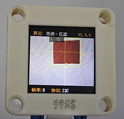
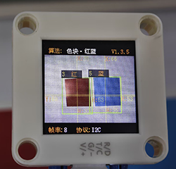
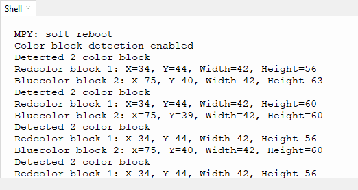

# 4.2 色块检测

## 4.2.1 算法简介



指定某种检测颜色，判断图像中是否有该颜色的色块，返回其坐标和大小，颜色分类标签与颜色识别中的定义相同。

---------------------------

## 4.2.2 配置参数

用户可指定待识别色块检测的，大小和颜色标签，参数定义如下：

代码：

```python
# 设置色块检测参数 - 只检测红色和蓝色
sentry.SetParamNum(sengo2_vision_e.kVisionBlob, 2)  # 设置2组参数

# 红色参数组
sentry.SetParam(
    sengo2_vision_e.kVisionBlob,
    [0, 0, 10, 10, color_label_e.kColorRed],  # 参数格式
    param_id=1
)

# 蓝色参数组
sentry.SetParam(
    sengo2_vision_e.kVisionBlob,
    [0, 0, 10, 10, color_label_e.kColorBlue],  # 参数格式
    param_id=2
)
```

-------------------

## 4.2.3 返回数据

主控器获取检测结果时，算法会返回以下数据：

|     形参     |      含义       |
| :----------: | :-------------: |
|   kXValue    | 色块中心横坐标x |
|   kYValue    | 色块中心纵坐标y |
| kWidthValue  |    色块宽度w    |
| kHeightValue |    色块高度h    |
|    kLabel    |  颜色分类标签   |

代码：

```python
            # 处理每个检测到的色块
            for i in range(1, obj_num + 1):
                # 获取颜色标签
                color_label = sentry.GetValue(
                    sengo2_vision_e.kVisionBlob,
                    sentry_obj_info_e.kLabel,
                    i
                )
                 # 只处理红色和蓝色
                if color_label in [color_label_e.kColorRed, color_label_e.kColorBlue]:
                    # 获取位置和大小
                    x = sentry.GetValue(
                        sengo2_vision_e.kVisionBlob,
                        sentry_obj_info_e.kXValue,
                        i
                    )
                    y = sentry.GetValue(
                        sengo2_vision_e.kVisionBlob,
                        sentry_obj_info_e.kYValue,
                        i
                    )
                    w = sentry.GetValue(
                        sengo2_vision_e.kVisionBlob,
                        sentry_obj_info_e.kWidthValue,
                        i
                    )
                    h = sentry.GetValue(
                        sengo2_vision_e.kVisionBlob,
                        sentry_obj_info_e.kHeightValue,
                        i
                    )
                    
                    # 确定颜色名称
                    color_name = "Red" if color_label == color_label_e.kColorRed else "Blue"
                    
                    print(f"{color_name}color block {i}: X={x}, Y={y}, Width={w}, Height={h}")
        
        time.sleep(0.1)  # 短暂延时

```

---------------------

## 4.2.4 代码

```python
from machine import I2C, Pin
import time
import random
from Sengo2 import *

# 初始化I2C (根据实际接线调整引脚)
i2c = I2C(0, scl=Pin(21), sda=Pin(20), freq=400000)  # 使用参考代码中的引脚

# 等待Sengo2初始化 (重要!)
time.sleep(2)

# 创建Sengo2对象
sentry = Sengo2()

# 开始传感器
if sentry.begin(i2c) != SENTRY_OK:
    print("Sentry initialization failed!")
    while True: pass

# 设置色块检测参数 - 只检测红色和蓝色
sentry.SetParamNum(sengo2_vision_e.kVisionBlob, 2)  # 设置2组参数

# 红色参数组
sentry.SetParam(
    sengo2_vision_e.kVisionBlob,
    [0, 0, 10, 10, color_label_e.kColorRed],  # 参数格式
    param_id=1
)

# 蓝色参数组
sentry.SetParam(
    sengo2_vision_e.kVisionBlob,
    [0, 0, 10, 10, color_label_e.kColorBlue],  # 参数格式
    param_id=2
)

# 开启色块检测功能
if sentry.VisionBegin(sengo2_vision_e.kVisionBlob) == SENTRY_OK:
    print("Color block detection enabled")

# 主检测循环
try:
    while True:
        # 获取检测到的色块数量
        obj_num = sentry.GetValue(sengo2_vision_e.kVisionBlob,sentry_obj_info_e.kStatus)
        
        if obj_num:
            print(f"Detected {obj_num} color block")
            
            # 处理每个检测到的色块
            for i in range(1, obj_num + 1):
                # 获取颜色标签
                color_label = sentry.GetValue(
                    sengo2_vision_e.kVisionBlob,
                    sentry_obj_info_e.kLabel,
                    i
                )
                 # 只处理红色和蓝色
                if color_label in [color_label_e.kColorRed, color_label_e.kColorBlue]:
                    # 获取位置和大小
                    x = sentry.GetValue(
                        sengo2_vision_e.kVisionBlob,
                        sentry_obj_info_e.kXValue,
                        i
                    )
                    y = sentry.GetValue(
                        sengo2_vision_e.kVisionBlob,
                        sentry_obj_info_e.kYValue,
                        i
                    )
                    w = sentry.GetValue(
                        sengo2_vision_e.kVisionBlob,
                        sentry_obj_info_e.kWidthValue,
                        i
                    )
                    h = sentry.GetValue(
                        sengo2_vision_e.kVisionBlob,
                        sentry_obj_info_e.kHeightValue,
                        i
                    )
                    
                    # 确定颜色名称
                    color_name = "Red" if color_label == color_label_e.kColorRed else "Blue"
                    
                    print(f"{color_name}color block {i}: X={x}, Y={y}, Width={w}, Height={h}")
        
        time.sleep(0.1)  # 短暂延时

except KeyboardInterrupt:
    sentry.VisionEnd(sengo2_vision_e.kVisionBlob)
    print("The program has stopped")

```

----------------------------

## 4.2.5 代码结果

上传代码后，AI视觉模块将会对摄像头拍到的地方进行分析如果有红色块和蓝色块就会进行框选标记，并且再串口监视器中打印色块再屏幕中的位置坐标xy与宽度高度还有颜色标签值（颜色标签值与“4.1 颜色识别课程中一致”），示例中我们将颜色标签值转换成了颜色名称。





## 4.2.6 扩展玩法

**智能分拣助手**

- **玩法简介：** 让识别模块区分不同颜色和形状的积木（如红色方块、蓝色圆形），并通过控制两个不同的舵机，将不同的积木推入对应的收集盒。
- **实现：** 编程设定识别目标为“红色圆形”和“蓝色方块”。识别到目标A，则舵机A动作；识别到目标B，则舵机B动作。专注于色块的**形状**和**颜色**双重属性。