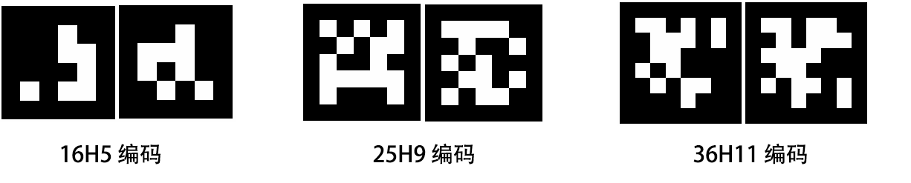
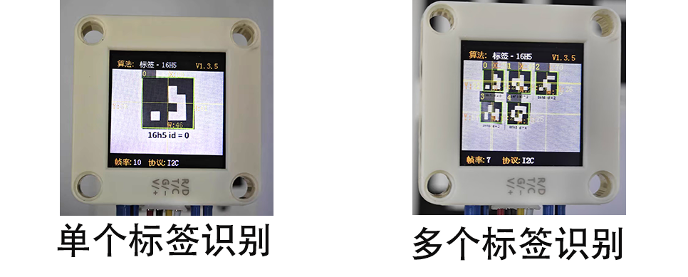
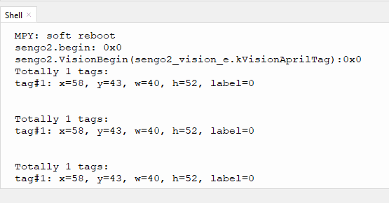

# 4.3 标签识别

## 4.3.1 算法简介

判断图像中是否有Apriltag标签， 支持16H5、25H9、36H11三种编码。算法运行时需要先选定一种编码格式，默认为36H11。不同编码的 Apriltag无法同时检测，但可以同时识别多达 25个相同编码的标签。

<span style="color:red;font-size:20px">注意：该算法不可以与其他带 \* 号的算法同时运行</span>

----------

## 4.3.2 分类标签



Apriltag标签为一组已经定义好的黑白方块图案，不同编码形式使用的方块数量是不同的。每个图案都有一个预定义的分类标签值，识别后会返回该值。


--------------------

## 4.3.3 配置参数

用户可指定编码格式，如未指定新的参数，则以默认格式36H11运行，参数定义如下：

|          模式          |    含义    |
| :--------------------: | :--------: |
| kVisionModeFamily16H5  | 16H5 编码  |
| kVisionModeFamily25H9  | 25H9 编码  |
| kVisionModeFamily36H11 | 36H11 编码 |

代码：

```python
# 选择编码格式，默认36H11。如果需要在程序运行过程中切换编码格式，请先关闭Apriltag算法，设置完毕编码格式后再开启算法
#sengo2.VisionSetMode(sengo2_vision_e.kVisionAprilTag, apriltag_vision_mode_e.kVisionModeFamily36H11)
#sengo2.VisionSetMode(sengo2_vision_e.kVisionAprilTag, apriltag_vision_mode_e.kVisionModeFamily25H9)
sengo2.VisionSetMode(sengo2_vision_e.kVisionAprilTag, apriltag_vision_mode_e.kVisionModeFamily16H5)
```

---------------

## 4.3.4 返回结果



识别到标签后会返回其坐标、大小和标签编号

当通过主控读取寄存器时，将会返回以下的数据：

|     参数     |      含义       |
| :----------: | :-------------: |
|   kXValue    | 标签中心横坐标x |
|   kYValue    | 标签中心纵坐标y |
| kWidthValue  |    标签宽度w    |
| kHeightValue |    标签高度h    |
| kHeightValue |    标签编号     |

代码：

```python
        for i in range(1,obj_num+1):
            x = sengo2.GetValue(sengo2_vision_e.kVisionAprilTag, sentry_obj_info_e.kXValue, i)
            y = sengo2.GetValue(sengo2_vision_e.kVisionAprilTag, sentry_obj_info_e.kYValue, i)
            w = sengo2.GetValue(sengo2_vision_e.kVisionAprilTag, sentry_obj_info_e.kWidthValue, i)
            h = sengo2.GetValue(sengo2_vision_e.kVisionAprilTag, sentry_obj_info_e.kHeightValue, i)
            l = sengo2.GetValue(sengo2_vision_e.kVisionAprilTag, sentry_obj_info_e.kLabel, i)
            print("tag#%d: x=%d, y=%d, w=%d, h=%d, label=%d"%(i, x, y, w, h, l))
```

----------

## 4.3.5 使用技巧

1. 算法返回的标签宽度值与高度值比较稳定，可以利用这一点进行距离判断，标签旋转后不会改变其大小，但倾斜时可能会有影响

2. 标签越大，识别的距离就越远

## 4.3.6 代码

```python
from machine import I2C,UART,Pin
from Sengo2 import *
import time

# 等待Sengo2完成操作系统的初始化。此等待时间不可去掉，避免出现Sengo2尚未初始化完毕主控器已经开发发送指令的情况
time.sleep(2)

# 选择UART或者I2C通讯模式，Sengo2出厂默认为I2C模式，短按模式按键可以切换
# 4种UART通讯模式：UART9600（标准协议指令），UART57600（标准协议指令），UART115200（标准协议指令），Simple9600（简单协议指令），
#########################################################################################################
# port = UART(2,rx=Pin(16),tx=Pin(17),baudrate=9600)
port = I2C(0,scl=Pin(21),sda=Pin(20),freq=400000)

# Sengo2通讯地址：0x60。如果I2C总线挂接多个设备，请避免出现地址冲突
sengo2 = Sengo2(0x60)
 
err = sengo2.begin(port)
print("sengo2.begin: 0x%x"% err)

# 选择编码格式，默认36H11。如果需要在程序运行过程中切换编码格式，请先关闭Apriltag算法，设置完毕编码格式后再开启算法
#sengo2.VisionSetMode(sengo2_vision_e.kVisionAprilTag, apriltag_vision_mode_e.kVisionModeFamily36H11)
#sengo2.VisionSetMode(sengo2_vision_e.kVisionAprilTag, apriltag_vision_mode_e.kVisionModeFamily25H9)
sengo2.VisionSetMode(sengo2_vision_e.kVisionAprilTag, apriltag_vision_mode_e.kVisionModeFamily16H5)
time.sleep(1)
 
# 1、Apriltag与二维码不同，请勿混淆。二者在使用时，周围一圈均需要留白；
# 2、sengo2可以同时运行多个算法，但有限制要求
# 3、Sengo系列产品参数与结果的编号都是从1开始；
# 4、正常使用时，应由主控器发送指令控制Sengo2算法的开启与关闭，而非通过摇杆手动进行操作；
err = sengo2.VisionBegin(sengo2_vision_e.kVisionAprilTag)
print("sengo2.VisionBegin(sengo2_vision_e.kVisionAprilTag):0x%x"% err)

while True:
    # Sengo2不主动返回检测识别结果，需要主控板发送指令进行读取。读取的流程：首先读取识别结果的数量，接收到指令后，Sengo2会刷新结果数据，如果结果数量不为零，那么主控再发送指令读取结果的相关信息。请务必按此流程构建程序。
    obj_num = sengo2.GetValue(sengo2_vision_e.kVisionAprilTag, sentry_obj_info_e.kStatus)
    
    if obj_num:
        print("Totally %d tags: "%( obj_num ))
        for i in range(1,obj_num+1):
            #获取位置和大小
            x = sengo2.GetValue(sengo2_vision_e.kVisionAprilTag, sentry_obj_info_e.kXValue, i)
            y = sengo2.GetValue(sengo2_vision_e.kVisionAprilTag, sentry_obj_info_e.kYValue, i)
            w = sengo2.GetValue(sengo2_vision_e.kVisionAprilTag, sentry_obj_info_e.kWidthValue, i)
            h = sengo2.GetValue(sengo2_vision_e.kVisionAprilTag, sentry_obj_info_e.kHeightValue, i)
            #获取标签编号
            l = sengo2.GetValue(sengo2_vision_e.kVisionAprilTag, sentry_obj_info_e.kLabel, i)
            print("tag#%d: x=%d, y=%d, w=%d, h=%d, label=%d"%(i, x, y, w, h, l))
            time.sleep(0.2)
        print("\n")
```

-----------

## 4.3.7 代码结果

上传代码后，AI视觉模块将会对摄像头拍到的地方进行识别如果有16H5标签则会被他捕捉并识别，然后通过串口监视器进行打印标签在屏幕上显示的位置xy与宽度高度以及标签代表的值。




## 4.3.8 扩展玩法

**标签指令卡片**

- **玩法简介：** 将标签对应0-4对应到一个动作，如舵机旋转90度或者小车前进等操作。
- **实现：** 开发板读取标签的ID序列，通过对标签ID序列的判断从而执行对应的操作。