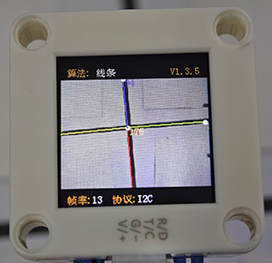
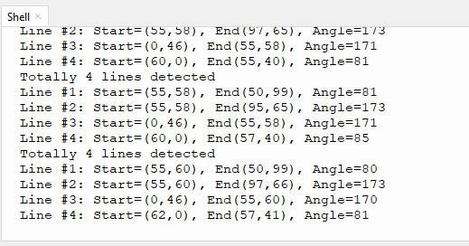

# 4.4 线条检测

## 4.4.1 算法简介


判断图像中是否有线段，如果有则会返回线段两个端点的坐标以及倾斜角度，如果线段为曲线，则返回由起点与终点相连所形成的直线的角度。

-----------

## 4.4.2 配置参数

用户可指定最大检测数量（1-5），如未指定新的参数，则以默认检测1条，参数定义如下：

| 参数 |       含义        |
| :--: | :---------------: |
|  1   | 可同时检测1个线段 |
|  2   | 可同时检测2个线段 |
|  3   | 可同时检测3个线段 |
|  4   | 可同时检测4个线段 |
|  5   | 可同时检测5个线段 |

<span style="color:red;">注意：显示屏上的线第一根线是红色，第二个线是黄色，第三根是绿色，第四根是蓝色，第五根是紫色。</span>

代码：

```c
# 设置输出线段的数量，算法默认设置为1，最多检测5条
sengo2.VisionSetMode(sengo2_vision_e.kVisionLine,1)
```

---------------

## 4.4.3 返回数据

主控器获取识别结果时，算法会返回以下数据：

|     参数     |          含义           |
| :----------: | :---------------------: |
|   kXValue    | 线段终点（远端）横坐标x |
|   kYValue    | 线段终点（远端）纵坐标y |
| kWidthValue  | 线段起点（近端）横坐标x |
| kHeightValue | 线段起点（近端）纵坐标y |
|    kLabel    |     线段的倾斜角度      |

<span style="color:red;font-size:20px;">注意：倾斜角逆时针增大，线段水平向右时其倾斜角为0°，线段垂直向上时其倾斜角为90°，线段水平向左时其倾斜角为 180°。算法不会向下检测输出角度。</span>

代码：

```python
        for i in range(1,obj_num+1):
            #获取线条角度（0-180度）
           angle = sengo2.GetValue(sengo2_vision_e.kVisionLine,sentry_obj_info_e.kLabel,i)
           #获取线条端点坐标
           x1 = sengo2.GetValue(sengo2_vision_e.kVisionLine,sentry_obj_info_e.kXValue,i)
           y1 = sengo2.GetValue(sengo2_vision_e.kVisionLine,sentry_obj_info_e.kYValue,i)
           x2 = sengo2.GetValue(sengo2_vision_e.kVisionLine,sentry_obj_info_e.kWidthValue,i)
           y2 = sengo2.GetValue(sengo2_vision_e.kVisionLine,sentry_obj_info_e.kHeightValue,i)
           print("Line #%d: Start=(%d,%d), End(%d,%d), Angle=%d"%(i,x1,y1,x2,y2,angle))
```

---------------

## 4.4.4 使用技巧

1. 请勿使用表面光滑的地图，避免反光导致检测失败；
2. 背景与线条边界应清晰分明，颜色差异明显，譬如白底黑线；
3. 背景尽量简单，颜色单一；如果背景杂乱，则可能会检测背景中的线条；
4. 线条粗细应适中，过细或过宽均影响检测；
5. 巡线时，第一条线段始终为屏幕下方最先检测到的线段；

--------------

## 4.4.5 代码

```python
from machine import I2C,UART,Pin
from  Sengo2  import *
import time

# 等待Sengo2完成操作系统的初始化。此等待时间不可去掉，避免出现Sengo2尚未初始化完毕主控器已经开发发送指令的情况
time.sleep(2)

# 选择UART或者I2C通讯模式，Sengo2出厂默认为I2C模式，短按模式按键可以切换
# 4种UART通讯模式：UART9600（标准协议指令），UART57600（标准协议指令），UART115200（标准协议指令），Simple9600（简单协议指令），
#########################################################################################################
# port = UART(2,rx=Pin(16),tx=Pin(17),baudrate=9600)
port = I2C(0,scl=Pin(21),sda=Pin(20),freq=400000)

# Sengo2通讯地址：0x60。如果I2C总线挂接多个设备，请避免出现地址冲突
sengo2 = Sengo2(0x60)

err = sengo2.begin(port)
print("sengo2.begin: 0x%x"% err)

# 设置输出线段的数量，算法默认设置为1，最多检测5条
sengo2.VisionSetMode(sengo2_vision_e.kVisionLine,4)
 
# 1、算法文档
# 2、请保持默认设置：只检测一条线段
# 3、正常使用时，应由主控器发送指令控制Sengo2算法的开启与关闭，而非通过摇杆手动进行操作；
# 4、满足特定限制条件下，Sengo2可以并行运行多个识别算法
err = sengo2.VisionBegin(sengo2_vision_e.kVisionLine)
print("sengo2.VisionBegin(sengo2_vision_e.kVisionLine):0x%x"% err)
        
while True:
    # Sengo2不主动返回检测识别结果，需要主控板发送指令进行读取。读取的流程：首先读取识别结果的数量，接收到指令后，Sengo2会刷新结果数据，如果结果数量不为零，那么主控再发送指令读取结果的相关信息。请务必按此流程构建程序。
    obj_num = sengo2.GetValue(sengo2_vision_e.kVisionLine, sentry_obj_info_e.kStatus)
    
    if obj_num:
        print(f"Totally {obj_num} lines detected")
        for i in range(1,obj_num+1):
            #获取线条角度（0-180度）
           angle = sengo2.GetValue(sengo2_vision_e.kVisionLine,sentry_obj_info_e.kLabel,i)
           #获取线条端点坐标
           x1 = sengo2.GetValue(sengo2_vision_e.kVisionLine,sentry_obj_info_e.kXValue,i)
           y1 = sengo2.GetValue(sengo2_vision_e.kVisionLine,sentry_obj_info_e.kYValue,i)
           x2 = sengo2.GetValue(sengo2_vision_e.kVisionLine,sentry_obj_info_e.kWidthValue,i)
           y2 = sengo2.GetValue(sengo2_vision_e.kVisionLine,sentry_obj_info_e.kHeightValue,i)
           print("Line #%d: Start=(%d,%d), End(%d,%d), Angle=%d"%(i,x1,y1,x2,y2,angle))
        time.sleep(0.2)
        
```

--------------------

## 4.4.6 代码结果

上传代码后，AI视觉模块将会对摄像头拍到的地方进行分析如果有线条就会进行识别，并且在串口监视器中打印线条的起始和结束坐标以及角度（角度的判别是垂直线是90度，水平垂直线是180度）。





## 4.4.7 扩展玩法

**区分三角形与矩形**

- **玩法简介：** 使用打印机将三角形与矩形打印到A4纸上线条要粗一些，然后使用线条检查功能对进行检测如果检测到三条线就是三角形，如果检测到4条线就是矩形。
- **实现：** 开发板读取识别的线条数量，然后对线条数量进行判断，线条数量为3则为三角形，线条数量为4则为矩形。