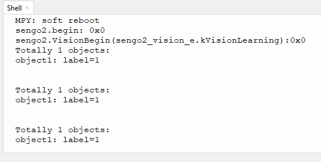

# 4.5 深度学习

## 4.5.1 算法简介


可以对任意物体进行离线学习存储并识别，可存储15个物体，已存储的数据可以全部或者单独进行删除。该算法只能对物体进行分类，无法检测物体的方位及大小。

-------------------------

## 4.5.2 分类标签

| 分类标签值 |     含义     |
| :--------: | :----------: |
|    1-15    | 物体分类编号 |

----------

## 4.5.3 保存数据

开启深度学习算法后，将摄像头正对目标物体，按下功能按键约5秒后松开，Sengo2开始学习，目标物体的数据会被存储并分配一个ID编号（注意：最多存储15个。）。

编号即标签值的分配原则：当前可用编号中最小的号。如果无空余编号，则Sengo2会提示存储失败。


---------

## 4.5.4 删除数据

执行完毕学习操作后，按下功能按键约10秒后松开，即可删除刚存储的数据；再次按下10秒后，则会清空全部的存储数据。若算法开启后未执行过学习操作，则下功能按键10秒后会直接清空全部的存储数据。

-------

## 4.5.5 返回数据

主控器获取识别结果时，算法会返回以下数据：

|  参数  |     含义     |
| :----: | :----------: |
| kLabel | 物体分类编号 |

代码：

```python
 for i in range(1,obj_num+1):
            #深度学习算法返回的xywh值为固定值，无需读取处理
            l = sengo2.GetValue(sengo2_vision_e.kVisionLearning, sentry_obj_info_e.kLabel, i)
            print("object%d: label=%d"%(i,l))
```

-------

## 4.5.6 使用技巧

1. 对于某些应用，譬如需要在较长距离内识别同一物体，或者在固定的位置识别不同角度下的同一物体（例如卡片旋转了90° 180°），解决方案：在不同距离下或者不同角度下对该物体进行学习并存储为ID1、ID2...识别时，如果返回的标签值为上述编号之一，即可认定为同一物体。
2. 学习物体时与识别物体时的背景（包含光照条件）如果存在差异，那么识别效果会受影响。

## 4.5.7 代码

```python
from machine import I2C,UART,Pin
from  Sengo2  import *
import time

# 等待Sengo2完成操作系统的初始化。此等待时间不可去掉，避免出现Sengo2尚未初始化完毕主控器已经开发发送指令的情况
time.sleep(2)

# 选择UART或者I2C通讯模式，Sengo2出厂默认为I2C模式，短按模式按键可以切换
# 4种UART通讯模式：UART9600（标准协议指令），UART57600（标准协议指令），UART115200（标准协议指令），Simple9600（简单协议指令），
#########################################################################################################
# port = UART(2,rx=Pin(16),tx=Pin(17),baudrate=9600)
port = I2C(0,scl=Pin(21),sda=Pin(20),freq=400000)

# Sengo2通讯地址：0x60。如果I2C总线挂接多个设备，请避免出现地址冲突
sengo2 = Sengo2(0x60)

err = sengo2.begin(port)
print("sengo2.begin: 0x%x"% err)
 
# 1、sengo2可以学习15个物体；
# 2、为了取得较好的识别效果，学习时的场景（包括但不限背景、灯光、角度等）请与实际使用的场景保持一致或者比较相似；
# 3、如果需要在较大的范围内多个角度下均能检测到某个物体，那么需要在不同距离处的不同角度下学习该物体，存储的ID值分别为ID1...IDn，那么使用时，只要获取的label值为上述ID系列中的一个
err = sengo2.VisionBegin(sengo2_vision_e.kVisionLearning)
print("sengo2.VisionBegin(sengo2_vision_e.kVisionLearning):0x%x"% err)


while True:
    # Sengo2不主动返回检测识别结果，需要主控板发送指令进行读取。读取的流程：首先读取识别结果的数量，接收到指令后，Sengo2会刷新结果数据，如果结果数量不为零，那么主控再发送指令读取结果的相关信息。请务必按此流程构建程序。
    obj_num = sengo2.GetValue(sengo2_vision_e.kVisionLearning, sentry_obj_info_e.kStatus)
    if obj_num:
        print("Totally %d objects: "%obj_num)
        for i in range(1,obj_num+1):
            #深度学习算法返回的xywh值为固定值，无需读取处理
            l = sengo2.GetValue(sengo2_vision_e.kVisionLearning, sentry_obj_info_e.kLabel, i)
            print("object%d: label=%d"%(i,l))
            time.sleep(0.2)
            print("\n")

```

----------

## 4.5.8 代码结果

上传代码后，按住AI视觉模块后面的功能按键并保持5秒然后对准白色背景下被识别的物体等待一会学习完毕后就可以对物体进行识别了。




## 4.5.9 扩展玩法

**专属手势识别器**（玩法难度较高）

- **玩法简介：** 不识别常规物体，而是训练它识别你自定义的几种手势（如“竖大拇指”、“OK”、“手掌”。识别到不同手势，控制电灯开关、播放音乐等。

- **实现：** 再背景干净（推荐白色背景）的环境下对手势进行识别并且每个手势需要识别3个这样能更好的识别分辨，代码中将三种一样手势的ID放到用逻辑或进行判断当有一个满足时就执行对应的功能。

- **难点：** 这个玩法对识别手势的背景，环境灯光，手势位置要求都很高需要注意