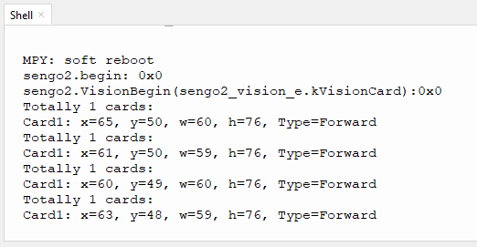

# 4.6 卡片识别

## 4.6.1 算法简介


识别图像中是否有配套的交通卡片，返回卡片的坐标、大小、分类标签等信息。

--------

## 4.6.2 卡片分类标签

| 分类标签 |  含义  |          图片           |
| :------: | :----: | :---------------------: |
|    1     |  前进  |  |
|    2     |  左转  |  |
|    3     |  右转  |  |
|    4     |  掉头  |  |
|    5     |  停车  |  |
|    6     |  绿灯  |  |
|    7     |  红灯  |  |
|    8     | 速度40 |  |
|    9     | 速度60 |  |
|    10    | 速度80 |  |

注意：算法可以同时识别多张卡片。在一定的旋转角、偏转角与俯仰角内卡片仍然可以被识别，使用时请尽量正对卡片以期获得较好的识别效果。

----------------------

## 4.6.3 返回数据

主控器获取识别结果时，算法会返回以下数据：

|     参数     |      含义       |
| :----------: | :-------------: |
|   kXValue    | 卡片中心横坐标x |
|   kYValue    | 卡片中心纵坐标y |
| kWidthValue  |    卡片宽度w    |
| kHeightValue |    卡片高度h    |
|    kLabel    |  卡片分类标签   |

代码：

```python
for i in range(1,obj_num+1):
            #获取位置和大小
            x = sengo2.GetValue(sengo2_vision_e.kVisionCard, sentry_obj_info_e.kXValue, i)
            y = sengo2.GetValue(sengo2_vision_e.kVisionCard, sentry_obj_info_e.kYValue, i)
            w = sengo2.GetValue(sengo2_vision_e.kVisionCard, sentry_obj_info_e.kWidthValue, i)
            h = sengo2.GetValue(sengo2_vision_e.kVisionCard, sentry_obj_info_e.kHeightValue, i)
            #获取卡片标签值
            cardType = sengo2.GetValue(sengo2_vision_e.kVisionCard,sentry_obj_info_e.kLabel,i)      
            print("Card%d: x=%d, y=%d, w=%d, h=%d, Type=%s"%(i,x, y, w, h,cardName[cardType]))
```

------------

## 4.6.4 代码

```python
from machine import I2C,UART,Pin
from Sengo2 import *
import time

# 等待Sengo2完成操作系统的初始化。此等待时间不可去掉，避免出现Sengo2尚未初始化完毕主控器已经开发发送指令的情况
time.sleep(2)

# 选择UART或者I2C通讯模式，Sengo2出厂默认为I2C模式，短按模式按键可以切换
# 4种UART通讯模式：UART9600（标准协议指令），UART57600（标准协议指令），UART115200（标准协议指令），Simple9600（简单协议指令），
#########################################################################################################
# port = UART(2,rx=Pin(16),tx=Pin(17),baudrate=9600)
port = I2C(0,scl=Pin(21),sda=Pin(20 ),freq=400000)

# Sengo2通讯地址：0x60。如果I2C总线挂接多个设备，请避免出现地址冲突
sengo2 = Sengo2(0x60)

err = sengo2.begin(port)
print("sengo2.begin: 0x%x"% err)
 
# 1、sengo2可以识别10张交通卡片
# 2、如需识别自定义的卡片，首先可以尝试集成的深度学习算法；如果效果或者功能不理想，可以购买Sentry2，烧录Sentry2MV固件，自行采集图片训练模型，然后编写python脚本调用模型；
# 4、sengo2最多可以同时识别2排4列共8张卡片，一般按照由上向下、由左向右的顺序输出结果信息；
# 5、正常使用时，应由主控器发送指令控制Sengo2算法的开启与关闭，而非通过摇杆手动进行操作；
# 6、满足特定限制条件下，Sengo2可以并行运行多个识别算法
err = sengo2.VisionBegin(sengo2_vision_e.kVisionCard)
print("sengo2.VisionBegin(sengo2_vision_e.kVisionCard):0x%x"% err)

#卡片名称，从1开始到10都是对应卡片标签值
cardName = ["unknown","Forward","Left","Right","TurnAround","Park","GreenLight","RedLight","Speed-40","Speed-60","Speed-80"]

while True:
    # Sengo2不主动返回检测识别结果，需要主控板发送指令进行读取。读取的流程：首先读取识别结果的数量，接收到指令后，Sengo2会刷新结果数据，如果结果数量不为零，那么主控再发送指令读取结果的相关信息。请务必按此流程构建程序。
    obj_num = (sengo2.GetValue(sengo2_vision_e.kVisionCard, sentry_obj_info_e.kStatus))
    if obj_num:
        print("Totally %d cards: "%obj_num)
        for i in range(1,obj_num+1):
            #获取位置和大小
            x = sengo2.GetValue(sengo2_vision_e.kVisionCard, sentry_obj_info_e.kXValue, i)
            y = sengo2.GetValue(sengo2_vision_e.kVisionCard, sentry_obj_info_e.kYValue, i)
            w = sengo2.GetValue(sengo2_vision_e.kVisionCard, sentry_obj_info_e.kWidthValue, i)
            h = sengo2.GetValue(sengo2_vision_e.kVisionCard, sentry_obj_info_e.kHeightValue, i)
            #获取卡片标签值
            cardType = sengo2.GetValue(sengo2_vision_e.kVisionCard,sentry_obj_info_e.kLabel,i)      
            print("Card%d: x=%d, y=%d, w=%d, h=%d, Type=%s"%(i,x, y, w, h,cardName[cardType]))
            time.sleep(0.2)    

```

## 4.6.5 代码结果

上传代码后，AI视觉模块将会对摄像头拍到的地方进行分析如果有卡片就会进行识别，并且在串口监视器中打印卡片的类型（前进，掉头，左转，右转等...）。



## 4.6.6 扩展玩法

**颜色选择器**

- **玩法简介：** 使用卡片的左转右转控制WS2812灯的变化，如灯光正常顺序是：红>绿>蓝>黄>紫等，使用卡片的左转右转可以对灯光进行调节。假如：当前灯光为红色使用右转卡片就会变成绿色，使用左转卡片就会变成紫色以此循环。
- **实现：** 识别到卡片后，对一个变量进行加减就可以实现控制灯光的操作。
