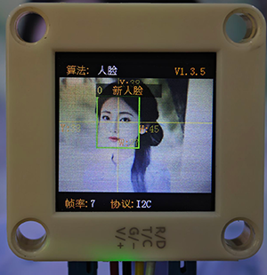
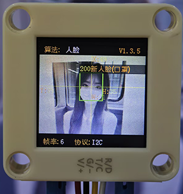
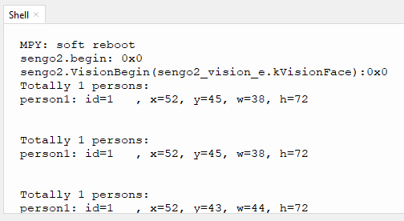

# 4.7 人脸识别

## 4.7.1 算法简介


判断图像中是否有人脸及识别人脸，用户可通过功能按键训练存储或删除人脸数据，Sengo2可以存储15张人脸数据。

-----------------

## 4.7.2 人脸分类标签

Sengo2定义了17个人脸的分类标签：

| 分类标签 |  含义  | 分类标签 |        含义        |
| :------: | :----: | :------: | :----------------: |
|    0     | 新人脸 |   1-15   | 存储的人脸分类编号 |
|   200    | 戴口罩 |          |                    |

新人脸（标签 0）：



戴口罩人脸 （标签 200）：



存储的人脸（标签 1-15）


---------------

## 4.7.3 保存人脸数据

开启人脸识别算法后，将摄像头正对人脸，按下功能按键约5秒后松开，Sengo2开始训练人脸，图像中当前的人脸数据会被存储并分配一个ID编号。

人脸数据的编号即标签值的分配原则：当前可用编号中最小的号。如果无空余编号，则Sengo2会提示保存失败。

----------------

## 4.7.4 删除人脸数据

执行完毕人脸存储操作后，按下功能按键约10秒后松开，即可删除刚存储的人脸数据；再次按下10秒后，则会清空存储的全部人脸数据。若算法开启后未执行过人脸保存操作，则下功能按键10秒后会直接清空全部的人脸数据。

------------------

## 4.7.5 返回数据

主控器获取识别结果时，算法会返回以下数据：

|     参数     |      含义       |
| :----------: | :-------------: |
|   kXValue    | 人脸中心横坐标x |
|   kYValue    | 人脸中心纵坐标y |
| kWidthValue  |    人脸宽度w    |
| kHeightValue |    人脸高度h    |
|    kLabel    |  人脸分类标签l  |

代码：

```python
for i in range(1,obj_num+1):
            print("person%d: "%i, end='')
            #当人脸高度不小于50时，才进行人脸判定，避免距离过远导致误识别
            h = sengo2.GetValue(sengo2_vision_e.kVisionFace, sentry_obj_info_e.kHeightValue, i)            
            if h >= 50:
                #人脸标签=0，表示陌生人；人脸标签范围1-15，表示已经记忆的人脸；#人脸标签=200，表示戴口罩；
                l = sengo2.GetValue(sengo2_vision_e.kVisionFace, sentry_obj_info_e.kLabel, i)
                if l == 0:
                    print("stranger, ", end='')
                elif l == 200:
                    print("masked  , ", end='')
                else:
                    print("id=%d   , "%l, end='')

            x = sengo2.GetValue(sengo2_vision_e.kVisionFace, sentry_obj_info_e.kXValue, i)
            y = sengo2.GetValue(sengo2_vision_e.kVisionFace, sentry_obj_info_e.kYValue, i)
            w = sengo2.GetValue(sengo2_vision_e.kVisionFace, sentry_obj_info_e.kWidthValue, i)
            print("x=%d, y=%d, w=%d, h=%d"%(x, y, w, h))
```

---------------

## 4.7.6 使用技巧

1. 环境光线充足，正对人脸且完整的人脸在视野中较大时识别效果佳
2. 佩戴眼镜或头发遮住面部时，会影响人脸检测效果

----------------

## 4.7.7 代码

```python
from machine import I2C,UART,Pin
from  Sengo2  import *
import time

# 等待Sengo2完成操作系统的初始化。此等待时间不可去掉，避免出现Sengo2尚未初始化完毕主控器已经开发发送指令的情况
time.sleep(2)

# 选择UART或者I2C通讯模式，Sengo2出厂默认为I2C模式，短按模式按键可以切换
# 4种UART通讯模式：UART9600（标准协议指令），UART57600（标准协议指令），UART115200（标准协议指令），Simple9600（简单协议指令），
#########################################################################################################
# port = UART(2,rx=Pin(16),tx=Pin(17),baudrate=9600)
port = I2C(0,scl=Pin(21),sda=Pin(20),freq=400000)

# Sengo2通讯地址：0x60。如果I2C总线挂接多个设备，请避免出现地址冲突
sengo2 = Sengo2(0x60)

err = sengo2.begin(port)
print("sengo2.begin: 0x%x"% err)
 
# 1、Sengo2消费版可以储存15张人脸数据
# 2、除了可以通过操作摇杆记忆/删除人脸数据外，还可以通过串口指令进行操作；
# 3、正常使用时，应由主控器发送指令控制Sengo2算法的开启与关闭，而非通过摇杆手动进行操作；
err = sengo2.VisionBegin(sengo2_vision_e.kVisionFace)
print("sengo2.VisionBegin(sengo2_vision_e.kVisionFace):0x%x"% err)


while True:
    # Sengo2不主动返回检测识别结果，需要主控板发送指令进行读取。读取的流程：首先读取识别结果的数量，接收到指令后，Sengo2会刷新结果数据，如果结果数量不为零，那么主控再发送指令读取结果的相关信息。请务必按此流程构建程序。
    obj_num = sengo2.GetValue(sengo2_vision_e.kVisionFace, sentry_obj_info_e.kStatus)
    if obj_num:
        print("Totally %d persons: "%obj_num)
        for i in range(1,obj_num+1):
            print("person%d: "%i, end='')
            #当人脸高度不小于50时，才进行人脸判定，避免距离过远导致误识别
            h = sengo2.GetValue(sengo2_vision_e.kVisionFace, sentry_obj_info_e.kHeightValue, i)            
            if h >= 50:
                #人脸标签=0，表示陌生人；人脸标签范围1-15，表示已经记忆的人脸；#人脸标签=200，表示戴口罩；
                l = sengo2.GetValue(sengo2_vision_e.kVisionFace, sentry_obj_info_e.kLabel, i)
                if l == 0:
                    print("stranger, ", end='')
                elif l == 200:
                    print("masked  , ", end='')
                else:
                    print("id=%d   , "%l, end='')

            x = sengo2.GetValue(sengo2_vision_e.kVisionFace, sentry_obj_info_e.kXValue, i)
            y = sengo2.GetValue(sengo2_vision_e.kVisionFace, sentry_obj_info_e.kYValue, i)
            w = sengo2.GetValue(sengo2_vision_e.kVisionFace, sentry_obj_info_e.kWidthValue, i)
            print("x=%d, y=%d, w=%d, h=%d"%(x, y, w, h))
            time.sleep(0.2)
        print("\n")

```

--------------------

## 4.7.8 代码结果

上传代码后，按住AI视觉模块后面的功能按键并保持5秒然后对准人脸等待一会学习完毕后就可以对物体进行识别了，当遇到新的人脸与戴口罩的人脸也是会提示的。




## 4.7.9 扩展玩法

**专注力监测仪**

- **玩法简介：** 学习时，摄像头对着你。如果它检测到你的人脸离开了摄像头视野（扭头干别的去了），会发出友好的语音提醒：“嘀嘀嘀！”
- **实现：** 编程持续检测人脸。如果连续若干帧没有检测到人脸，则通过连接的语音模块触发提醒音频。