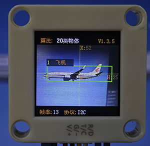
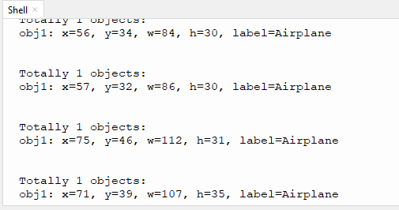

# 4.8 20类物体识别

## 4.8.1 算法简介

识别常见的20类物体，返回他们的坐标信息和分类标签。

## 4.8.2 分类标签 

| 分类标签 | 含义 | 分类标签 |   含义   |
| :------: | :--: | :------: | :------: |
|    1     | 飞机 |    2     |  自行车  |
|    3     |  鸟  |    4     |    船    |
|    5     | 瓶子 |    6     |  公交车  |
|    7     | 汽车 |    8     |    猫    |
|    9     | 椅子 |    10    |    牛    |
|    11    | 餐桌 |    12    |    狗    |
|    13    |  马  |    14    |  摩托车  |
|    15    |  人  |    16    | 盆栽植物 |
|    17    |  羊  |    18    |   沙发   |
|    19    | 火车 |    20    |  显示器  |

我们有在下载的文件资料文件夹中提供20类物体识别的图片以供使用。

---------------

## 4.8.4 返回数据

主控器获取识别结果时，算法会返回以下数据：

|     结果     |      含义       |
| :----------: | :-------------: |
|   kXValue    | 物体中心横坐标x |
|   kYValue    | 物体中心纵坐标y |
| kWidthValue  |    物体宽度w    |
| kHeightValue |    物体高度h    |
|    kLabel    |  物体分类标签l  |

代码：

```python
for i in range(1,obj_num+1):
            l = sengo2.GetValue(sengo2_vision_e.kVision20Classes,sentry_obj_info_e.kLabel,i)
            x = sengo2.GetValue(sengo2_vision_e.kVision20Classes, sentry_obj_info_e.kXValue, i)
            y = sengo2.GetValue(sengo2_vision_e.kVision20Classes, sentry_obj_info_e.kYValue, i)
            w = sengo2.GetValue(sengo2_vision_e.kVision20Classes, sentry_obj_info_e.kWidthValue, i)
            h = sengo2.GetValue(sengo2_vision_e.kVision20Classes, sentry_obj_info_e.kHeightValue, i)
            print("obj%d: x=%d, y=%d, w=%d, h=%d, label=%s"%(i,x, y, w, h,classes20Name[l]))
```

----------

## 4.8.5 使用技巧

1. 图像的清晰度会影响识别效果。如果图案偏小，摄像头无法聚焦到图案，图案成像模糊，会导致识别效果变差，此时应改用较大的图案

2. 如果需要识别屏幕上的图案，应当适当调节屏幕的亮度，避免过曝

-------

## 4.8.6 代码

```python
from machine import I2C,UART,Pin
from Sengo2 import *
import time

# 等待Sengo2完成操作系统的初始化。此等待时间不可去掉，避免出现Sengo2尚未初始化完毕主控器已经开发发送指令的情况
time.sleep(3)

# 选择UART或者I2C通讯模式，Sengo2出厂默认为I2C模式，短按模式按键可以切换
# 4种UART通讯模式：UART9600（标准协议指令），UART57600（标准协议指令），UART115200（标准协议指令），Simple9600（简单协议指令），
#########################################################################################################
# port = UART(2,rx=Pin(16),tx=Pin(17),baudrate=9600)
port = I2C(0,scl=Pin(21),sda=Pin(20),freq=400000)

# Sengo2通讯地址：0x60。如果I2C总线挂接多个设备，请避免出现地址冲突
sengo2 = Sengo2(0x60)
 
err = sengo2.begin(port)
print("sengo2.begin: 0x%x"% err)
 
# 1、sengo2可以同时运行多个算法，但有限制要求
# 2、Sengo/sentry系列产品参数与结果的编号都是从1开始；
# 3、正常使用时，应由主控器发送指令控制Sengo2算法的开启与关闭，而非通过摇杆手动进行操作；
err = sengo2.VisionBegin(sengo2_vision_e.kVision20Classes)
print("sengo2.VisionBegin(sengo2_vision_e.kVision20Classes):0x%x"% err)

#20classes 物体名称
classes20Name = ["unknown",			"Airplane", 		"Bicycle",  	"Bird",			"Boat",
                 "Bottle",			"Bus",				"Car",			"Cat",			"Chair",
                 "Cow",				"Dining Table",		"Dog",			"Horse",    	"Motorbike",
                 "Person",			"Potted Plant",		"Sheep",		"Sofa",			"Train",
                 "TV Monitor"]

while True:
  # Sengo不主动返回检测识别结果，需要主控板发送指令进行读取。读取的流程：首先读取识别结果的数量，接收到指令后，Sengo2会刷新结果数据，如果结果数量不为零，那么主控再发送指令读取结果的相关信息。请务必按此流程构建程序。
    obj_num = (sengo2.GetValue(sengo2_vision_e.kVision20Classes, sentry_obj_info_e.kStatus))
    if obj_num:
        print("Totally %d objects: "%( obj_num ))
        for i in range(1,obj_num+1):
            l = sengo2.GetValue(sengo2_vision_e.kVision20Classes,sentry_obj_info_e.kLabel,i)
            x = sengo2.GetValue(sengo2_vision_e.kVision20Classes, sentry_obj_info_e.kXValue, i)
            y = sengo2.GetValue(sengo2_vision_e.kVision20Classes, sentry_obj_info_e.kYValue, i)
            w = sengo2.GetValue(sengo2_vision_e.kVision20Classes, sentry_obj_info_e.kWidthValue, i)
            h = sengo2.GetValue(sengo2_vision_e.kVision20Classes, sentry_obj_info_e.kHeightValue, i)
            print("obj%d: x=%d, y=%d, w=%d, h=%d, label=%s"%(i,x, y, w, h,classes20Name[l]))
            time.sleep(0.2)
            print("\n")
        time.sleep(0.5);
        

```

-----------

## 4.8.7 代码结果

上传代码后，AI视觉模块将会对摄像头拍到的地方进行识别，如果有识别到20类物体中的某一个将会在串口监视器中打印识别到的物体的名称。

注意：如果AI模块出现错误请断电重启即可。





## 4.8.8 扩展玩法

**儿童智能认知卡**

- **玩法简介：** 让小朋友拿着20类物体卡片到摄像头前，AI会自动识别并读出物品的名称，并显示在屏幕上。
- **实现：** 识别到物体后，通过串口将物体名称发送给语音合成模块，并同时在屏幕显示大字体的名称。
- **难点：** 需要接入音频模块