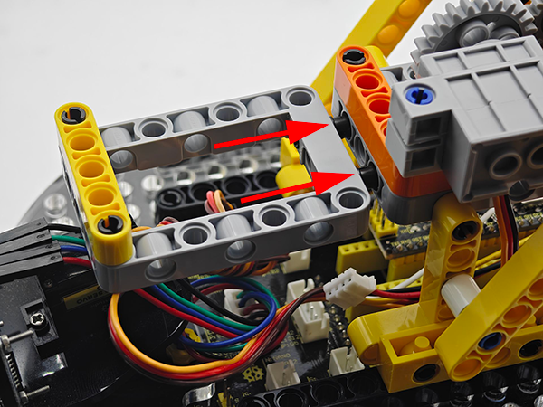
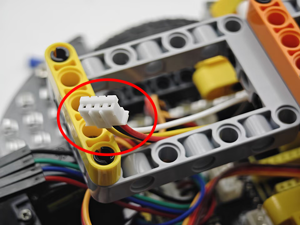
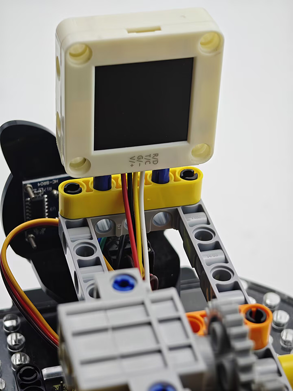
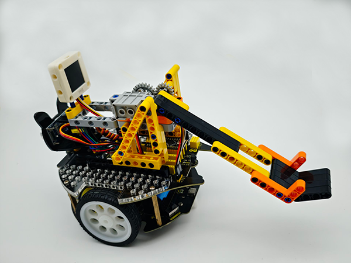
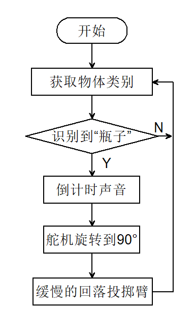

# 5.6 智能投石车

## 5.6.1 简介

使用AI视觉模块搭配小车的投石攻城车造型，制作出有趣的自动识别投石器，先将AI视觉模块固定到投石器小车上，然后使用AI模块进行识别如果识别到了瓶子就蜂鸣器开始倒计时3声然后投掷，投掷结束后缓慢落下投掷臂等待下一次识别到瓶子后投掷。

## 5.6.2 将AI模块安装到投石小车上

<p style="color:red;font-size:25px;">注意：你需要先按照小车教程将`投石攻城车`的乐高搭建好，然后再按照下方的安装教程进行安装。</p>

**所需配件**


**步骤1：**


**步骤2：**




**步骤3：**





**步骤4：**

|  AI视觉模块  | 小车接口 |
| :----------: | :------: |
| T/C (黄色线) |   SCL    |
| R/D (白色线) |   SDA    |
| V/+ (红色线) |    5V    |
| G/- (黑色线) |    G     |


**完整展示：**



## 5.6.3 流程图



## 5.6.4 代码

```python
from machine import I2C,UART,Pin,PWM
from Sengo2 import *
import time

# 舵机控制引脚GPIO 3
servo_pin = Pin(3)
servo = PWM(servo_pin)

#蜂鸣器控制引脚GPIO12
buzzer = PWM(Pin(12))

# 设置PWM频率为50Hz（标准舵机频率）
servo.freq(50)

# 等待Sengo2完成操作系统的初始化。此等待时间不可去掉，避免出现Sengo2尚未初始化完毕主控器已经开发发送指令的情况
time.sleep(3)

# 选择UART或者I2C通讯模式，Sengo2出厂默认为I2C模式，短按模式按键可以切换
# 4种UART通讯模式：UART9600（标准协议指令），UART57600（标准协议指令），UART115200（标准协议指令），Simple9600（简单协议指令），
#########################################################################################################
# port = UART(2,rx=Pin(16),tx=Pin(17),baudrate=9600)
port = I2C(0,scl=Pin(21),sda=Pin(20),freq=400000)

# Sengo2通讯地址：0x60。如果I2C总线挂接多个设备，请避免出现地址冲突
sengo2 = Sengo2(0x60)
 
err = sengo2.begin(port)
print("sengo2.begin: 0x%x"% err)
 
# 1、sengo2可以同时运行多个算法，但有限制要求
# 2、Sengo/sentry系列产品参数与结果的编号都是从1开始；
# 3、正常使用时，应由主控器发送指令控制Sengo2算法的开启与关闭，而非通过摇杆手动进行操作；
err = sengo2.VisionBegin(sengo2_vision_e.kVision20Classes)
print("sengo2.VisionBegin(sengo2_vision_e.kVision20Classes):0x%x"% err)


def tone(pin, frequency, duration):
    """Play the sound of the specified frequency"""
    if frequency > 0:
        pin.freq(frequency)
        pin.duty_u16(32768)  # 50% duty cycle
    time.sleep_ms(duration)
    pin.duty_u16(0)  # stop play tone

def no_tone(pin):
    """no tone"""
    pin.duty_u16(0)

def countdown(seconds):
    """countdown sound"""
    for i in range(seconds, 0, -1):
        # The ticking of the countdown
        tone(buzzer, 800, 100)
        time.sleep_ms(200)
        no_tone(buzzer)
        
        # Interval time
        time.sleep_ms(500)

# 定义舵机角度到占空比的转换函数
def set_servo_angle(angle):
    # 确保角度在0-270度范围内
    if angle < 0:
        angle = 0
    elif angle > 270:
        angle = 270
    
    # 将角度转换为占空比
    # 对于270度舵机，通常0.5ms脉冲对应0度，2.5ms脉冲对应270度
    min_duty = 1638  # 0.5ms的占空比值 (0.5/20 * 65535)
    max_duty = 8192  # 2.5ms的占空比值 (2.5/20 * 65535)
    
    # 计算对应角度的占空比
    duty = int(min_duty + (max_duty - min_duty) * angle / 270)
    servo.duty_u16(duty)


while True:
  # Sengo不主动返回检测识别结果，需要主控板发送指令进行读取。读取的流程：首先读取识别结果的数量，接收到指令后，Sengo2会刷新结果数据，如果结果数量不为零，那么主控再发送指令读取结果的相关信息。请务必按此流程构建程序。
    obj_num = (sengo2.GetValue(sengo2_vision_e.kVision20Classes, sentry_obj_info_e.kStatus))
    if obj_num:
        for i in range(1,obj_num+1):
            class20_label = sengo2.GetValue(sengo2_vision_e.kVision20Classes,sentry_obj_info_e.kLabel,1)
            #判断是否检测到“Bottle”
            if class20_label == class20_label_e.kBottle:
                #投掷前倒计时声音，三声
                countdown(3)
                #投掷
                set_servo_angle(90)
                time.sleep(1)
                #缓慢的回落投掷臂
                for j in range(90,0,-1):
                    set_servo_angle(j)
                    time.sleep(0.01)

```

## 5.6.5 代码结果

上传代码成功后，AI视觉模块会开启“20类物体”模式然后对拍到的画面进行识别，判断是否有检测到瓶子，如果有则进行投掷，投掷前会有三声倒计时提示音倒计时结束就会进行投掷，投掷完成后投掷臂会慢慢的回落等待下一次投掷。
