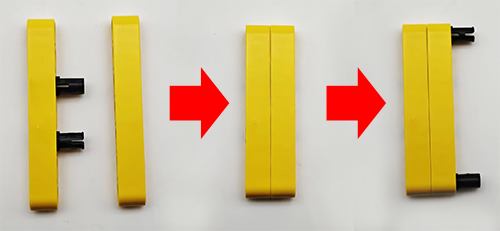
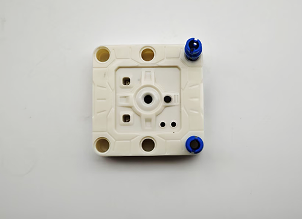
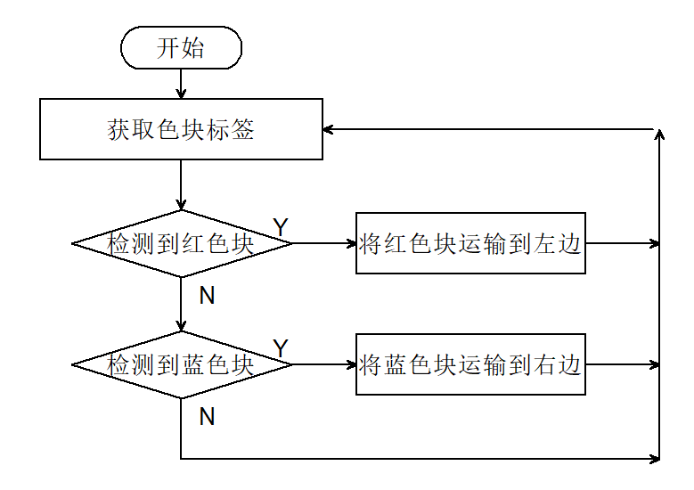

# 5.7 红蓝颜色分拣车

## 5.7.1 简介

使用AI视觉模块搭配小车的足球机器人造型，制作出有趣的色块分拣机器人，先将AI视觉模块固定到足球机器人小车上，然后使用AI模块进行识别，如果识别到了红色块就运输到左边然后原路返回原位，如果识别到蓝色则运输到右边再原路返回到原位。

## 5.7.2 将AI模块安装到足球小车上

<p style="color:red;font-size:25px;">注意：你需要先按照小车教程将`足球机器人`的乐高搭建好，然后再按照下方的安装教程进行安装。</p>

 **所需配件：**


**步骤1：**



**步骤2：**


**步骤3：**



**步骤4：**


**步骤5：**


**步骤6：**

|  AI视觉模块  | 小车接口 |
| :----------: | :------: |
| T/C (黄色线) |   SCL    |
| R/D (白色线) |   SDA    |
| V/+ (红色线) |    5V    |
| G/- (黑色线) |    G     |


**完整展示：**


## 5.7.3 流程图




## 5.7.4 代码

```python
from machine import I2C, Pin, PWM
import time
import random
from Sengo2 import *

#初始化PWM对象，控制引脚GPIO3
servo_pin = Pin(3)
servo = PWM(servo_pin)

#设置PWM频率为50HZ（标准舵机频率）
servo.freq(50)

# 初始化I2C (根据实际接线调整引脚)
i2c = I2C(0, scl=Pin(21), sda=Pin(20), freq=400000)  # 使用参考代码中的引脚

# 等待Sengo2初始化 (重要!)
time.sleep(2)

# 创建Sengo2对象
sentry = Sengo2()

# 开始传感器
if sentry.begin(i2c) != SENTRY_OK:
    print("Sentry initialization failed!")
    while True: pass

# 设置色块检测参数 - 只检测红色和蓝色
sentry.SetParamNum(sengo2_vision_e.kVisionBlob, 2)  # 设置2组参数

# 红色参数组
sentry.SetParam(
    sengo2_vision_e.kVisionBlob,
    [0, 0, 25, 25, color_label_e.kColorRed],  # 参数格式
    param_id=1
)

# 蓝色参数组
sentry.SetParam(
    sengo2_vision_e.kVisionBlob,
    [0, 0, 25, 25, color_label_e.kColorBlue],  # 参数格式
    param_id=2
)

# 开启色块检测功能
if sentry.VisionBegin(sengo2_vision_e.kVisionBlob) == SENTRY_OK:
    print("Color block detection enabled")
    
    
# 定义舵机角度到占空比的转换函数
def set_servo_angle(angle):
    # 确保角度在0-270度范围内
    if angle < 0:
        angle = 0
    elif angle > 270:
        angle = 270
    
    # 将角度转换为占空比
    # 对于270度舵机，通常0.5ms脉冲对应0度，2.5ms脉冲对应270度
    min_duty = 1638  # 0.5ms的占空比值 (0.5/20 * 65535)
    max_duty = 8192  # 2.5ms的占空比值 (2.5/20 * 65535)
    
    # 计算对应角度的占空比
    duty = int(min_duty + (max_duty - min_duty) * angle / 270)
    servo.duty_u16(duty)
    
# right wheel
pin1=Pin(14,Pin.OUT)
pin2=PWM(Pin(16))
pin2.freq(50)

# left wheel
pin3=Pin(15,Pin.OUT)
pin4=PWM(Pin(17))
pin4.freq(50)

# As a function of the car going forward.
def car_forward(): 
  pin1.value(0)
  pin2.duty_u16(20000) 
  pin3.value(0)
  pin4.duty_u16(20000)

# As a function of the car going backwards.
def car_back(): 
  pin1.value(1)
  pin2.duty_u16(40000)  
  pin3.value(1)
  pin4.duty_u16(40000)

# As a function of the car going left.
def car_left(): 
  pin1.value(0)
  pin2.duty_u16(10000)  
  pin3.value(1)
  pin4.duty_u16(45000)
# As a function of the car going right.
def car_right(): 
  pin1.value(1)
  pin2.duty_u16(45000)  
  pin3.value(0)
  pin4.duty_u16(10000)

# As a function of the car stopping.
def car_stop(): 
  pin1.value(0)
  pin2.duty_u16(0)  
  pin3.value(0)
  pin4.duty_u16(0)
    
#色块分拣代码
def sorting(val):
    #夹住色块
    set_servo_angle(270)
    time.sleep(1)
    #判断val，是0则是红色块，是1则是蓝色块
    if val == 0:
        #小车左转
        car_left()
    else :
        #小车右转
        car_right()
    time.sleep(0.3)
    #小车前进0.3秒
    car_forward()
    time.sleep(0.3)
    car_stop()
    time.sleep(0.3)
    #打开夹子放下色块
    set_servo_angle(240)
    time.sleep(0.5)
    #小车后退0.3秒
    car_back()
    time.sleep(0.3)
    #判断val，是0则是红色块，是1则是蓝色块
    if val == 0:
        #小车右转
        car_right()
    else :
        #小车左转
        car_left()
    time.sleep(0.3)

# 主检测循环
try:
    while True:
        # 获取检测到的色块数量
        obj_num = sentry.GetValue(sengo2_vision_e.kVisionBlob,sentry_obj_info_e.kStatus)
        if obj_num:
            # 处理每个检测到的色块
            for i in range(1, obj_num + 1):
                # 获取颜色标签
                color_label = sentry.GetValue(sengo2_vision_e.kVisionBlob,sentry_obj_info_e.kLabel,i)
                #判断是否检测到红色块
                if color_label == color_label_e.kColorRed:
                    sorting(0)
                #判断是否检测到蓝色块
                elif color_label == color_label_e.kColorBlue:
                    sorting(1)
        else :
            car_stop()
        time.sleep(0.1)  # 短暂延时

except KeyboardInterrupt:
    sentry.VisionEnd(sengo2_vision_e.kVisionBlob)
    # 程序被中断时关闭PWM
    servo.duty_u16(0)
    servo.deinit()
    print("The program has stopped")

```

## 5.7.5 代码结果

上传代码成功后，AI视觉模块会进入“色块检测”功能对拍到的画面进行识别，判断是否有红色块或蓝色块，如果检测到红色块小车会夹住红色快然后将它送到小车的左边然后小车会原路返回到原位。如果检测到蓝色块小车会夹住蓝色块然后将它送到小车的右边然后小车会原路返回到原位。（返回到原位时位置稍有偏差，因为他是通过行驶的时间设置的）

注意：代码中有设置色块最小尺寸宽25，高25，如果你的色块识别后的尺寸比这个小将不会被识别，你可以修改下方代码的尺寸进行识别。

```python
# 红色参数组
sentry.SetParam(
    sengo2_vision_e.kVisionBlob,
    [0, 0, 25, 25, color_label_e.kColorRed],  # 参数格式
    param_id=1
)

# 蓝色参数组
sentry.SetParam(
    sengo2_vision_e.kVisionBlob,
    [0, 0, 25, 25, color_label_e.kColorBlue],  # 参数格式
    param_id=2
)
```

