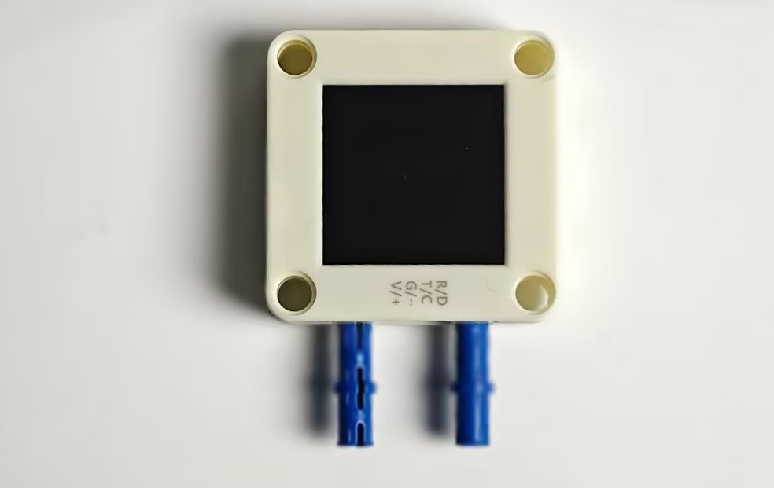

# 将AI视觉模块安装到KE3070小车上
使用KE3070小车的`搬运机器人`乐高造型，如下图：

准备好AI视觉模块与乐高插销

将乐高插销插到AI视觉模块排线接口两边的乐高孔中

将AI视觉模块的连接线从小车乐高缝中穿过来以便于接线

将AI连接线端子接入AI视觉模块，并将AI视觉模块通过乐高接到小车上，如图：

最后将线连接到I2C接口即可，注意不要接错线：

|  AI视觉模块  | 小车接口 |
| :----------: | :------: |
| T/C (黄色线) |   SCL    |
| R/D (白色线) |   SDA    |
| V/+ (红色线) |    5V    |
| G/- (黑色线) |    G     |

