# Sengo2 AI视觉图卡创客扩展包


## 1、产品简介：

Sengo2 AI视觉图卡创客扩展包（3合1小车）是一款专为创客教育设计的带智能视觉模块的智能小车套件，完美兼容乐高积木结构与Arduino生态。视觉模块集成多核AI处理器，支持颜色识别、标签码追踪、人脸检测、实时深度学习等10种机器视觉功能。通过即插即用式硬件接口以及开源项目，学生可快速搭建视觉驱动的小车、机械臂等智能项目，从图形化编程轻松过渡到Python/Arduino代码开发，是培养AI思维与工程能力的理想教具。

特点：

1. **乐高生态融合**
   - 模块化卡扣设计，直接嵌入乐高机械结构
2. **10种视觉识别功能**
   - 颜色识别，色块检测，标签识别，线条检测，深度学习，卡片识别，人脸识别，20类物体识别，二维码识别，运动物体检测
3. **多种编程开发**
   - KidsBlock图形化编程（中小学生适用）+ Arduino/C++/MicroPython代码层（高中生/大学）
4. **兼容性强**
   - 兼容Arduino UNO，Arduino Nano，ESP32，Pico等开发板
5. **自主训练AI识别**
   -   支持模型训练，学生可自主训练专属识别模型（如垃圾分类识别）


## 2、清单：

| 序号 |        名称         | 数量 |          图片           |
| :--: | :-----------------: | :--: | :---------------------: |
|  1   |     AI视觉模块      |  1   | 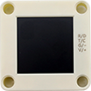 |
|  2   |       连接线        |  1   |  |
|  3   |  乐高 标准栓 黑色   |  6   | 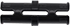 |
|  4   | 乐高 1x3摩擦销 蓝色 |  4   |  |
|  5   |     乐高 1x11梁     |  2   |  |
|  6   |     乐高 1*9梁      |  2   |  |
|  7   | Apriltag卡片 ID：0  |  1   |  |
|  8   | Apriltag卡片 ID：1  |  1   |  |
|  9   | Apriltag卡片 ID：2  |  1   | 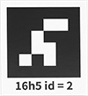 |
|  10  | Apriltag卡片 ID：3  |  1   | 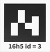 |
|  11  | Apriltag卡片 ID：4  |  1   | 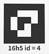 |
|  12  |      红色卡片       |  1   |  |
|  13  |      绿色卡片       |  1   | 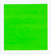 |
|  14  |      蓝色卡片       |  1   | 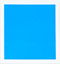 |
|  15  |      黑色卡片       |  1   | 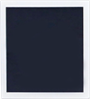 |
|  16  |      白色卡片       |  1   |  |
|  17  |     二维码 Red      |  1   |  |
|  18  |    二维码 Green     |  1   |  |
|  19  |     二维码 Blue     |  1   |  |
|  20  |    二维码 Black     |  1   |  |
|  21  |    二维码 White     |  1   |  |
|  22  |     交通卡 前进     |  1   |  |
|  23  |     交通卡 左转     |  1   |  |
|  24  |     交通卡 右转     |  1   |  |
|  25  |     交通拉 掉头     |  1   |  |
|  26  |     交通卡 停止     |  1   |  |
|  27  |     交通卡 红灯     |  1   | 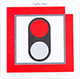 |
|  28  |     交通卡 绿灯     |  1   | 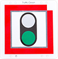 |
|  29  |    交通卡 速度40    |  1   |  |
|  30  |    交通卡 速度60    |  1   |  |
|  21  |    交通卡 速度80    |  1   |  |


## 3、sengo2 视觉传感器

### 3.1 介绍

Sengo2视觉传感器是一款面向中小学人工智能教育的图像识别设备。采用嘉楠科技的K210处理器，NPU神经网络内核带来强劲的图像识别性能，可处理多种离线图像识别算法，如颜色识别，线条检测，人脸识别，二维码识别，交通卡片识别等。通过UART串口或I2C方式与主控通讯。机身背面配有一块全视角1.3寸高清LCD屏幕，可实时显示图像画面及识别结果，便于用户使用和调试。

Sengo2支持Arduino、掌控板、Micro:bit、源师兄、ESP32等主流教育用开发板，支持MakeCode、Mind+、Mixly、OHCode V2等图形化编程平台，也支持Arduino、BXY/Thonny等代码编辑器。官方提供了多种驱动库，完全满足中小学开展人工智能教育以及AI竞赛的需求，也适合于学生个人或创客进行AI视觉产品的设计。

Sengo2体积轻巧，易于使用，传感器四周分布有12个兼容乐高机械组的定位孔设计，便于用户进行产品搭建和思维创新，完成丰富的主题教学或比赛设计。

### 3.2 组件介绍


**像头：** 采集图像数据

**屏幕：** 实时显示摄像头画面和算法检测结果，便于观察和调试设备

**通讯接口：** 实现传感器与主控设备的数据通讯，采用PH2.0-4Pin接口，支持UART串口和I2C两种通讯模式

**功能按键：** 短按可快速切换算法，长按可训练/删除数据，开机时按下可进入固件烧录模式

**模式按键：** 短按切换通讯模式，长按可翻转摄像头的成像

**复位按键：** 可实现硬件复位，一般用于固件烧录

**RGB-LED 灯：** 不同的灯光颜色可反映算法识别的状态，LED颜色可通过编程指令进行设置

**供电指示灯：** 设备上电后，此LED灯会常亮显示

**心跳指示灯：** 设备正常工作时，此LED灯会有节奏的心跳闪烁

**定位孔：** 设备四周预留了多个4mm的定位孔，相邻间距16mm或32mm，兼容乐高类型的拼搭积木


### 3.3 参数

| 项目         | 单位 | 参数       | 备注                                         |
| ------------ | ---- | ---------- | -------------------------------------------- |
| 输入电压     | V    | 3.3-5.0    | 超出此范围，可能导致设备工作异常或损坏       |
| 工作电流     | mA   | 140@5V     | 5V 供电，开启人脸算法时的典型值              |
| IO电平       | V    | 3.3-5.0    | IO电平与输入电压一致。无法适配1.8V的主控设备 |
| 尺寸         | mm   | 40x40x12.5 | 外壳边缘尺寸，按键略高于壳体                 |
| 重量         | g    | 15         |                                              |
| 摄像头类型   | 1    | CMOS       |                                              |
| 摄像头分辨率 | 像素 | 30W        | VGA镜头，最大640x480分辨率                   |
| 镜头视场角   | 度   | 83         | 指画面斜对角，带红外滤光                     |
| 屏幕类型     | /    | TFT        | 262K色彩，全视角                             |
| 屏幕尺寸     | 寸   | 1.3        | 指画面斜对角，240x240分辨率                  |
| LED指示灯    | 个   | 4          | 可编程RGB-LEDx2，电源指示灯，心跳指示灯      |
| 按键         | 个   | 3          | 功能按键、模式按键、复位按键                 |
| 通讯接口     | 个   | 1          | PH2.0-4pin接口                               |
| 通讯方式     | /    | UART、I2C  | 支持UART串口和I2C方式                        |
| 硬件地址     | /    | 0x60       | 7位I2C总线地址                               |
| 定位孔数量   | 个   | 12         | 分布在外壳正反面、两侧及底部                 |
| 定位孔中心距 | mm   | 16、32     |                                              |
| 定位孔直径   | mm   | 4          | 兼容乐高机械组类型的积木                     |

### 3.4 按键与操作说明：

#### 3.4.1 按键操作

| 按键      | 短按                   | 长按5s                                                   | 长按10s                                                      | 上电时长按                             |
| --------- | ---------------------- | -------------------------------------------------------- | ------------------------------------------------------------ | -------------------------------------- |
| 功能 按键 | 切换算法               | 运行人脸识别等算法时， <br />可以训练并存储当前训练 数据 | 运行人脸识别等算法时，<br />可 以删除最近一次或所有的训 练数据 | 进入固件烧录模 式，<br />用于更新程 序 |
| 模式 按键 | 切换UART或 I2C通讯方式 | 上下翻转镜头                                             | 无                                                           | 无                                     |
| 复位 按键 | 复位硬件               | 无                                                       | 无                                                           | 无                                     |

#### 3.4.2 算法切换

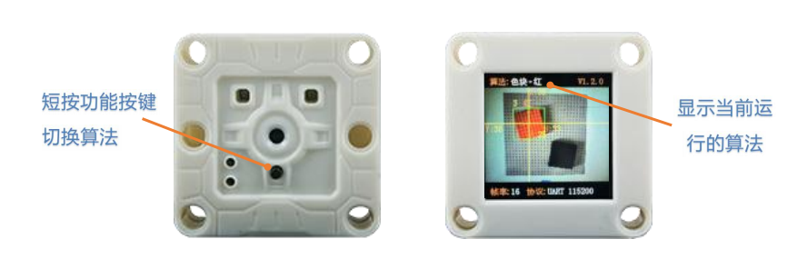

**操作：** 短按功能按键。

**简介：** 当执行此操作后，Sengo2会按照算法ID编号依次循环切换算法，切换算法时Sengo2会自动关闭当前运行的算法，可以在屏幕上方查看当前所开启的算法。算法运行状态不会被保存，Sengo2重启后默认关闭所有算法。

算法切换顺序为：颜色识别 > 色块检测 > 标签识别 > 线条检测 > 深度学习 > 卡片识别 >人脸识别 > 20类物体 >二维码 >运动物体>… 

**注意：** 通常使用时，应由主控设备发送指令控制算法的开启与关闭

#### 3.4.3 模型数据存储与删除


**操作：** 长按5秒功能按键后松开。

**简介：** 在运行人脸算法时，可以训练并存储当前的人脸数据并分配一个人脸ID编号。

**操作：** 长按10秒功能按键后松开。

**简介：** 在运行人脸算法时，可以删除最近一次训练的人脸数据，当再次长按时，会删除所有的人脸数据。如果本次运行人脸算法时并没有执行过训练人脸数据的操作，则直接删除所有的人脸数据。该操作同样适用于“深度学习”算法

#### 3.4.4 切换通讯模式


**操作：** 短按模式按键。

**简介：** 循环切换通讯模式，当执行此操作后，传感器会自动存储该通讯模式并重启设备，可以通过屏幕下方查看当前通讯模式。

Sengo2提供5种通讯模式，分别为I2C协议模式、UART-9600串口协议、UART-57600串口协议、UART-115200串口协议、UART-9600串口简单协议。默认为I2C 模式。

#### 3.4.5 翻转摄像头画面


**操作：** 长按5秒模式按键然后松开。

**简介：** 可以上下翻转摄像头成像方向，适合于镜头前置时使用（即镜头与屏幕位于同侧），执行该操作后，Sengo2会保存当前的状态，设备重启后仍然有效。

<span style="color:red;font-size:25px">注意：镜头前置需要用户自行拆开外壳后手动翻转至屏幕侧，产品外壳结构本身不包含可旋转的机械结构，操作不当可能造成产品损坏，因此本操作只适合于有此需求且具备一定动手能力的用户！！！</span>


#### 3.4.6 进入固件烧录模式


**操作：** 用户可通过2种方式进入固件烧录模式

1、设备上电后，压按功能按键不松开，短按复位按键，即可进入烧录模式，然后松开按键；

2、设备上电前，压按功能按键不松开，再插入数据线给设备上电，即可进入烧录模式，然后松开按键；

**简介：** 进入固件烧录模式，可以给Sengo2进行程序升级。

### 3.5 接线与使用说明

#### 3.5.1 接口定义


| 引脚序号 | 标识 |  功能   | UART模式 | I2C模式 |
| :------: | :--: | :-----: | :------: | :-----: |
|    1     | R/D  |  信号1  |    RX    |   SDA   |
|    2     | T/C  |  信号2  |    TX    |   SCL   |
|    3     | GND  | 电源负- |   GND    |   GND   |
|    4     | VCC  | 电源正+ |   VCC    |   VCC   |

<span style="color:red;font-size:25px;">注意：请务必确认接线无误后再上电，错误的接线可能会导致设备无法正常工作，甚至导致设备损坏。</span>

#### 3.5.2 通讯方式

**• I2C模式**：采用I2C总线通讯协议，支持100~400Kbps通讯速率。硬件设备地址为0x60。

每次仅可读写一个字节的数据，不支持连续地址读写。

**• UART-9600标准协议、UART-57600标准协议、UART-115200标准协议**：此3种模式为串口通讯模式，数字代表通讯波特率，采用瞳芯智能视觉传感器标准指令协议。协议带有校验码，数据传输稳定可靠。可根据主控设备的硬件性能选择适合的波特率，波特率越大则通讯时间短，有利于提升系统的响应速度。较低的波特率适合于采用软串口的主控设备或数据线较长时的情景。

**• UART-9600简单协议**：串口通讯模式，波特率为9600，采用瞳芯智能视觉传感器简单指令协议。主控设备只需发送和接收字符串即可开启算法，获取结果，无需开发专用的驱动库，可适配任何具有UART串口通讯功能的硬件平台。

#### 3.5.3 接线方式

Sengo2可以适配多种主控设备，这里我们以UNO板进行举例说明如何进行接线，其他主控板如Micro:bit、Pico、ESP32开发板等。

Sengo2支持3.3V-5V供电，根据主控板电源供电能力选择合适的电源。如果电源稳定性较差，负载能力偏小，尤其是当电机、舵机、喇叭等外设与Sengo2共用电源时，可能发生供电不稳定造成Sengo重启。

##### 3.5.3.1 硬件UART串口模式

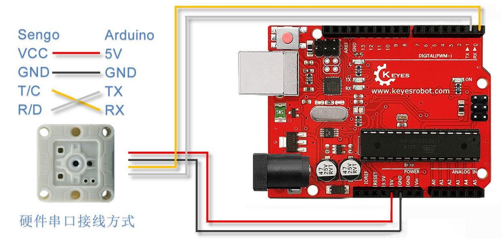

硬件UART模式下，Sengo2的RX引脚需要接Arduino的TX引脚，Sengo2的TX引脚接Arduino的RX引脚。

某些型号的Arduino主控板例如常见的UNO板，只有一个硬件串口。由于烧录ArduinoUNO默认的程序烧录端口、调试端口均采用与此串口，因此在烧录程序时需要断开与Sengo2的接线，Arduino代码中不能使用print输出调试信息，否则会导致Sengo2通讯异常。推荐使用I2C模式，降低接线的难度以及出错的概率。

##### 3.5.3.2 软件模拟串口模式

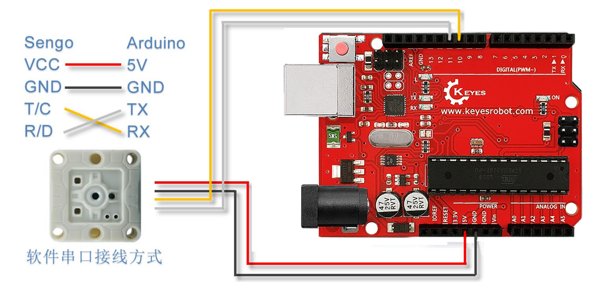

软件模拟串口模式又称软串口模式，指通过软件模拟将Arduino普通的IO口分别定义为TX和RX引脚，通过IO口的电平变化来模拟UART的信号波形，进而实现数据通信。本示意图中将IO口10定义为RX引脚，IO口11定义为TX引脚，Arduino IDE中软串口的引脚定义代码如下：

```c
#include <SoftwareSerial.h>
#define TX_PIN 11
#define RX_PIN 10
SoftwareSerial mySerial(RX_PIN, TX_PIN);
```

<span style="color:red;font-size:25px;">注意：软串口模式下，通讯波特率建议设置范围为9600~57600，高波特率可能会导致数据传输失败。</span>

##### 3.5.3.3 I2C 模式

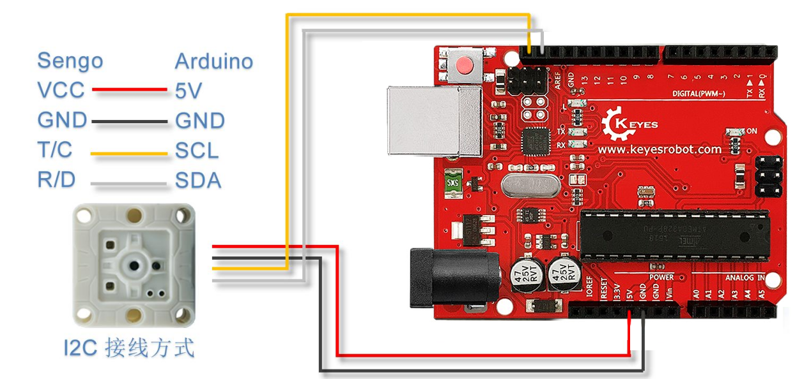

Sengo2的T/C脚接主控的SCL，R/D脚接主控的SDA。I2C模式下，通讯线不易太长，避免数据干扰造成通讯异常。

### 3.6 运行界面


**算法状态：** 显示当前正在运行的算法

**固件版本：** 显示当前固件版本号

**图像区域：** 实时显示摄像头画面

**识别结果：** 识别到物体后会以画框或画线的方式，标记物体的坐标方位、大小及标签等信息

**图像帧率：** 显示算法的运行帧率，不同算法的运行速度会有所差别，光照强度也会对帧率有所影响

**通讯协议：** 显示当前采用的通讯协议

### 3.7 识别结果


**坐标系：** Sengo2采用“百分比”相对值坐标系，即沿水平方向X与竖直方向Y将图像100等分，摄像头画面左上角为原点坐标(0,0)，右下角坐标为(100,100)，图像中心区域坐标为(50,50)

**检测结果：** Sengo2检测到物体后，不同的算法会返回不同的识别结果，包括物体的坐标方位信息，物体大小信息，分类标签信息。以上信息会在屏幕上显示，方便用户观察与调试主控设备需要通过协议指令读取结果，Sengo2不主动外发数据

**水平坐标X：** 物体中心点水平方向的坐标，范围0~100

**垂直坐标Y：** 物体中心点垂直方向的坐标，范围0~100

**物体宽度W：** 物体外轮廓所组成的矩形的水平边长，范围0~100

**物体高度H：** 物体外轮廓所组成的矩形的垂直边长，范围0~100

**分类标签L：** 对于可分类的算法，用一个数字ID指代某一个物体。相同的数字在不同的算法中的含义可能不同，比如数字3在颜色识别算法中代表红色，而在卡片算法中代表右转

**特殊：** 颜色识别算法会返回RGB颜色分量，线条检测算法会返回两个端点的坐标以及倾斜角度，二维码算法会返回二维码中的字符信息等，详见各算法介绍

### 3.8 算法介绍

Sengo2内部集成了多个简单实用的离线算法，并为每个算法分配了一个ID编号，此编号是主控设备与传感器通讯交互的唯一标识，用于控制算法的开启关闭、设置参数或读取结果。

| 算法ID | 中文名称  | 英文名称  | 简介                                                         |
| :----: | --------- | --------- | ------------------------------------------------------------ |
|   1    | 颜色识别  | Color     | 返回指定识别区域的颜色信息：RGB分量值及颜色的分类标签        |
|   2    | 色块检测  | Blob      | 检测图像中是否有指定参数的色块，支持检测黑、白、红 、<br />绿、蓝、黄任意一种颜色的色块 |
|   3    | 标签识别* | Apriltag* | 支持16H5或25H9或36H11编码格式的Apriltag识别，<br />默 认36H11格式 |
|   4    | 线条检测  | Line      | 检测图像中的线条，返回两个端点坐标及倾斜角度                 |
|   5    | 深度学习* | Learning* | 对任意物体进行离线训练并进行识别，可存储15个模型 数据        |
|   6    | 卡片识别* | Card*     | 识别配套的10张交通卡片                                       |
|   7    | 人脸识别* | Face*     | 记忆与识别人脸，支持口罩检测，可存储15张人脸数据             |
|   8    | 20类物体* | 20Class*  | 识别常见的20类物体，如猫、狗、汽车等                         |
|   9    | 二维码    | QrCode    | 识别由不超过10个字符生成的二维码                             |
|   11   | 运动物体  | Motion    | 判断图像中是否有运动中的物体                                 |

<span style="color:red;font-size:25px">注意：①不带星号的算法可以同时运行多个；带星号的算法任意时刻只能开启运行一个，但可以与不带星号的算法并行运行。同时开启多个算法，算法的运行速度会降低；②部分算法支持检测/识别并输出多个结果的信息，但部分主控设备例如Arduino UNO因自身RAM大小的限制，无法存储全部的结果信息，导致出现丢失数据的问题。当需要获取超过5个检测 / 识别结果的信息时，建议选择以ESP32等RAM较大的芯片为处理器的主控设备。</span>

